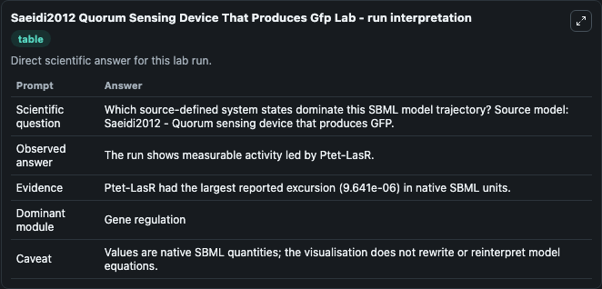
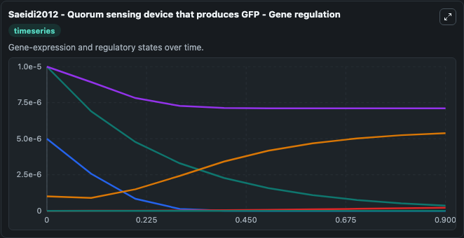
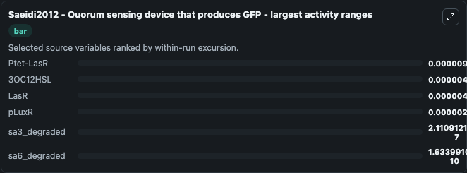
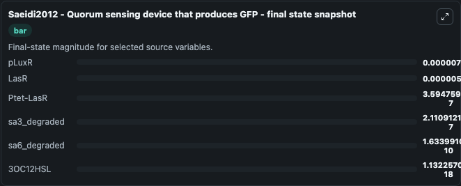
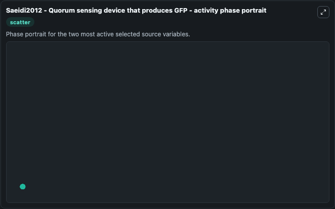

# Saeidi2012 Quorum Sensing Device That Produces Gfp

This Biosimulant lab wraps `Saeidi2012 Quorum Sensing Device That Produces Gfp` as a runnable systems biology model with a companion visualization module.
Saeidi2012 - Quorum sensing device that produces GFP Saeidi et al. (2012) has modelled a quorum sensing device that produces green fluorescent protein (GFP) as reporter in the presence of Acyl Homoser. It can be used to explore the configured dynamics and compare scenario outcomes across configurations.

## What You'll See

The lab asks: Which source-defined system states dominate this SBML model trajectory? Source model: Saeidi2012 - Quorum sensing device that produces GFP. It runs for 1.0 time units with a communication step of 0.1. The run uses the model defaults declared by the curated SBML wrapper. The generated visualizations focus on pLuxR, Ptet-LasR, 3OC12HSL, LasR, sa6_degraded, and sa3_degraded, combining trajectory, endpoint-comparison, and summary-table views from one completed dark-mode run.

In this captured run, **Ptet-LasR** moved from 1e-05 to 3.59e-07 across 1.0 simulation windows.


### Output Visualizations



*Summary table for Saeidi2012 Quorum Sensing Device That Produces Gfp, reporting the scientific question, observed answer, dominant module, and caveat.*



*Trajectories of Ptet-LasR, 3OC12HSL, LasR, pLuxR, sa3_degraded, and sa6_degraded across the 1.0 simulation. In this run **LasR** climbed from 1e-06 to 5.39e-06 and **Ptet-LasR** fell from 1e-05 to 3.59e-07 — the largest movements among the focused observables.*



*Largest-excursion ranking of the focused observables — the absolute movement magnitude during the run. Top 3: **Ptet-LasR** = 9.64e-06, **3OC12HSL** = 5e-06, **LasR** = 4.49e-06, with 3 more observables below.*



*Endpoint snapshot of the focused observables — final values from the captured run. Top 3 by value: **pLuxR** = 7.11e-06, **LasR** = 5.39e-06, **Ptet-LasR** = 3.59e-07, with 3 more observables below.*



*Visualization card from the Saeidi2012 Quorum Sensing Device That Produces Gfp dark-mode run.*


## Model Context

- Core model: `models/core`
- Visualization model: `models/visualisation`
- Standard: `other`
- Upstream source: `biomodels_ebi:BIOMD0000000438`
- License: `CC0`

## Inputs

| Input | Maps To | Default | Notes |
|---|---|---|---|
| Initial P Lux R | `systemsbiology_sbml_saeidi2012_quorum_sensing_device_that_produces_g_biomd0000000438_model.initial_p_lux_r` | | Source state initial condition exposed as a model-specific control because no explicit intervention parameter is identifiable. Maps to SBML symbol `s16`. |
| Initial Ptet Las R | `systemsbiology_sbml_saeidi2012_quorum_sensing_device_that_produces_g_biomd0000000438_model.initial_ptet_las_r` | | Source state initial condition exposed as a model-specific control because no explicit intervention parameter is identifiable. Maps to SBML symbol `s1`. |
| Initial Model State 3 Oc12 Hsl | `systemsbiology_sbml_saeidi2012_quorum_sensing_device_that_produces_g_biomd0000000438_model.initial_model_state_3_oc12_hsl` | | Source state initial condition exposed as a model-specific control because no explicit intervention parameter is identifiable. Maps to SBML symbol `s4`. |
| Initial Las R | `systemsbiology_sbml_saeidi2012_quorum_sensing_device_that_produces_g_biomd0000000438_model.initial_las_r` | | Source state initial condition exposed as a model-specific control because no explicit intervention parameter is identifiable. Maps to SBML symbol `s19`. |
| Initial SA6 Degraded | `systemsbiology_sbml_saeidi2012_quorum_sensing_device_that_produces_g_biomd0000000438_model.initial_sa6_degraded` | | Source state initial condition exposed as a model-specific control because no explicit intervention parameter is identifiable. Maps to SBML symbol `s5`. |
| Initial SA3 Degraded | `systemsbiology_sbml_saeidi2012_quorum_sensing_device_that_produces_g_biomd0000000438_model.initial_sa3_degraded` | | Source state initial condition exposed as a model-specific control because no explicit intervention parameter is identifiable. Maps to SBML symbol `s3`. |

## Outputs

| Output | Maps To | Role |
|---|---|---|
| `state` | `systemsbiology_sbml_saeidi2012_quorum_sensing_device_that_produces_g_biomd0000000438_model.state` | Available to the visualization model and downstream workflows. |
| `summary` | `systemsbiology_sbml_saeidi2012_quorum_sensing_device_that_produces_g_biomd0000000438_model.summary` | Available to the visualization model and downstream workflows. |
| `species_labels` | `systemsbiology_sbml_saeidi2012_quorum_sensing_device_that_produces_g_biomd0000000438_model.species_labels` | Available to the visualization model and downstream workflows. |
| `p_lux_r` | `systemsbiology_sbml_saeidi2012_quorum_sensing_device_that_produces_g_biomd0000000438_model.p_lux_r` | Available to the visualization model and downstream workflows. |
| `ptet_las_r` | `systemsbiology_sbml_saeidi2012_quorum_sensing_device_that_produces_g_biomd0000000438_model.ptet_las_r` | Available to the visualization model and downstream workflows. |
| `model_state_3_oc12_hsl` | `systemsbiology_sbml_saeidi2012_quorum_sensing_device_that_produces_g_biomd0000000438_model.model_state_3_oc12_hsl` | Available to the visualization model and downstream workflows. |
| `las_r` | `systemsbiology_sbml_saeidi2012_quorum_sensing_device_that_produces_g_biomd0000000438_model.las_r` | Available to the visualization model and downstream workflows. |
| `sa6_degraded` | `systemsbiology_sbml_saeidi2012_quorum_sensing_device_that_produces_g_biomd0000000438_model.sa6_degraded` | Available to the visualization model and downstream workflows. |
| `sa3_degraded` | `systemsbiology_sbml_saeidi2012_quorum_sensing_device_that_produces_g_biomd0000000438_model.sa3_degraded` | Available to the visualization model and downstream workflows. |

## Runtime

- Duration: `1.0`
- Communication step: `0.1`

## Running Locally

```bash
biosimulant labs serve
```
