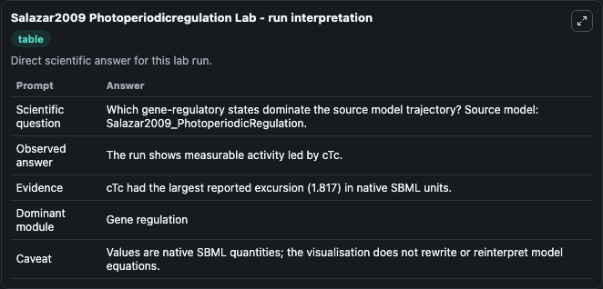
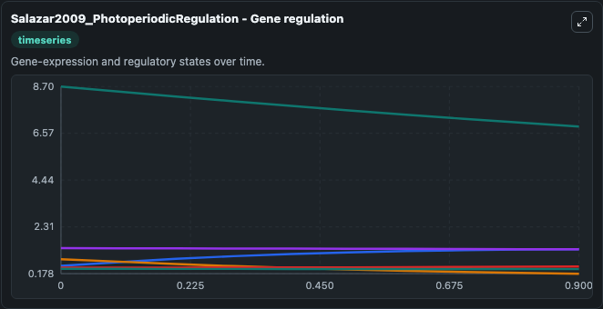
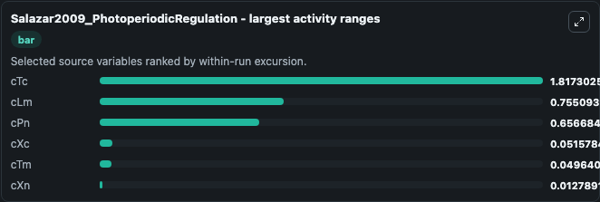
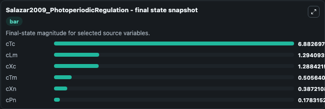
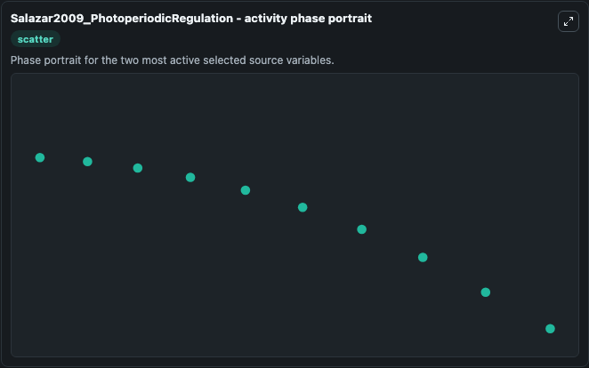

# Salazar2009 Photoperiodicregulation

This Biosimulant lab wraps `Salazar2009 Photoperiodicregulation` as a runnable systems biology model with a companion visualization module.
This a model from the article: Prediction of photoperiodic regulators from quantitative gene circuit models. It can be used to explore the configured dynamics and compare scenario outcomes across configurations.

## What You'll See

The lab asks: Which gene-regulatory states dominate the source model trajectory? Source model: Salazar2009_PhotoperiodicRegulation. It runs for 1.0 time units with a communication step of 0.1. The run uses the model defaults declared by the curated SBML wrapper. The generated visualizations focus on cTc, cXc, cPn, cLm, cTm, and cXn, combining trajectory, endpoint-comparison, and summary-table views from one completed dark-mode run.

In this captured run, **cTc** moved from 8.700 to 6.883 across 1.0 simulation windows.


### Output Visualizations



*Summary table for Salazar2009 Photoperiodicregulation, reporting the scientific question, observed answer, dominant module, and caveat.*



*Trajectories of cTc, cLm, cPn, cXc, cTm, and cXn across the 1.0 simulation. In this run **cLm** climbed from 0.5390 to 1.294 and **cTc** fell from 8.700 to 6.883 — the largest movements among the focused observables.*



*Largest-excursion ranking of the focused observables — the absolute movement magnitude during the run. Top 3: **cTc** = 1.817, **cLm** = 0.7551, **cPn** = 0.6567, with 3 more observables below.*



*Endpoint snapshot of the focused observables — final values from the captured run. Top 3 by value: **cTc** = 6.883, **cLm** = 1.294, **cXc** = 1.288, with 3 more observables below.*



*Visualization card from the Salazar2009 Photoperiodicregulation dark-mode run.*


## Model Context

- Core model: `models/core`
- Visualization model: `models/visualisation`
- Standard: `other`
- Upstream source: `biomodels_ebi:MODEL1005050000`
- License: `CC0`

## Inputs

| Input | Maps To | Default | Notes |
|---|---|---|---|
| Light Amplitude | `systemsbiology_sbml_salazar2009_photoperiodicregulation_model1005050000_model.light_amplitude` | | Source parameter exposed because its SBML label indicates a boundary, stimulus, dose, ligand, protocol, substrate, or environmental control. Maps to SBML symbol `lightAmplitude`. |
| Light Offset | `systemsbiology_sbml_salazar2009_photoperiodicregulation_model1005050000_model.light_offset` | | Source parameter exposed because its SBML label indicates a boundary, stimulus, dose, ligand, protocol, substrate, or environmental control. Maps to SBML symbol `lightOffset`. |
| Twilight Period | `systemsbiology_sbml_salazar2009_photoperiodicregulation_model1005050000_model.twilight_period` | | Source parameter exposed because its SBML label indicates a boundary, stimulus, dose, ligand, protocol, substrate, or environmental control. Maps to SBML symbol `twilightPeriod`. |

## Outputs

| Output | Maps To | Role |
|---|---|---|
| `state` | `systemsbiology_sbml_salazar2009_photoperiodicregulation_model1005050000_model.state` | Available to the visualization model and downstream workflows. |
| `summary` | `systemsbiology_sbml_salazar2009_photoperiodicregulation_model1005050000_model.summary` | Available to the visualization model and downstream workflows. |
| `species_labels` | `systemsbiology_sbml_salazar2009_photoperiodicregulation_model1005050000_model.species_labels` | Available to the visualization model and downstream workflows. |
| `c_tc` | `systemsbiology_sbml_salazar2009_photoperiodicregulation_model1005050000_model.c_tc` | Available to the visualization model and downstream workflows. |
| `c_xc` | `systemsbiology_sbml_salazar2009_photoperiodicregulation_model1005050000_model.c_xc` | Available to the visualization model and downstream workflows. |
| `c_pn` | `systemsbiology_sbml_salazar2009_photoperiodicregulation_model1005050000_model.c_pn` | Available to the visualization model and downstream workflows. |
| `c_lm` | `systemsbiology_sbml_salazar2009_photoperiodicregulation_model1005050000_model.c_lm` | Available to the visualization model and downstream workflows. |
| `c_tm` | `systemsbiology_sbml_salazar2009_photoperiodicregulation_model1005050000_model.c_tm` | Available to the visualization model and downstream workflows. |
| `c_xn` | `systemsbiology_sbml_salazar2009_photoperiodicregulation_model1005050000_model.c_xn` | Available to the visualization model and downstream workflows. |

## Runtime

- Duration: `1.0`
- Communication step: `0.1`

## Running Locally

```bash
biosimulant labs serve
```
