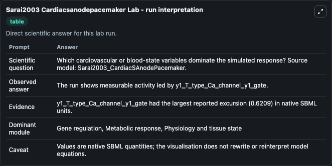
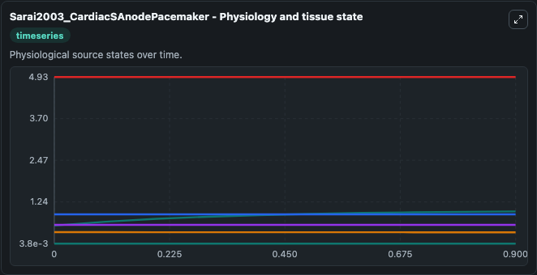
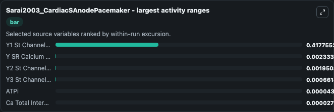
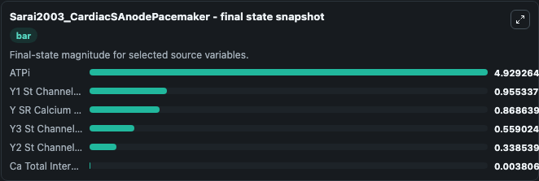
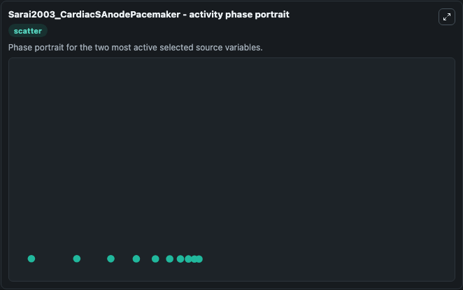

# Sarai2003 Cardiacsanodepacemaker

This Biosimulant lab wraps `Sarai2003 Cardiacsanodepacemaker` as a runnable systems biology model with a companion visualization module.
This a model from the article: Role of individual ionic current systems in the SA node hypothesized by a modelstudy. It can be used to explore the configured dynamics and compare scenario outcomes across configurations.

## What You'll See

The lab asks: Which cardiovascular or blood-state variables dominate the simulated response? Source model: Sarai2003_CardiacSAnodePacemaker. It runs for 1.0 time units with a communication step of 0.1. The run uses the model defaults declared by the curated SBML wrapper. The generated visualizations focus on ATPi, Ca Total Internal Ion Concentrations, Y3 St Channel Y3 Gate, Y2 St Channel Y2 Gate, Y1 St Channel Y1 Gate, and Y SR Calcium Pump Y Gate, combining trajectory, endpoint-comparison, and summary-table views from one completed dark-mode run.

In this captured run, **Y1 St Channel Y1 Gate** moved from 0.5376 to 0.9553 across 1.0 simulation windows.


### Output Visualizations



*Summary table for Sarai2003 Cardiacsanodepacemaker, reporting the scientific question, observed answer, dominant module, and caveat.*



*Trajectories of Y1 St Channel Y1 Gate, Y SR Calcium Pump Y Gate, Y2 St Channel Y2 Gate, Y3 St Channel Y3 Gate, ATPi, and Ca Total Internal Ion Concentrations across the 1.0 simulation. In this run **Y1 St Channel Y1 Gate** climbed from 0.5376 to 0.9553 and **Y SR Calcium Pump Y Gate** fell from 0.8710 to 0.8686 — the largest movements among the focused observables.*



*Largest-excursion ranking of the focused observables — the absolute movement magnitude during the run. Top 3: **Y1 St Channel Y1 Gate** = 0.4178, **Y SR Calcium Pump Y Gate** = 0.00233, **Y2 St Channel Y2 Gate** = 0.00195, with 3 more observables below.*



*Endpoint snapshot of the focused observables — final values from the captured run. Top 3 by value: **ATPi** = 4.929, **Y1 St Channel Y1 Gate** = 0.9553, **Y SR Calcium Pump Y Gate** = 0.8686, with 3 more observables below.*



*Visualization card from the Sarai2003 Cardiacsanodepacemaker dark-mode run.*


## Model Context

- Core model: `models/core`
- Visualization model: `models/visualisation`
- Standard: `other`
- Upstream source: `biomodels_ebi:MODEL1006230108`
- License: `CC0`

## Inputs

| Input | Maps To | Default | Notes |
|---|---|---|---|
| Initial At Pi | `systemsbiology_sbml_sarai2003_cardiacsanodepacemaker_model1006230108_model.initial_at_pi` | | Source state initial condition exposed as a model-specific control because no explicit intervention parameter is identifiable. Maps to SBML symbol `ATPi`. |
| Initial Ca Total Internal Ion Concentrations | `systemsbiology_sbml_sarai2003_cardiacsanodepacemaker_model1006230108_model.initial_ca_total_internal_ion_concentrations` | | Source state initial condition exposed as a model-specific control because no explicit intervention parameter is identifiable. Maps to SBML symbol `Ca_Total_internal_ion_concentrations`. |
| Initial Y3 St Channel Y3 Gate | `systemsbiology_sbml_sarai2003_cardiacsanodepacemaker_model1006230108_model.initial_y3_st_channel_y3_gate` | | Source state initial condition exposed as a model-specific control because no explicit intervention parameter is identifiable. Maps to SBML symbol `y3_st_channel_y3_gate`. |
| Initial Y2 St Channel Y2 Gate | `systemsbiology_sbml_sarai2003_cardiacsanodepacemaker_model1006230108_model.initial_y2_st_channel_y2_gate` | | Source state initial condition exposed as a model-specific control because no explicit intervention parameter is identifiable. Maps to SBML symbol `y2_st_channel_y2_gate`. |
| Initial Y1 St Channel Y1 Gate | `systemsbiology_sbml_sarai2003_cardiacsanodepacemaker_model1006230108_model.initial_y1_st_channel_y1_gate` | | Source state initial condition exposed as a model-specific control because no explicit intervention parameter is identifiable. Maps to SBML symbol `y1_st_channel_y1_gate`. |
| Initial Y Sr Calcium Pump Y Gate | `systemsbiology_sbml_sarai2003_cardiacsanodepacemaker_model1006230108_model.initial_y_sr_calcium_pump_y_gate` | | Source state initial condition exposed as a model-specific control because no explicit intervention parameter is identifiable. Maps to SBML symbol `y_SR_calcium_pump_y_gate`. |

## Outputs

| Output | Maps To | Role |
|---|---|---|
| `state` | `systemsbiology_sbml_sarai2003_cardiacsanodepacemaker_model1006230108_model.state` | Available to the visualization model and downstream workflows. |
| `summary` | `systemsbiology_sbml_sarai2003_cardiacsanodepacemaker_model1006230108_model.summary` | Available to the visualization model and downstream workflows. |
| `species_labels` | `systemsbiology_sbml_sarai2003_cardiacsanodepacemaker_model1006230108_model.species_labels` | Available to the visualization model and downstream workflows. |
| `at_pi` | `systemsbiology_sbml_sarai2003_cardiacsanodepacemaker_model1006230108_model.at_pi` | Available to the visualization model and downstream workflows. |
| `ca_total_internal_ion_concentrations` | `systemsbiology_sbml_sarai2003_cardiacsanodepacemaker_model1006230108_model.ca_total_internal_ion_concentrations` | Available to the visualization model and downstream workflows. |
| `y3_st_channel_y3_gate` | `systemsbiology_sbml_sarai2003_cardiacsanodepacemaker_model1006230108_model.y3_st_channel_y3_gate` | Available to the visualization model and downstream workflows. |
| `y2_st_channel_y2_gate` | `systemsbiology_sbml_sarai2003_cardiacsanodepacemaker_model1006230108_model.y2_st_channel_y2_gate` | Available to the visualization model and downstream workflows. |
| `y1_st_channel_y1_gate` | `systemsbiology_sbml_sarai2003_cardiacsanodepacemaker_model1006230108_model.y1_st_channel_y1_gate` | Available to the visualization model and downstream workflows. |
| `y_sr_calcium_pump_y_gate` | `systemsbiology_sbml_sarai2003_cardiacsanodepacemaker_model1006230108_model.y_sr_calcium_pump_y_gate` | Available to the visualization model and downstream workflows. |

## Runtime

- Duration: `1.0`
- Communication step: `0.1`

## Running Locally

```bash
biosimulant labs serve
```
