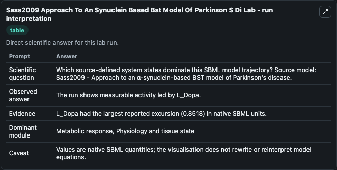
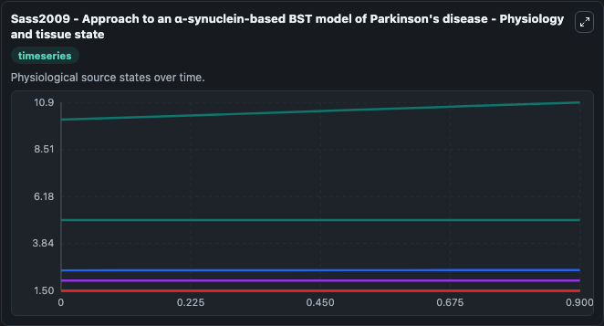
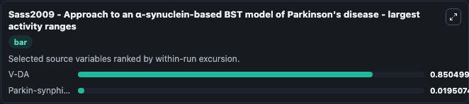
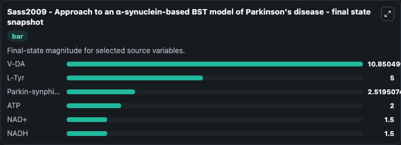
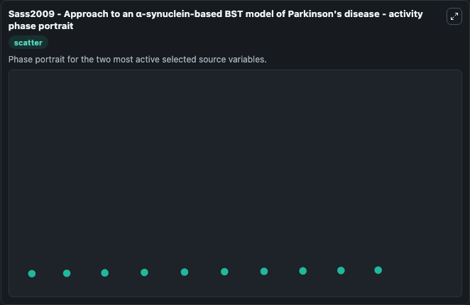

# Sass2009 Approach To An Synuclein Based Bst Model Of Parkinson S Di

This Biosimulant lab wraps `Sass2009 Approach To An Synuclein Based Bst Model Of Parkinson S Di` as a runnable systems biology model with a companion visualization module.
Sass2009 - Approach to anα-synuclein-based BST model of Parkinson's disease This model is described in the article: A pragmatic approach to biochemical systems theory applied to an alpha-synuclein-bas. It can be used to explore the configured dynamics and compare scenario outcomes across configurations.

## What You'll See

The lab asks: Which source-defined system states dominate this SBML model trajectory? Source model: Sass2009 - Approach to an α-synuclein-based BST model of Parkinson's disease. It runs for 1.0 time units with a communication step of 0.1. The run uses the model defaults declared by the curated SBML wrapper. The generated visualizations focus on NAD+, ATP, NADH, V-DA, L-Tyr, and Parkin-synphilin-1-ub, combining trajectory, endpoint-comparison, and summary-table views from one completed dark-mode run.

In this captured run, **V-DA** moved from 10.000 to 10.850 across 1.0 simulation windows.


### Output Visualizations



*Summary table for Sass2009 Approach To An Synuclein Based Bst Model Of Parkinson S Di, reporting the scientific question, observed answer, dominant module, and caveat.*



*Trajectories of V-DA, Parkin-synphilin-1-ub, NAD+, ATP, NADH, and L-Tyr across the 1.0 simulation. In this run **V-DA** climbed from 10.000 to 10.850 — the largest movements among the focused observables.*



*Largest-excursion ranking of the focused observables — the absolute movement magnitude during the run. Top 2: **V-DA** = 0.8505, **Parkin-synphilin-1-ub** = 0.0195.*



*Endpoint snapshot of the focused observables — final values from the captured run. Top 3 by value: **V-DA** = 10.850, **L-Tyr** = 5.000, **Parkin-synphilin-1-ub** = 2.520, with 3 more observables below.*



*Visualization card from the Sass2009 Approach To An Synuclein Based Bst Model Of Parkinson S Di dark-mode run.*


## Model Context

- Core model: `models/core`
- Visualization model: `models/visualisation`
- Standard: `other`
- Upstream source: `biomodels_ebi:BIOMD0000000575`
- License: `CC0`

## Inputs

| Input | Maps To | Default | Notes |
|---|---|---|---|
| Initial Model State Nad | `systemsbiology_sbml_sass2009_approach_to_an_synuclein_based_bst_mode_biomd0000000575_model.initial_model_state_nad` | | Source state initial condition exposed as a model-specific control because no explicit intervention parameter is identifiable. Maps to SBML symbol `NAD`. |
| Initial Model State ATP | `systemsbiology_sbml_sass2009_approach_to_an_synuclein_based_bst_mode_biomd0000000575_model.initial_model_state_atp` | | Source state initial condition exposed as a model-specific control because no explicit intervention parameter is identifiable. Maps to SBML symbol `ATP`. |
| Initial Nadh | `systemsbiology_sbml_sass2009_approach_to_an_synuclein_based_bst_mode_biomd0000000575_model.initial_nadh` | | Source state initial condition exposed as a model-specific control because no explicit intervention parameter is identifiable. Maps to SBML symbol `NADH`. |
| Initial V Da | `systemsbiology_sbml_sass2009_approach_to_an_synuclein_based_bst_mode_biomd0000000575_model.initial_v_da` | | Source state initial condition exposed as a model-specific control because no explicit intervention parameter is identifiable. Maps to SBML symbol `V_DA`. |
| Initial L Tyr | `systemsbiology_sbml_sass2009_approach_to_an_synuclein_based_bst_mode_biomd0000000575_model.initial_l_tyr` | | Source state initial condition exposed as a model-specific control because no explicit intervention parameter is identifiable. Maps to SBML symbol `L_Tyr`. |
| Initial Parkin Synphilin 1 Ub | `systemsbiology_sbml_sass2009_approach_to_an_synuclein_based_bst_mode_biomd0000000575_model.initial_parkin_synphilin_1_ub` | | Source state initial condition exposed as a model-specific control because no explicit intervention parameter is identifiable. Maps to SBML symbol `Parkin_synphilin_1_ub`. |

## Outputs

| Output | Maps To | Role |
|---|---|---|
| `state` | `systemsbiology_sbml_sass2009_approach_to_an_synuclein_based_bst_mode_biomd0000000575_model.state` | Available to the visualization model and downstream workflows. |
| `summary` | `systemsbiology_sbml_sass2009_approach_to_an_synuclein_based_bst_mode_biomd0000000575_model.summary` | Available to the visualization model and downstream workflows. |
| `species_labels` | `systemsbiology_sbml_sass2009_approach_to_an_synuclein_based_bst_mode_biomd0000000575_model.species_labels` | Available to the visualization model and downstream workflows. |
| `nad` | `systemsbiology_sbml_sass2009_approach_to_an_synuclein_based_bst_mode_biomd0000000575_model.nad` | Available to the visualization model and downstream workflows. |
| `atp` | `systemsbiology_sbml_sass2009_approach_to_an_synuclein_based_bst_mode_biomd0000000575_model.atp` | Available to the visualization model and downstream workflows. |
| `nadh` | `systemsbiology_sbml_sass2009_approach_to_an_synuclein_based_bst_mode_biomd0000000575_model.nadh` | Available to the visualization model and downstream workflows. |
| `v_da` | `systemsbiology_sbml_sass2009_approach_to_an_synuclein_based_bst_mode_biomd0000000575_model.v_da` | Available to the visualization model and downstream workflows. |
| `l_tyr` | `systemsbiology_sbml_sass2009_approach_to_an_synuclein_based_bst_mode_biomd0000000575_model.l_tyr` | Available to the visualization model and downstream workflows. |
| `parkin_synphilin_1_ub` | `systemsbiology_sbml_sass2009_approach_to_an_synuclein_based_bst_mode_biomd0000000575_model.parkin_synphilin_1_ub` | Available to the visualization model and downstream workflows. |

## Runtime

- Duration: `1.0`
- Communication step: `0.1`

## Running Locally

```bash
biosimulant labs serve
```
