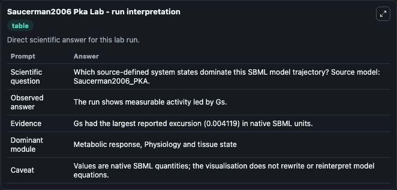
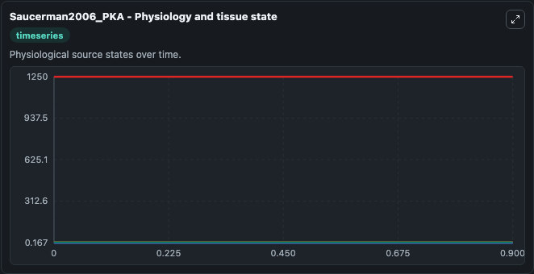
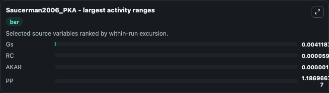
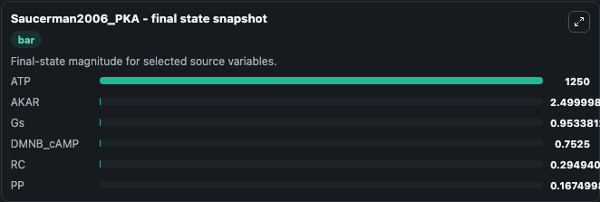
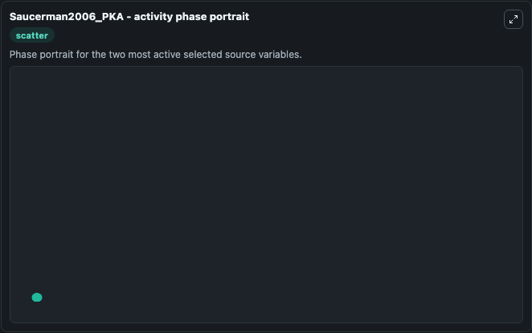

# Saucerman2006 Pka

This Biosimulant lab wraps `Saucerman2006 Pka` as a runnable systems biology model with a companion visualization module.
The model reproduces Fig 2B of the paper. It can be used to explore the configured dynamics and compare scenario outcomes across configurations.

## What You'll See

The lab asks: Which source-defined system states dominate this SBML model trajectory? Source model: Saucerman2006_PKA. It runs for 1.0 time units with a communication step of 0.1. The run uses the model defaults declared by the curated SBML wrapper. The generated visualizations focus on ATP, AKAR, Gs, DMNB_cAMP, RC, and PP, combining trajectory, endpoint-comparison, and summary-table views from one completed dark-mode run.

In this captured run, **Gs** moved from 0.9575 to 0.9534 across 1.0 simulation windows.


### Output Visualizations



*Summary table for Saucerman2006 Pka, reporting the scientific question, observed answer, dominant module, and caveat.*



*Trajectories of Gs, RC, AKAR, PP, ATP, and DMNB_cAMP across the 1.0 simulation. In this run **Gs** fell from 0.9575 to 0.9534 — the largest movements among the focused observables.*



*Largest-excursion ranking of the focused observables — the absolute movement magnitude during the run. Top 3: **Gs** = 0.00412, **RC** = 5.96e-05, **AKAR** = 1.5e-06, with 1 more observable below.*



*Endpoint snapshot of the focused observables — final values from the captured run. Top 3 by value: **ATP** = 1250.0, **AKAR** = 2.500, **Gs** = 0.9534, with 3 more observables below.*



*Visualization card from the Saucerman2006 Pka dark-mode run.*


## Model Context

- Core model: `models/core`
- Visualization model: `models/visualisation`
- Standard: `other`
- Upstream source: `biomodels_ebi:BIOMD0000000165`
- License: `CC0`

## Inputs

| Input | Maps To | Default | Notes |
|---|---|---|---|
| Toff Global Light CAMP Photolysis | `systemsbiology_sbml_saucerman2006_pka_biomd0000000165_model.toff_global_light_camp_photolysis` | | Source parameter exposed because its SBML label indicates a boundary, stimulus, dose, ligand, protocol, substrate, or environmental control. Maps to SBML symbol `toff_global_light_cAMP_photolysis`. |
| Toff Local Light CAMP Photolysis | `systemsbiology_sbml_saucerman2006_pka_biomd0000000165_model.toff_local_light_camp_photolysis` | | Source parameter exposed because its SBML label indicates a boundary, stimulus, dose, ligand, protocol, substrate, or environmental control. Maps to SBML symbol `toff_local_light_cAMP_photolysis`. |
| Ton Global Light CAMP Photolysis | `systemsbiology_sbml_saucerman2006_pka_biomd0000000165_model.ton_global_light_camp_photolysis` | | Source parameter exposed because its SBML label indicates a boundary, stimulus, dose, ligand, protocol, substrate, or environmental control. Maps to SBML symbol `ton_global_light_cAMP_photolysis`. |
| Ton Local Light CAMP Photolysis | `systemsbiology_sbml_saucerman2006_pka_biomd0000000165_model.ton_local_light_camp_photolysis` | | Source parameter exposed because its SBML label indicates a boundary, stimulus, dose, ligand, protocol, substrate, or environmental control. Maps to SBML symbol `ton_local_light_cAMP_photolysis`. |

## Outputs

| Output | Maps To | Role |
|---|---|---|
| `state` | `systemsbiology_sbml_saucerman2006_pka_biomd0000000165_model.state` | Available to the visualization model and downstream workflows. |
| `summary` | `systemsbiology_sbml_saucerman2006_pka_biomd0000000165_model.summary` | Available to the visualization model and downstream workflows. |
| `species_labels` | `systemsbiology_sbml_saucerman2006_pka_biomd0000000165_model.species_labels` | Available to the visualization model and downstream workflows. |
| `atp` | `systemsbiology_sbml_saucerman2006_pka_biomd0000000165_model.atp` | Available to the visualization model and downstream workflows. |
| `akar` | `systemsbiology_sbml_saucerman2006_pka_biomd0000000165_model.akar` | Available to the visualization model and downstream workflows. |
| `model_state_gs` | `systemsbiology_sbml_saucerman2006_pka_biomd0000000165_model.model_state_gs` | Available to the visualization model and downstream workflows. |
| `dmnb_camp` | `systemsbiology_sbml_saucerman2006_pka_biomd0000000165_model.dmnb_camp` | Available to the visualization model and downstream workflows. |
| `model_state_rc` | `systemsbiology_sbml_saucerman2006_pka_biomd0000000165_model.model_state_rc` | Available to the visualization model and downstream workflows. |
| `model_state_pp` | `systemsbiology_sbml_saucerman2006_pka_biomd0000000165_model.model_state_pp` | Available to the visualization model and downstream workflows. |

## Runtime

- Duration: `1.0`
- Communication step: `0.1`

## Running Locally

```bash
biosimulant labs serve
```
