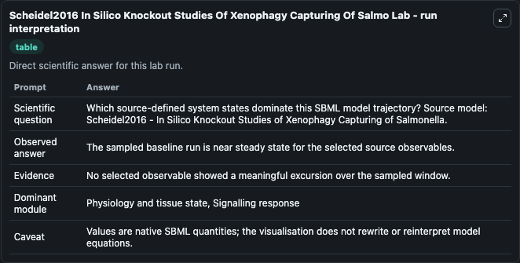
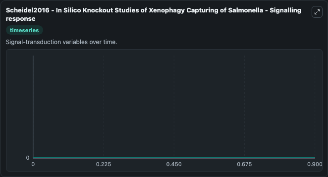

# Scheidel2016 In Silico Knockout Studies Of Xenophagy Capturing Of Salmo

This Biosimulant lab wraps `Scheidel2016 In Silico Knockout Studies Of Xenophagy Capturing Of Salmo` as a runnable systems biology model with a companion visualization module.
Xenophagy, also known as antibacterial autophagy, is a process of capturing and eliminating cytosolic pathogens, like Salmonella. It can be used to explore the configured dynamics and compare scenario outcomes across configurations.

## What You'll See

The lab asks: Which source-defined system states dominate this SBML model trajectory? Source model: Scheidel2016 - In Silico Knockout Studies of Xenophagy Capturing of Salmonella. It runs for 1.0 time units with a communication step of 0.1. The run uses the model defaults declared by the curated SBML wrapper. The generated visualizations focus on mTORC1inactive, mTORC1:ULK1comp_, mTORC1:ULK1comp:SCV__, SignalSCVdamage_, SignalAutophagyInduction_, and p62'i, combining trajectory, endpoint-comparison, and summary-table views from one completed dark-mode run.

In this captured run, **mTORC1inactive** moved from 0 to 0 across 1.0 simulation windows.


### Output Visualizations



*Summary table for Scheidel2016 In Silico Knockout Studies Of Xenophagy Capturing Of Salmo, reporting the scientific question, observed answer, dominant module, and caveat.*



*Trajectories of mTORC1inactive, mTORC1:ULK1comp_, mTORC1:ULK1comp:SCV__, SignalSCVdamage_, SignalAutophagyInduction_, and p62'i across the 1.0 simulation. In this run mTORC1inactive, mTORC1:ULK1comp_, mTORC1:ULK1comp:SCV__, SignalSCVdamage_ stayed near their initial values — no observable moved appreciably.*


## Model Context

- Core model: `models/core`
- Visualization model: `models/visualisation`
- Standard: `other`
- Upstream source: `biomodels_ebi:MODEL1904150001`
- License: `CC0`

## Inputs

| Input | Maps To | Default | Notes |
|---|---|---|---|
| Initial M Torc1inactive | `systemsbiology_sbml_scheidel2016_in_silico_knockout_studies_of_xenop_model1904150001_model.initial_m_torc1inactive` | | Source state initial condition exposed as a model-specific control because no explicit intervention parameter is identifiable. Maps to SBML symbol `P382`. |
| Initial M Torc1 Ulk1comp | `systemsbiology_sbml_scheidel2016_in_silico_knockout_studies_of_xenop_model1904150001_model.initial_m_torc1_ulk1comp` | | Source state initial condition exposed as a model-specific control because no explicit intervention parameter is identifiable. Maps to SBML symbol `P384`. |
| Initial M Torc1 Ulk1comp Scv | `systemsbiology_sbml_scheidel2016_in_silico_knockout_studies_of_xenop_model1904150001_model.initial_m_torc1_ulk1comp_scv` | | Source state initial condition exposed as a model-specific control because no explicit intervention parameter is identifiable. Maps to SBML symbol `P415`. |
| Initial Signal Sc Vdamage | `systemsbiology_sbml_scheidel2016_in_silico_knockout_studies_of_xenop_model1904150001_model.initial_signal_sc_vdamage` | | Source state initial condition exposed as a model-specific control because no explicit intervention parameter is identifiable. Maps to SBML symbol `P400`. |
| Initial Signal Autophagy Induction | `systemsbiology_sbml_scheidel2016_in_silico_knockout_studies_of_xenop_model1904150001_model.initial_signal_autophagy_induction` | | Source state initial condition exposed as a model-specific control because no explicit intervention parameter is identifiable. Maps to SBML symbol `P408`. |
| Initial P62 I | `systemsbiology_sbml_scheidel2016_in_silico_knockout_studies_of_xenop_model1904150001_model.initial_p62_i` | | Source state initial condition exposed as a model-specific control because no explicit intervention parameter is identifiable. Maps to SBML symbol `P352`. |

## Outputs

| Output | Maps To | Role |
|---|---|---|
| `state` | `systemsbiology_sbml_scheidel2016_in_silico_knockout_studies_of_xenop_model1904150001_model.state` | Available to the visualization model and downstream workflows. |
| `summary` | `systemsbiology_sbml_scheidel2016_in_silico_knockout_studies_of_xenop_model1904150001_model.summary` | Available to the visualization model and downstream workflows. |
| `species_labels` | `systemsbiology_sbml_scheidel2016_in_silico_knockout_studies_of_xenop_model1904150001_model.species_labels` | Available to the visualization model and downstream workflows. |
| `m_torc1inactive` | `systemsbiology_sbml_scheidel2016_in_silico_knockout_studies_of_xenop_model1904150001_model.m_torc1inactive` | Available to the visualization model and downstream workflows. |
| `m_torc1_ulk1comp` | `systemsbiology_sbml_scheidel2016_in_silico_knockout_studies_of_xenop_model1904150001_model.m_torc1_ulk1comp` | Available to the visualization model and downstream workflows. |
| `m_torc1_ulk1comp_scv` | `systemsbiology_sbml_scheidel2016_in_silico_knockout_studies_of_xenop_model1904150001_model.m_torc1_ulk1comp_scv` | Available to the visualization model and downstream workflows. |
| `signal_sc_vdamage` | `systemsbiology_sbml_scheidel2016_in_silico_knockout_studies_of_xenop_model1904150001_model.signal_sc_vdamage` | Available to the visualization model and downstream workflows. |
| `signal_autophagy_induction` | `systemsbiology_sbml_scheidel2016_in_silico_knockout_studies_of_xenop_model1904150001_model.signal_autophagy_induction` | Available to the visualization model and downstream workflows. |
| `p62_i` | `systemsbiology_sbml_scheidel2016_in_silico_knockout_studies_of_xenop_model1904150001_model.p62_i` | Available to the visualization model and downstream workflows. |

## Runtime

- Duration: `1.0`
- Communication step: `0.1`

## Running Locally

```bash
biosimulant labs serve
```
