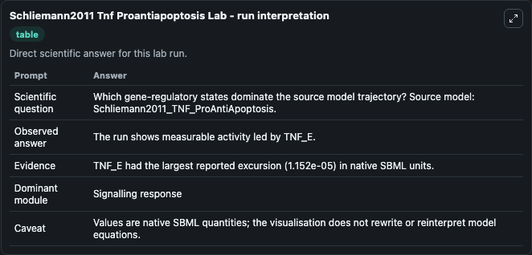
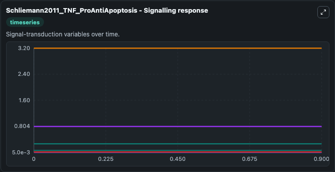
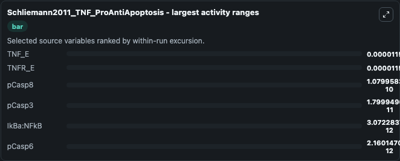
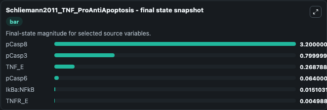
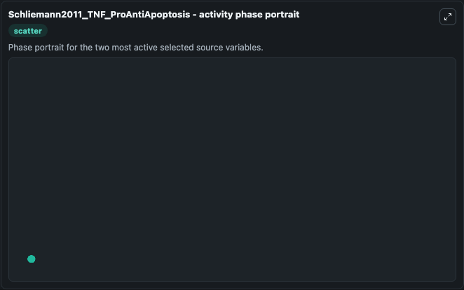

# Schliemann2011 Tnf Proantiapoptosis

This Biosimulant lab wraps `Schliemann2011 Tnf Proantiapoptosis` as a runnable systems biology model with a companion visualization module.
This model is from the article: Heterogeneity Reduces Sensitivity of Cell Death for TNF-Stimuli Schliemann M, Bullinger E, Borchers S, Allgower F, Findeisen R, Scheurich P. It can be used to explore the configured dynamics and compare scenario outcomes across configurations.

## What You'll See

The lab asks: Which gene-regulatory states dominate the source model trajectory? Source model: Schliemann2011_TNF_ProAntiApoptosis. It runs for 1.0 time units with a communication step of 0.1. The run uses the model defaults declared by the curated SBML wrapper. The generated visualizations focus on pCasp8, pCasp3, TNF_E, pCasp6, IkBa:NFkB, and TNFR_E, combining trajectory, endpoint-comparison, and summary-table views from one completed dark-mode run.

In this captured run, **TNF_E** moved from 0.2688 to 0.2688 across 1.0 simulation windows.


### Output Visualizations



*Summary table for Schliemann2011 Tnf Proantiapoptosis, reporting the scientific question, observed answer, dominant module, and caveat.*



*Trajectories of TNF_E, TNFR_E, pCasp8, pCasp3, IkBa:NFkB, and pCasp6 across the 1.0 simulation. In this run **pCasp8** climbed from 3.200 to 3.200 and **TNF_E** fell from 0.2688 to 0.2688 — the largest movements among the focused observables.*



*Largest-excursion ranking of the focused observables — the absolute movement magnitude during the run. Top 3: **TNF_E** = 1.15e-05, **TNFR_E** = 1.15e-05, **pCasp8** = 1.08e-10, with 3 more observables below.*



*Endpoint snapshot of the focused observables — final values from the captured run. Top 3 by value: **pCasp8** = 3.200, **pCasp3** = 0.8000, **TNF_E** = 0.2688, with 3 more observables below.*



*Visualization card from the Schliemann2011 Tnf Proantiapoptosis dark-mode run.*


## Model Context

- Core model: `models/core`
- Visualization model: `models/visualisation`
- Standard: `other`
- Upstream source: `biomodels_ebi:BIOMD0000000407`
- License: `CC0`

## Inputs

| Input | Maps To | Default | Notes |
|---|---|---|---|
| Initial P Casp8 | `systemsbiology_sbml_schliemann2011_tnf_proantiapoptosis_biomd0000000407_model.initial_p_casp8` | | Source state initial condition exposed as a model-specific control because no explicit intervention parameter is identifiable. Maps to SBML symbol `pCasp8`. |
| Initial P Casp3 | `systemsbiology_sbml_schliemann2011_tnf_proantiapoptosis_biomd0000000407_model.initial_p_casp3` | | Source state initial condition exposed as a model-specific control because no explicit intervention parameter is identifiable. Maps to SBML symbol `pCasp3`. |
| Initial TNF E | `systemsbiology_sbml_schliemann2011_tnf_proantiapoptosis_biomd0000000407_model.initial_tnf_e` | | Source state initial condition exposed as a model-specific control because no explicit intervention parameter is identifiable. Maps to SBML symbol `TNF_E`. |
| Initial P Casp6 | `systemsbiology_sbml_schliemann2011_tnf_proantiapoptosis_biomd0000000407_model.initial_p_casp6` | | Source state initial condition exposed as a model-specific control because no explicit intervention parameter is identifiable. Maps to SBML symbol `pCasp6`. |
| Initial Ik Ba N Fk B | `systemsbiology_sbml_schliemann2011_tnf_proantiapoptosis_biomd0000000407_model.initial_ik_ba_n_fk_b` | | Source state initial condition exposed as a model-specific control because no explicit intervention parameter is identifiable. Maps to SBML symbol `IkBa_NFkB`. |
| Initial Tnfr E | `systemsbiology_sbml_schliemann2011_tnf_proantiapoptosis_biomd0000000407_model.initial_tnfr_e` | | Source state initial condition exposed as a model-specific control because no explicit intervention parameter is identifiable. Maps to SBML symbol `TNFR_E`. |

## Outputs

| Output | Maps To | Role |
|---|---|---|
| `state` | `systemsbiology_sbml_schliemann2011_tnf_proantiapoptosis_biomd0000000407_model.state` | Available to the visualization model and downstream workflows. |
| `summary` | `systemsbiology_sbml_schliemann2011_tnf_proantiapoptosis_biomd0000000407_model.summary` | Available to the visualization model and downstream workflows. |
| `species_labels` | `systemsbiology_sbml_schliemann2011_tnf_proantiapoptosis_biomd0000000407_model.species_labels` | Available to the visualization model and downstream workflows. |
| `p_casp8` | `systemsbiology_sbml_schliemann2011_tnf_proantiapoptosis_biomd0000000407_model.p_casp8` | Available to the visualization model and downstream workflows. |
| `p_casp3` | `systemsbiology_sbml_schliemann2011_tnf_proantiapoptosis_biomd0000000407_model.p_casp3` | Available to the visualization model and downstream workflows. |
| `tnf_e` | `systemsbiology_sbml_schliemann2011_tnf_proantiapoptosis_biomd0000000407_model.tnf_e` | Available to the visualization model and downstream workflows. |
| `p_casp6` | `systemsbiology_sbml_schliemann2011_tnf_proantiapoptosis_biomd0000000407_model.p_casp6` | Available to the visualization model and downstream workflows. |
| `ik_ba_n_fk_b` | `systemsbiology_sbml_schliemann2011_tnf_proantiapoptosis_biomd0000000407_model.ik_ba_n_fk_b` | Available to the visualization model and downstream workflows. |
| `tnfr_e` | `systemsbiology_sbml_schliemann2011_tnf_proantiapoptosis_biomd0000000407_model.tnfr_e` | Available to the visualization model and downstream workflows. |

## Runtime

- Duration: `1.0`
- Communication step: `0.1`

## Running Locally

```bash
biosimulant labs serve
```
