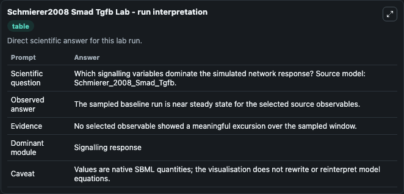
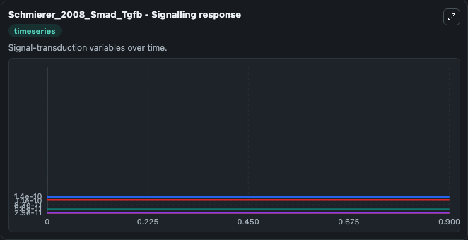
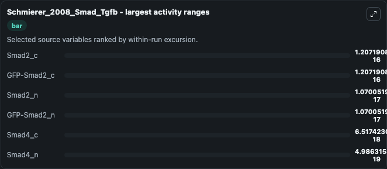
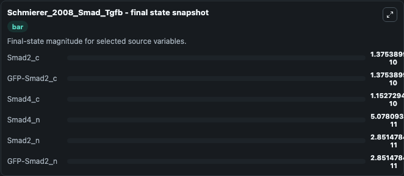
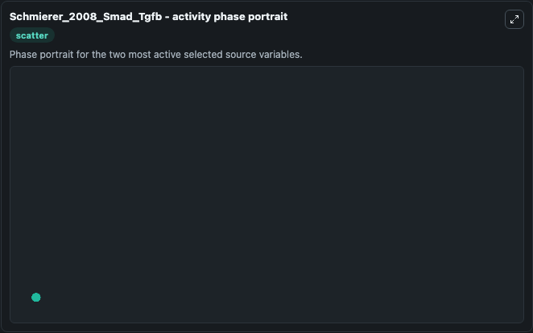

# Schmierer2008 Smad Tgfb

This Biosimulant lab wraps `Schmierer2008 Smad Tgfb` as a runnable systems biology model with a companion visualization module.
This sbml file describes the RECI model from: 'Mathematical modeling identifies Smad nucleocytoplasmic shuttling as a dynamic signal-interpreting system' by Bernhard Schmierer, Alexander L. It can be used to explore the configured dynamics and compare scenario outcomes across configurations.

## What You'll See

The lab asks: Which signalling variables dominate the simulated network response? Source model: Schmierer_2008_Smad_Tgfb. It runs for 1.0 time units with a communication step of 0.1. The run uses the model defaults declared by the curated SBML wrapper. The generated visualizations focus on Smad2_c, GFP-Smad2_c, Smad4_c, Smad4_n, Smad2_n, and GFP-Smad2_n, combining trajectory, endpoint-comparison, and summary-table views from one completed dark-mode run.

In this captured run, **Smad2_c** moved from 1.38e-10 to 1.38e-10 across 1.0 simulation windows.


### Output Visualizations



*Summary table for Schmierer2008 Smad Tgfb, reporting the scientific question, observed answer, dominant module, and caveat.*



*Trajectories of Smad2_c, GFP-Smad2_c, Smad2_n, GFP-Smad2_n, Smad4_c, and Smad4_n across the 1.0 simulation. In this run **Smad2_n** climbed from 2.85e-11 to 2.85e-11 and **Smad2_c** fell from 1.38e-10 to 1.38e-10 — the largest movements among the focused observables.*



*Largest-excursion ranking of the focused observables — the absolute movement magnitude during the run. Top 3: **Smad2_c** = 1.21e-16, **GFP-Smad2_c** = 1.21e-16, **Smad2_n** = 1.07e-17, with 3 more observables below.*



*Endpoint snapshot of the focused observables — final values from the captured run. Top 3 by value: **Smad2_c** = 1.38e-10, **GFP-Smad2_c** = 1.38e-10, **Smad4_c** = 1.15e-10, with 3 more observables below.*



*Visualization card from the Schmierer2008 Smad Tgfb dark-mode run.*


## Model Context

- Core model: `models/core`
- Visualization model: `models/visualisation`
- Standard: `other`
- Upstream source: `biomodels_ebi:BIOMD0000000173`
- License: `CC0`

## Inputs

| Input | Maps To | Default | Notes |
|---|---|---|---|
| Initial Smad2 C | `systemsbiology_sbml_schmierer_2008_smad_tgfb_biomd0000000173_model.initial_smad2_c` | | Source state initial condition exposed as a model-specific control because no explicit intervention parameter is identifiable. Maps to SBML symbol `S2_c`. |
| Initial Gfp Smad2 C | `systemsbiology_sbml_schmierer_2008_smad_tgfb_biomd0000000173_model.initial_gfp_smad2_c` | | Source state initial condition exposed as a model-specific control because no explicit intervention parameter is identifiable. Maps to SBML symbol `G_c`. |
| Initial Smad4 C | `systemsbiology_sbml_schmierer_2008_smad_tgfb_biomd0000000173_model.initial_smad4_c` | | Source state initial condition exposed as a model-specific control because no explicit intervention parameter is identifiable. Maps to SBML symbol `S4_c`. |
| Initial Smad4 N | `systemsbiology_sbml_schmierer_2008_smad_tgfb_biomd0000000173_model.initial_smad4_n` | | Source state initial condition exposed as a model-specific control because no explicit intervention parameter is identifiable. Maps to SBML symbol `S4_n`. |
| Initial Smad2 N | `systemsbiology_sbml_schmierer_2008_smad_tgfb_biomd0000000173_model.initial_smad2_n` | | Source state initial condition exposed as a model-specific control because no explicit intervention parameter is identifiable. Maps to SBML symbol `S2_n`. |
| Initial Gfp Smad2 N | `systemsbiology_sbml_schmierer_2008_smad_tgfb_biomd0000000173_model.initial_gfp_smad2_n` | | Source state initial condition exposed as a model-specific control because no explicit intervention parameter is identifiable. Maps to SBML symbol `G_n`. |

## Outputs

| Output | Maps To | Role |
|---|---|---|
| `state` | `systemsbiology_sbml_schmierer_2008_smad_tgfb_biomd0000000173_model.state` | Available to the visualization model and downstream workflows. |
| `summary` | `systemsbiology_sbml_schmierer_2008_smad_tgfb_biomd0000000173_model.summary` | Available to the visualization model and downstream workflows. |
| `species_labels` | `systemsbiology_sbml_schmierer_2008_smad_tgfb_biomd0000000173_model.species_labels` | Available to the visualization model and downstream workflows. |
| `smad2_c` | `systemsbiology_sbml_schmierer_2008_smad_tgfb_biomd0000000173_model.smad2_c` | Available to the visualization model and downstream workflows. |
| `gfp_smad2_c` | `systemsbiology_sbml_schmierer_2008_smad_tgfb_biomd0000000173_model.gfp_smad2_c` | Available to the visualization model and downstream workflows. |
| `smad4_c` | `systemsbiology_sbml_schmierer_2008_smad_tgfb_biomd0000000173_model.smad4_c` | Available to the visualization model and downstream workflows. |
| `smad4_n` | `systemsbiology_sbml_schmierer_2008_smad_tgfb_biomd0000000173_model.smad4_n` | Available to the visualization model and downstream workflows. |
| `smad2_n` | `systemsbiology_sbml_schmierer_2008_smad_tgfb_biomd0000000173_model.smad2_n` | Available to the visualization model and downstream workflows. |
| `gfp_smad2_n` | `systemsbiology_sbml_schmierer_2008_smad_tgfb_biomd0000000173_model.gfp_smad2_n` | Available to the visualization model and downstream workflows. |

## Runtime

- Duration: `1.0`
- Communication step: `0.1`

## Running Locally

```bash
biosimulant labs serve
```
