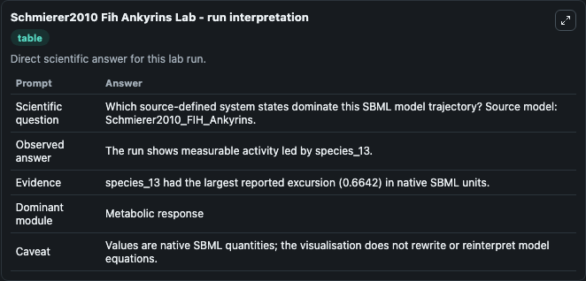
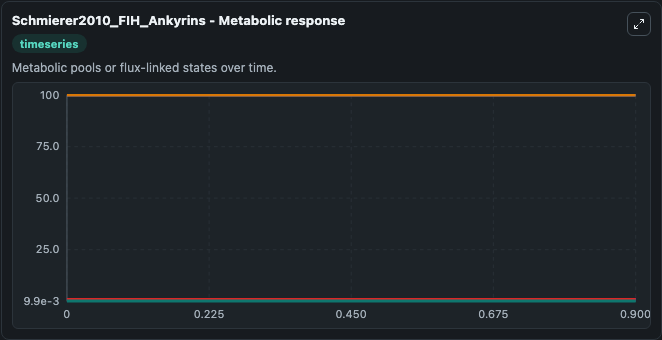
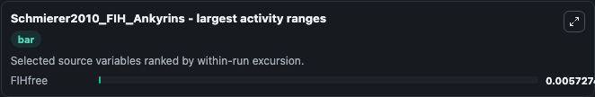
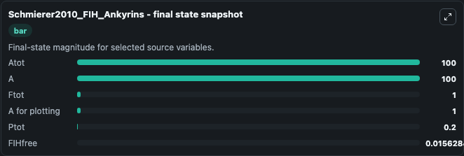

# Schmierer2010 Fih Ankyrins

This Biosimulant lab wraps `Schmierer2010 Fih Ankyrins` as a runnable systems biology model with a companion visualization module.
This a model from the article: Hypoxia-dependent sequestration of an oxygen sensor by a widespread structural motif can shape the hypoxic response - a predictive kinetic model Bernhard Schmierer, Béla. It can be used to explore the configured dynamics and compare scenario outcomes across configurations.

## What You'll See

The lab asks: Which source-defined system states dominate this SBML model trajectory? Source model: Schmierer2010_FIH_Ankyrins. It runs for 1.0 time units with a communication step of 0.1. The run uses the model defaults declared by the curated SBML wrapper. The generated visualizations focus on Atot, A, Ftot, A for plotting, Ptot, and FIHfree, combining trajectory, endpoint-comparison, and summary-table views from one completed dark-mode run.

In this captured run, **FIHfree** moved from 0.0099 to 0.0156 across 1.0 simulation windows.


### Output Visualizations



*Summary table for Schmierer2010 Fih Ankyrins, reporting the scientific question, observed answer, dominant module, and caveat.*



*Trajectories of FIHfree, Atot, A, Ftot, A for plotting, and Ptot across the 1.0 simulation. In this run **FIHfree** climbed from 0.0099 to 0.0156 — the largest movements among the focused observables.*



*Largest-excursion ranking of the focused observables — the absolute movement magnitude during the run. Top 1: **FIHfree** = 0.00573.*



*Endpoint snapshot of the focused observables — final values from the captured run. Top 3 by value: **Atot** = 100.0, **A** = 100.0, **Ftot** = 1.000, with 3 more observables below.*


## Model Context

- Core model: `models/core`
- Visualization model: `models/visualisation`
- Standard: `other`
- Upstream source: `biomodels_ebi:BIOMD0000000300`
- License: `CC0`

## Inputs

| Input | Maps To | Default | Notes |
|---|---|---|---|
| Initial Atot | `systemsbiology_sbml_schmierer2010_fih_ankyrins_biomd0000000300_model.initial_atot` | | Source state initial condition exposed as a model-specific control because no explicit intervention parameter is identifiable. Maps to SBML symbol `species_5`. |
| Initial Model State A | `systemsbiology_sbml_schmierer2010_fih_ankyrins_biomd0000000300_model.initial_model_state_a` | | Source state initial condition exposed as a model-specific control because no explicit intervention parameter is identifiable. Maps to SBML symbol `species_3`. |
| Initial Ftot | `systemsbiology_sbml_schmierer2010_fih_ankyrins_biomd0000000300_model.initial_ftot` | | Source state initial condition exposed as a model-specific control because no explicit intervention parameter is identifiable. Maps to SBML symbol `species_7`. |
| Initial A For Plotting | `systemsbiology_sbml_schmierer2010_fih_ankyrins_biomd0000000300_model.initial_a_for_plotting` | | Source state initial condition exposed as a model-specific control because no explicit intervention parameter is identifiable. Maps to SBML symbol `species_16`. |
| Initial Ptot | `systemsbiology_sbml_schmierer2010_fih_ankyrins_biomd0000000300_model.initial_ptot` | | Source state initial condition exposed as a model-specific control because no explicit intervention parameter is identifiable. Maps to SBML symbol `species_8`. |
| Initial Fi Hfree | `systemsbiology_sbml_schmierer2010_fih_ankyrins_biomd0000000300_model.initial_fi_hfree` | | Source state initial condition exposed as a model-specific control because no explicit intervention parameter is identifiable. Maps to SBML symbol `species_12`. |

## Outputs

| Output | Maps To | Role |
|---|---|---|
| `state` | `systemsbiology_sbml_schmierer2010_fih_ankyrins_biomd0000000300_model.state` | Available to the visualization model and downstream workflows. |
| `summary` | `systemsbiology_sbml_schmierer2010_fih_ankyrins_biomd0000000300_model.summary` | Available to the visualization model and downstream workflows. |
| `species_labels` | `systemsbiology_sbml_schmierer2010_fih_ankyrins_biomd0000000300_model.species_labels` | Available to the visualization model and downstream workflows. |
| `atot` | `systemsbiology_sbml_schmierer2010_fih_ankyrins_biomd0000000300_model.atot` | Available to the visualization model and downstream workflows. |
| `model_state_a` | `systemsbiology_sbml_schmierer2010_fih_ankyrins_biomd0000000300_model.model_state_a` | Available to the visualization model and downstream workflows. |
| `ftot` | `systemsbiology_sbml_schmierer2010_fih_ankyrins_biomd0000000300_model.ftot` | Available to the visualization model and downstream workflows. |
| `a_for_plotting` | `systemsbiology_sbml_schmierer2010_fih_ankyrins_biomd0000000300_model.a_for_plotting` | Available to the visualization model and downstream workflows. |
| `ptot` | `systemsbiology_sbml_schmierer2010_fih_ankyrins_biomd0000000300_model.ptot` | Available to the visualization model and downstream workflows. |
| `fi_hfree` | `systemsbiology_sbml_schmierer2010_fih_ankyrins_biomd0000000300_model.fi_hfree` | Available to the visualization model and downstream workflows. |

## Runtime

- Duration: `1.0`
- Communication step: `0.1`

## Running Locally

```bash
biosimulant labs serve
```
