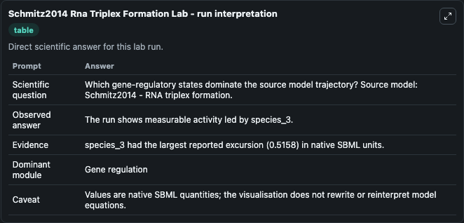
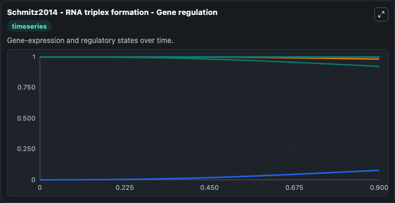
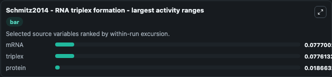
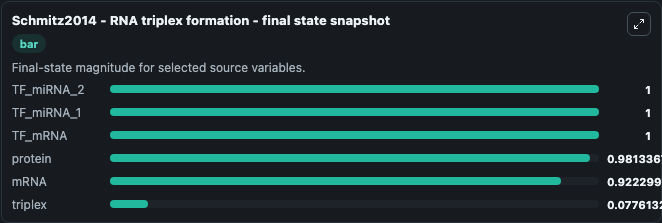
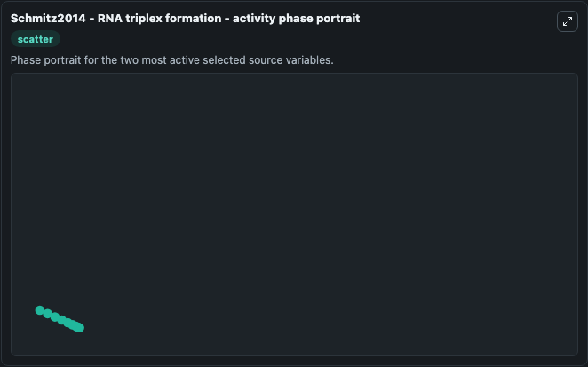

# Schmitz2014 Rna Triplex Formation

This Biosimulant lab wraps `Schmitz2014 Rna Triplex Formation` as a runnable systems biology model with a companion visualization module.
Schmitz2014 - RNA triplex formation The model is parameterized using theparameters for gene CCDC3 from Supplementary Table S1. It can be used to explore the configured dynamics and compare scenario outcomes across configurations.

## What You'll See

The lab asks: Which gene-regulatory states dominate the source model trajectory? Source model: Schmitz2014 - RNA triplex formation. It runs for 1.0 time units with a communication step of 0.1. The run uses the model defaults declared by the curated SBML wrapper. The generated visualizations focus on protein, mRNA, TF_miRNA_2, TF_miRNA_1, TF_mRNA, and triplex, combining trajectory, endpoint-comparison, and summary-table views from one completed dark-mode run.

In this captured run, **mRNA** moved from 1.000 to 0.9223 across 1.0 simulation windows.


### Output Visualizations



*Summary table for Schmitz2014 Rna Triplex Formation, reporting the scientific question, observed answer, dominant module, and caveat.*



*Trajectories of mRNA, triplex, protein, TF_miRNA_2, TF_miRNA_1, and TF_mRNA across the 1.0 simulation. In this run **triplex** climbed from 0 to 0.0776 and **mRNA** fell from 1.000 to 0.9223 — the largest movements among the focused observables.*



*Largest-excursion ranking of the focused observables — the absolute movement magnitude during the run. Top 3: **mRNA** = 0.0777, **triplex** = 0.0776, **protein** = 0.0187.*



*Endpoint snapshot of the focused observables — final values from the captured run. Top 3 by value: **TF_miRNA_2** = 1.000, **TF_miRNA_1** = 1.000, **TF_mRNA** = 1.000, with 3 more observables below.*



*Visualization card from the Schmitz2014 Rna Triplex Formation dark-mode run.*


## Model Context

- Core model: `models/core`
- Visualization model: `models/visualisation`
- Standard: `other`
- Upstream source: `biomodels_ebi:BIOMD0000000530`
- License: `CC0`

## Inputs

| Input | Maps To | Default | Notes |
|---|---|---|---|
| Initial Protein | `systemsbiology_sbml_schmitz2014_rna_triplex_formation_biomd0000000530_model.initial_protein` | | Source state initial condition exposed as a model-specific control because no explicit intervention parameter is identifiable. Maps to SBML symbol `species_10`. |
| Initial MRNA | `systemsbiology_sbml_schmitz2014_rna_triplex_formation_biomd0000000530_model.initial_mrna` | | Source state initial condition exposed as a model-specific control because no explicit intervention parameter is identifiable. Maps to SBML symbol `species_1`. |
| Initial Tf Mi RNA 2 | `systemsbiology_sbml_schmitz2014_rna_triplex_formation_biomd0000000530_model.initial_tf_mi_rna_2` | | Source state initial condition exposed as a model-specific control because no explicit intervention parameter is identifiable. Maps to SBML symbol `species_9`. |
| Initial Tf Mi RNA 1 | `systemsbiology_sbml_schmitz2014_rna_triplex_formation_biomd0000000530_model.initial_tf_mi_rna_1` | | Source state initial condition exposed as a model-specific control because no explicit intervention parameter is identifiable. Maps to SBML symbol `species_8`. |
| Initial Tf MRNA | `systemsbiology_sbml_schmitz2014_rna_triplex_formation_biomd0000000530_model.initial_tf_mrna` | | Source state initial condition exposed as a model-specific control because no explicit intervention parameter is identifiable. Maps to SBML symbol `species_7`. |
| Initial Triplex | `systemsbiology_sbml_schmitz2014_rna_triplex_formation_biomd0000000530_model.initial_triplex` | | Source state initial condition exposed as a model-specific control because no explicit intervention parameter is identifiable. Maps to SBML symbol `species_6`. |

## Outputs

| Output | Maps To | Role |
|---|---|---|
| `state` | `systemsbiology_sbml_schmitz2014_rna_triplex_formation_biomd0000000530_model.state` | Available to the visualization model and downstream workflows. |
| `summary` | `systemsbiology_sbml_schmitz2014_rna_triplex_formation_biomd0000000530_model.summary` | Available to the visualization model and downstream workflows. |
| `species_labels` | `systemsbiology_sbml_schmitz2014_rna_triplex_formation_biomd0000000530_model.species_labels` | Available to the visualization model and downstream workflows. |
| `protein` | `systemsbiology_sbml_schmitz2014_rna_triplex_formation_biomd0000000530_model.protein` | Available to the visualization model and downstream workflows. |
| `mrna` | `systemsbiology_sbml_schmitz2014_rna_triplex_formation_biomd0000000530_model.mrna` | Available to the visualization model and downstream workflows. |
| `tf_mi_rna_2` | `systemsbiology_sbml_schmitz2014_rna_triplex_formation_biomd0000000530_model.tf_mi_rna_2` | Available to the visualization model and downstream workflows. |
| `tf_mi_rna_1` | `systemsbiology_sbml_schmitz2014_rna_triplex_formation_biomd0000000530_model.tf_mi_rna_1` | Available to the visualization model and downstream workflows. |
| `tf_mrna` | `systemsbiology_sbml_schmitz2014_rna_triplex_formation_biomd0000000530_model.tf_mrna` | Available to the visualization model and downstream workflows. |
| `triplex` | `systemsbiology_sbml_schmitz2014_rna_triplex_formation_biomd0000000530_model.triplex` | Available to the visualization model and downstream workflows. |

## Runtime

- Duration: `1.0`
- Communication step: `0.1`

## Running Locally

```bash
biosimulant labs serve
```
