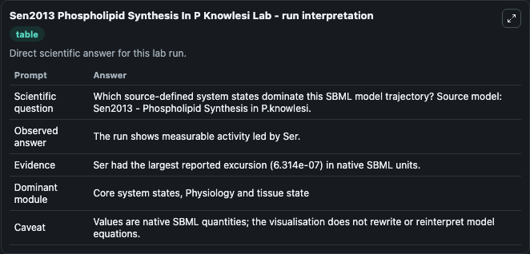
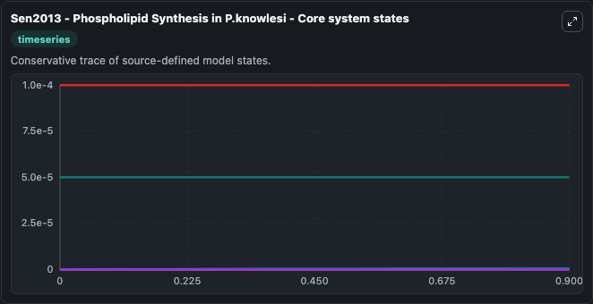
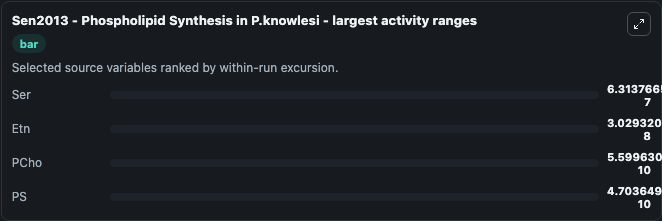
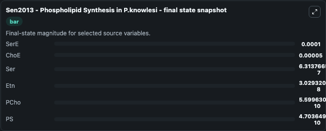
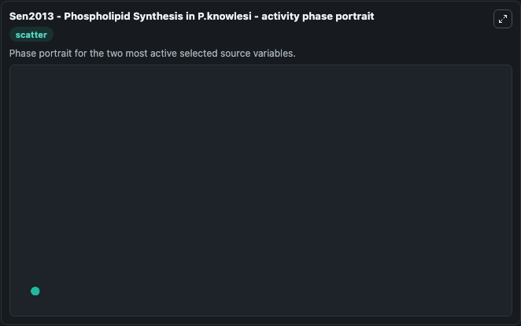

# Sen2013 Phospholipid Synthesis In P Knowlesi

This Biosimulant lab wraps `Sen2013 Phospholipid Synthesis In P Knowlesi` as a runnable systems biology model with a companion visualization module.
Sen2013 - Phospholipid Synthesis in P.knowlesi The model describes the multiple phospholipid synthetic pathways in Plasmodium knowlesi. It can be used to explore the configured dynamics and compare scenario outcomes across configurations.

## What You'll See

The lab asks: Which source-defined system states dominate this SBML model trajectory? Source model: Sen2013 - Phospholipid Synthesis in P.knowlesi. It runs for 1.0 time units with a communication step of 0.1. The run uses the model defaults declared by the curated SBML wrapper. The generated visualizations focus on SerE, PCho, Etn, ChoE, Ser, and PS, combining trajectory, endpoint-comparison, and summary-table views from one completed dark-mode run.

In this captured run, **Ser** moved from 0 to 6.31e-07 across 1.0 simulation windows.


### Output Visualizations



*Summary table for Sen2013 Phospholipid Synthesis In P Knowlesi, reporting the scientific question, observed answer, dominant module, and caveat.*



*Trajectories of Ser, Etn, PCho, PS, SerE, and ChoE across the 1.0 simulation. In this run **Ser** climbed from 0 to 6.31e-07 — the largest movements among the focused observables.*



*Largest-excursion ranking of the focused observables — the absolute movement magnitude during the run. Top 3: **Ser** = 6.31e-07, **Etn** = 3.03e-08, **PCho** = 5.6e-10, with 1 more observable below.*



*Endpoint snapshot of the focused observables — final values from the captured run. Top 3 by value: **SerE** = 0.0001, **ChoE** = 5e-05, **Ser** = 6.31e-07, with 3 more observables below.*



*Visualization card from the Sen2013 Phospholipid Synthesis In P Knowlesi dark-mode run.*


## Model Context

- Core model: `models/core`
- Visualization model: `models/visualisation`
- Standard: `other`
- Upstream source: `biomodels_ebi:BIOMD0000000495`
- License: `CC0`

## Inputs

| Input | Maps To | Default | Notes |
|---|---|---|---|
| Initial Ser E | `systemsbiology_sbml_sen2013_phospholipid_synthesis_in_p_knowlesi_biomd0000000495_model.initial_ser_e` | | Source state initial condition exposed as a model-specific control because no explicit intervention parameter is identifiable. Maps to SBML symbol `mw73259e20_240e_4f3a_b2e0_9ca248658898`. |
| Initial P Cho | `systemsbiology_sbml_sen2013_phospholipid_synthesis_in_p_knowlesi_biomd0000000495_model.initial_p_cho` | | Source state initial condition exposed as a model-specific control because no explicit intervention parameter is identifiable. Maps to SBML symbol `mwcb834e43_dc57_45ae_9452_f4c10955caf1`. |
| Initial Model State Etn | `systemsbiology_sbml_sen2013_phospholipid_synthesis_in_p_knowlesi_biomd0000000495_model.initial_model_state_etn` | | Source state initial condition exposed as a model-specific control because no explicit intervention parameter is identifiable. Maps to SBML symbol `mw8796c919_9251_4970_8f87_0bca9ecfeb5c`. |
| Initial Cho E | `systemsbiology_sbml_sen2013_phospholipid_synthesis_in_p_knowlesi_biomd0000000495_model.initial_cho_e` | | Source state initial condition exposed as a model-specific control because no explicit intervention parameter is identifiable. Maps to SBML symbol `mw919f8a86_e702_4b24_9cd7_adad694fcf9b`. |
| Initial Model State Ser | `systemsbiology_sbml_sen2013_phospholipid_synthesis_in_p_knowlesi_biomd0000000495_model.initial_model_state_ser` | | Source state initial condition exposed as a model-specific control because no explicit intervention parameter is identifiable. Maps to SBML symbol `mw15abaa48_d7d0_4845_ae04_c573d289d495`. |
| Initial Model State Ps | `systemsbiology_sbml_sen2013_phospholipid_synthesis_in_p_knowlesi_biomd0000000495_model.initial_model_state_ps` | | Source state initial condition exposed as a model-specific control because no explicit intervention parameter is identifiable. Maps to SBML symbol `mwfcfaf604_14d4_47a6_b021_226d1fb5497c`. |

## Outputs

| Output | Maps To | Role |
|---|---|---|
| `state` | `systemsbiology_sbml_sen2013_phospholipid_synthesis_in_p_knowlesi_biomd0000000495_model.state` | Available to the visualization model and downstream workflows. |
| `summary` | `systemsbiology_sbml_sen2013_phospholipid_synthesis_in_p_knowlesi_biomd0000000495_model.summary` | Available to the visualization model and downstream workflows. |
| `species_labels` | `systemsbiology_sbml_sen2013_phospholipid_synthesis_in_p_knowlesi_biomd0000000495_model.species_labels` | Available to the visualization model and downstream workflows. |
| `ser_e` | `systemsbiology_sbml_sen2013_phospholipid_synthesis_in_p_knowlesi_biomd0000000495_model.ser_e` | Available to the visualization model and downstream workflows. |
| `p_cho` | `systemsbiology_sbml_sen2013_phospholipid_synthesis_in_p_knowlesi_biomd0000000495_model.p_cho` | Available to the visualization model and downstream workflows. |
| `etn` | `systemsbiology_sbml_sen2013_phospholipid_synthesis_in_p_knowlesi_biomd0000000495_model.etn` | Available to the visualization model and downstream workflows. |
| `cho_e` | `systemsbiology_sbml_sen2013_phospholipid_synthesis_in_p_knowlesi_biomd0000000495_model.cho_e` | Available to the visualization model and downstream workflows. |
| `ser` | `systemsbiology_sbml_sen2013_phospholipid_synthesis_in_p_knowlesi_biomd0000000495_model.ser` | Available to the visualization model and downstream workflows. |
| `model_state_ps` | `systemsbiology_sbml_sen2013_phospholipid_synthesis_in_p_knowlesi_biomd0000000495_model.model_state_ps` | Available to the visualization model and downstream workflows. |

## Runtime

- Duration: `1.0`
- Communication step: `0.1`

## Running Locally

```bash
biosimulant labs serve
```
