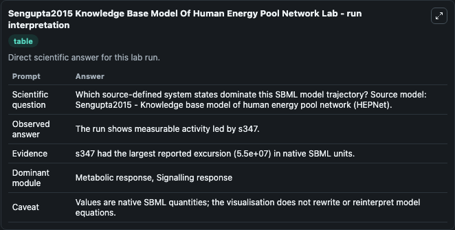
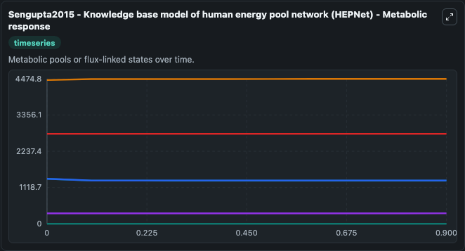
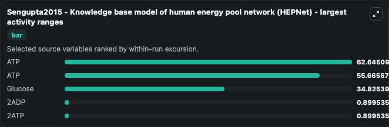
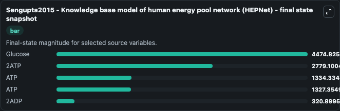
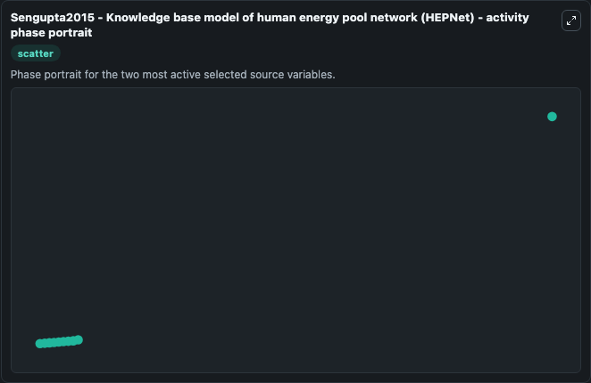

# Sengupta2015 Knowledge Base Model Of Human Energy Pool Network

This Biosimulant lab wraps `Sengupta2015 Knowledge Base Model Of Human Energy Pool Network` as a runnable systems biology model with a companion visualization module.
Sengupta2015 - Knowledge base model of humanenergy pool network (HEPNet) This model is described in the article: HEPNet: A Knowledge Base Model of Human Energy Pool Network for Predicting the Energy A. It can be used to explore the configured dynamics and compare scenario outcomes across configurations.

## What You'll See

The lab asks: Which source-defined system states dominate this SBML model trajectory? Source model: Sengupta2015 - Knowledge base model of human energy pool network (HEPNet). It runs for 1.0 time units with a communication step of 0.1. The run uses the model defaults declared by the curated SBML wrapper. The generated visualizations focus on UDP glucose4epimerase, Glucose, 2ATP, ATP, and 2ADP, combining trajectory, endpoint-comparison, and summary-table views from one completed dark-mode run.

In this captured run, **ATP** moved from 1390.0 to 1327.4 across 1.0 simulation windows.


### Output Visualizations



*Summary table for Sengupta2015 Knowledge Base Model Of Human Energy Pool Network, reporting the scientific question, observed answer, dominant module, and caveat.*



*Trajectories of ATP, ATP, Glucose, 2ADP, 2ATP, and UDP glucose4epimerase across the 1.0 simulation. In this run **Glucose** climbed from 4440.0 to 4474.8 and **ATP** fell from 1390.0 to 1327.4 — the largest movements among the focused observables.*



*Largest-excursion ranking of the focused observables — the absolute movement magnitude during the run. Top 3: **ATP** = 62.645, **ATP** = 55.666, **Glucose** = 34.825, with 2 more observables below.*



*Endpoint snapshot of the focused observables — final values from the captured run. Top 3 by value: **Glucose** = 4474.8, **2ATP** = 2779.1, **ATP** = 1334.3, with 2 more observables below.*



*Visualization card from the Sengupta2015 Knowledge Base Model Of Human Energy Pool Network dark-mode run.*


## Model Context

- Core model: `models/core`
- Visualization model: `models/visualisation`
- Standard: `other`
- Upstream source: `biomodels_ebi:BIOMD0000000579`
- License: `CC0`

## Inputs

| Input | Maps To | Default | Notes |
|---|---|---|---|
| Initial Udp Glucose4epimerase | `systemsbiology_sbml_sengupta2015_knowledge_base_model_of_human_energ_biomd0000000579_model.initial_udp_glucose4epimerase` | | Source state initial condition exposed as a model-specific control because no explicit intervention parameter is identifiable. Maps to SBML symbol `s13`. |
| Initial Glucose | `systemsbiology_sbml_sengupta2015_knowledge_base_model_of_human_energ_biomd0000000579_model.initial_glucose` | | Source state initial condition exposed as a model-specific control because no explicit intervention parameter is identifiable. Maps to SBML symbol `s71`. |
| Initial Model State 2 ATP | `systemsbiology_sbml_sengupta2015_knowledge_base_model_of_human_energ_biomd0000000579_model.initial_model_state_2_atp` | | Source state initial condition exposed as a model-specific control because no explicit intervention parameter is identifiable. Maps to SBML symbol `s29`. |
| Initial Model State ATP | `systemsbiology_sbml_sengupta2015_knowledge_base_model_of_human_energ_biomd0000000579_model.initial_model_state_atp` | | Source state initial condition exposed as a model-specific control because no explicit intervention parameter is identifiable. Maps to SBML symbol `s63`. |
| Initial Model State ATP 2 | `systemsbiology_sbml_sengupta2015_knowledge_base_model_of_human_energ_biomd0000000579_model.initial_model_state_atp_2` | | Source state initial condition exposed as a model-specific control because no explicit intervention parameter is identifiable. Maps to SBML symbol `s345`. |
| Initial Model State 2 ADP | `systemsbiology_sbml_sengupta2015_knowledge_base_model_of_human_energ_biomd0000000579_model.initial_model_state_2_adp` | | Source state initial condition exposed as a model-specific control because no explicit intervention parameter is identifiable. Maps to SBML symbol `s30`. |

## Outputs

| Output | Maps To | Role |
|---|---|---|
| `state` | `systemsbiology_sbml_sengupta2015_knowledge_base_model_of_human_energ_biomd0000000579_model.state` | Available to the visualization model and downstream workflows. |
| `summary` | `systemsbiology_sbml_sengupta2015_knowledge_base_model_of_human_energ_biomd0000000579_model.summary` | Available to the visualization model and downstream workflows. |
| `species_labels` | `systemsbiology_sbml_sengupta2015_knowledge_base_model_of_human_energ_biomd0000000579_model.species_labels` | Available to the visualization model and downstream workflows. |
| `udp_glucose4epimerase` | `systemsbiology_sbml_sengupta2015_knowledge_base_model_of_human_energ_biomd0000000579_model.udp_glucose4epimerase` | Available to the visualization model and downstream workflows. |
| `glucose` | `systemsbiology_sbml_sengupta2015_knowledge_base_model_of_human_energ_biomd0000000579_model.glucose` | Available to the visualization model and downstream workflows. |
| `model_state_2_atp` | `systemsbiology_sbml_sengupta2015_knowledge_base_model_of_human_energ_biomd0000000579_model.model_state_2_atp` | Available to the visualization model and downstream workflows. |
| `atp` | `systemsbiology_sbml_sengupta2015_knowledge_base_model_of_human_energ_biomd0000000579_model.atp` | Available to the visualization model and downstream workflows. |
| `atp_2` | `systemsbiology_sbml_sengupta2015_knowledge_base_model_of_human_energ_biomd0000000579_model.atp_2` | Available to the visualization model and downstream workflows. |
| `model_state_2_adp` | `systemsbiology_sbml_sengupta2015_knowledge_base_model_of_human_energ_biomd0000000579_model.model_state_2_adp` | Available to the visualization model and downstream workflows. |

## Runtime

- Duration: `1.0`
- Communication step: `0.1`

## Running Locally

```bash
biosimulant labs serve
```
