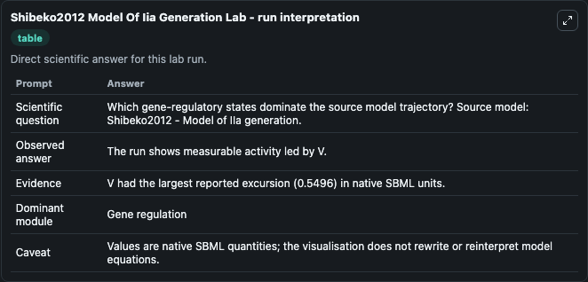
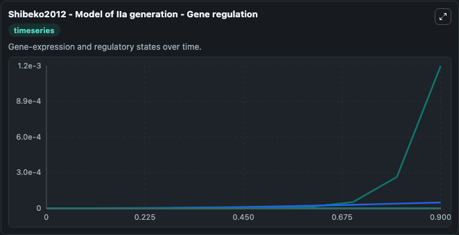
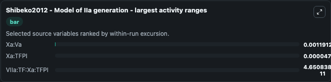
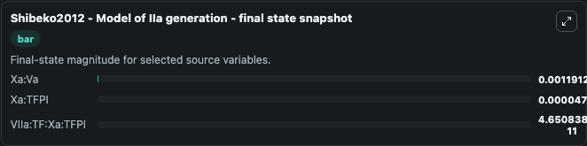
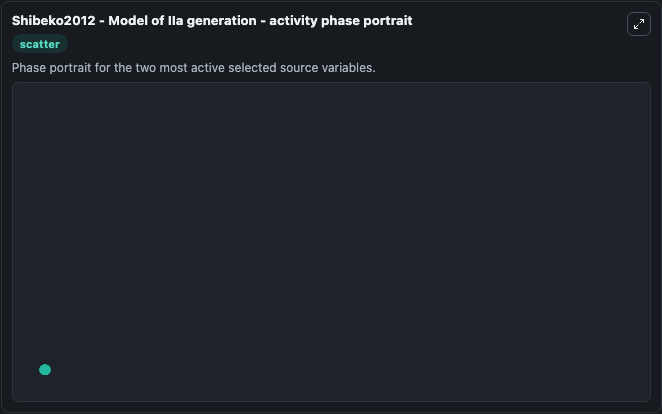

# Shibeko2012 Model Of Iia Generation

This Biosimulant lab wraps `Shibeko2012 Model Of Iia Generation` as a runnable systems biology model with a companion visualization module.
Mathematical model of blood coagulation investigating the effects of varied rFVIIa and TF concentration. It can be used to explore the configured dynamics and compare scenario outcomes across configurations.

## What You'll See

The lab asks: Which gene-regulatory states dominate the source model trajectory? Source model: Shibeko2012 - Model of IIa generation. It runs for 1.0 time units with a communication step of 0.1. The run uses the model defaults declared by the curated SBML wrapper. The generated visualizations focus on Xa:Va, Xa:TFPI, VIIa_i:TF:Xa:TFPI, VIIa_i:TF, VIIa_i, and VIIa:TF:Xa:TFPI, combining trajectory, endpoint-comparison, and summary-table views from one completed dark-mode run.

In this captured run, **Xa:Va** moved from 0 to 0.00119 across 1.0 simulation windows.


### Output Visualizations



*Summary table for Shibeko2012 Model Of Iia Generation, reporting the scientific question, observed answer, dominant module, and caveat.*



*Trajectories of Xa:Va, Xa:TFPI, VIIa:TF:Xa:TFPI, VIIa_i:TF:Xa:TFPI, VIIa_i:TF, and VIIa_i across the 1.0 simulation. In this run **Xa:Va** climbed from 0 to 0.00119 — the largest movements among the focused observables.*



*Largest-excursion ranking of the focused observables — the absolute movement magnitude during the run. Top 3: **Xa:Va** = 0.00119, **Xa:TFPI** = 4.77e-05, **VIIa:TF:Xa:TFPI** = 4.65e-11.*



*Endpoint snapshot of the focused observables — final values from the captured run. Top 3 by value: **Xa:Va** = 0.00119, **Xa:TFPI** = 4.77e-05, **VIIa:TF:Xa:TFPI** = 4.65e-11.*



*Visualization card from the Shibeko2012 Model Of Iia Generation dark-mode run.*


## Model Context

- Core model: `models/core`
- Visualization model: `models/visualisation`
- Standard: `other`
- Upstream source: `biomodels_ebi:MODEL1808150001`
- License: `CC0`

## Inputs

| Input | Maps To | Default | Notes |
|---|---|---|---|
| Initial Xa Va | `systemsbiology_sbml_shibeko2012_model_of_iia_generation_model1808150001_model.initial_xa_va` | | Source state initial condition exposed as a model-specific control because no explicit intervention parameter is identifiable. Maps to SBML symbol `Xa_Va`. |
| Initial Xa Tfpi | `systemsbiology_sbml_shibeko2012_model_of_iia_generation_model1808150001_model.initial_xa_tfpi` | | Source state initial condition exposed as a model-specific control because no explicit intervention parameter is identifiable. Maps to SBML symbol `Xa_TFPI`. |
| Initial Vi Ia I Tf Xa Tfpi | `systemsbiology_sbml_shibeko2012_model_of_iia_generation_model1808150001_model.initial_vi_ia_i_tf_xa_tfpi` | | Source state initial condition exposed as a model-specific control because no explicit intervention parameter is identifiable. Maps to SBML symbol `VIIa_i_TF_Xa_TFPI`. |
| Initial Vi Ia I Tf | `systemsbiology_sbml_shibeko2012_model_of_iia_generation_model1808150001_model.initial_vi_ia_i_tf` | | Source state initial condition exposed as a model-specific control because no explicit intervention parameter is identifiable. Maps to SBML symbol `VIIa_i_TF`. |
| Initial Vi Ia I | `systemsbiology_sbml_shibeko2012_model_of_iia_generation_model1808150001_model.initial_vi_ia_i` | | Source state initial condition exposed as a model-specific control because no explicit intervention parameter is identifiable. Maps to SBML symbol `VIIa_i`. |
| Initial Vi Ia Tf Xa Tfpi | `systemsbiology_sbml_shibeko2012_model_of_iia_generation_model1808150001_model.initial_vi_ia_tf_xa_tfpi` | | Source state initial condition exposed as a model-specific control because no explicit intervention parameter is identifiable. Maps to SBML symbol `VIIa_TF_Xa_TFPI`. |

## Outputs

| Output | Maps To | Role |
|---|---|---|
| `state` | `systemsbiology_sbml_shibeko2012_model_of_iia_generation_model1808150001_model.state` | Available to the visualization model and downstream workflows. |
| `summary` | `systemsbiology_sbml_shibeko2012_model_of_iia_generation_model1808150001_model.summary` | Available to the visualization model and downstream workflows. |
| `species_labels` | `systemsbiology_sbml_shibeko2012_model_of_iia_generation_model1808150001_model.species_labels` | Available to the visualization model and downstream workflows. |
| `xa_va` | `systemsbiology_sbml_shibeko2012_model_of_iia_generation_model1808150001_model.xa_va` | Available to the visualization model and downstream workflows. |
| `xa_tfpi` | `systemsbiology_sbml_shibeko2012_model_of_iia_generation_model1808150001_model.xa_tfpi` | Available to the visualization model and downstream workflows. |
| `vi_ia_i_tf_xa_tfpi` | `systemsbiology_sbml_shibeko2012_model_of_iia_generation_model1808150001_model.vi_ia_i_tf_xa_tfpi` | Available to the visualization model and downstream workflows. |
| `vi_ia_i_tf` | `systemsbiology_sbml_shibeko2012_model_of_iia_generation_model1808150001_model.vi_ia_i_tf` | Available to the visualization model and downstream workflows. |
| `vi_ia_i` | `systemsbiology_sbml_shibeko2012_model_of_iia_generation_model1808150001_model.vi_ia_i` | Available to the visualization model and downstream workflows. |
| `vi_ia_tf_xa_tfpi` | `systemsbiology_sbml_shibeko2012_model_of_iia_generation_model1808150001_model.vi_ia_tf_xa_tfpi` | Available to the visualization model and downstream workflows. |

## Runtime

- Duration: `1.0`
- Communication step: `0.1`

## Running Locally

```bash
biosimulant labs serve
```
