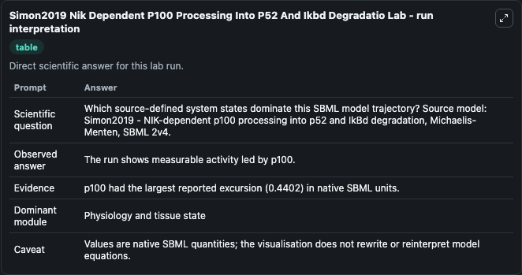
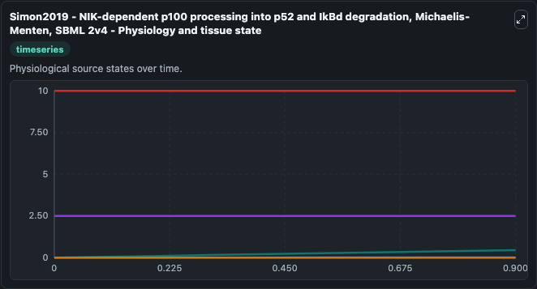
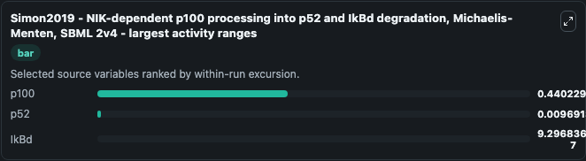
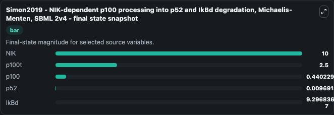
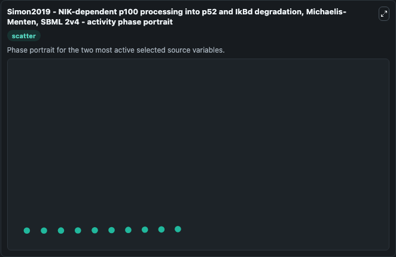

# Simon2019 Nik Dependent P100 Processing Into P52 And Ikbd Degradatio (BIOMD0000000869)

This Biosimulant lab wraps `BIOMD0000000869 Simon2019 Nik Dependent P100 Processing Into P52 And Ikbd Degradatio` as a runnable systems biology model with a companion visualization module.
This model represents NIK-dependent p100 processing into p52 and NIK-dependent IkBd degradation with Michaelis-Menten kinetics. It can be used to explore the configured dynamics and compare scenario outcomes across configurations.

## What You'll See

The lab asks: Which source-defined system states dominate this SBML model trajectory? Source model: Simon2019 - NIK-dependent p100 processing into p52 and IkBd degradation, Michaelis-Menten, SBML 2v4. It runs for 1.0 time units with a communication step of 0.1. The run uses the model defaults declared by the curated SBML wrapper. The generated visualizations focus on p100t, p52, p100, NIK, and IkBd, combining trajectory, endpoint-comparison, and summary-table views from one completed dark-mode run.

In this captured run, **p100** moved from 0 to 0.4402 across 1.0 simulation windows.


### Output Visualizations



*Summary table for Simon2019 Nik Dependent P100 Processing Into P52 And Ikbd Degradatio, reporting the scientific question, observed answer, dominant module, and caveat.*



*Trajectories of p100, p52, IkBd, p100t, and NIK across the 1.0 simulation. In this run **p100** climbed from 0 to 0.4402 — the largest movements among the focused observables.*



*Largest-excursion ranking of the focused observables — the absolute movement magnitude during the run. Top 3: **p100** = 0.4402, **p52** = 0.00969, **IkBd** = 9.3e-07.*



*Endpoint snapshot of the focused observables — final values from the captured run. Top 3 by value: **NIK** = 10.000, **p100t** = 2.500, **p100** = 0.4402, with 2 more observables below.*



*Visualization card from the Simon2019 Nik Dependent P100 Processing Into P52 And Ikbd Degradatio dark-mode run.*


## Model Context

- Core model: `models/core`
- Visualization model: `models/visualisation`
- Standard: `other`
- Upstream source: `biomodels_ebi:BIOMD0000000869`
- License: `CC0`

## Inputs

| Input | Maps To | Default | Notes |
|---|---|---|---|
| Initial P100t | `systemsbiology_sbml_simon2019_nik_dependent_p100_processing_into_p52_biomd0000000869_model.initial_p100t` | | Source state initial condition exposed as a model-specific control because no explicit intervention parameter is identifiable. Maps to SBML symbol `p100t`. |
| Initial Model State P52 | `systemsbiology_sbml_simon2019_nik_dependent_p100_processing_into_p52_biomd0000000869_model.initial_model_state_p52` | | Source state initial condition exposed as a model-specific control because no explicit intervention parameter is identifiable. Maps to SBML symbol `p52`. |
| Initial P100 | `systemsbiology_sbml_simon2019_nik_dependent_p100_processing_into_p52_biomd0000000869_model.initial_p100` | | Source state initial condition exposed as a model-specific control because no explicit intervention parameter is identifiable. Maps to SBML symbol `p100`. |
| Initial Model State Nik | `systemsbiology_sbml_simon2019_nik_dependent_p100_processing_into_p52_biomd0000000869_model.initial_model_state_nik` | | Source state initial condition exposed as a model-specific control because no explicit intervention parameter is identifiable. Maps to SBML symbol `NIK`. |
| Initial Ik Bd | `systemsbiology_sbml_simon2019_nik_dependent_p100_processing_into_p52_biomd0000000869_model.initial_ik_bd` | | Source state initial condition exposed as a model-specific control because no explicit intervention parameter is identifiable. Maps to SBML symbol `IkBd`. |

## Outputs

| Output | Maps To | Role |
|---|---|---|
| `state` | `systemsbiology_sbml_simon2019_nik_dependent_p100_processing_into_p52_biomd0000000869_model.state` | Available to the visualization model and downstream workflows. |
| `summary` | `systemsbiology_sbml_simon2019_nik_dependent_p100_processing_into_p52_biomd0000000869_model.summary` | Available to the visualization model and downstream workflows. |
| `species_labels` | `systemsbiology_sbml_simon2019_nik_dependent_p100_processing_into_p52_biomd0000000869_model.species_labels` | Available to the visualization model and downstream workflows. |
| `p100t` | `systemsbiology_sbml_simon2019_nik_dependent_p100_processing_into_p52_biomd0000000869_model.p100t` | Available to the visualization model and downstream workflows. |
| `p52` | `systemsbiology_sbml_simon2019_nik_dependent_p100_processing_into_p52_biomd0000000869_model.p52` | Available to the visualization model and downstream workflows. |
| `p100` | `systemsbiology_sbml_simon2019_nik_dependent_p100_processing_into_p52_biomd0000000869_model.p100` | Available to the visualization model and downstream workflows. |
| `nik` | `systemsbiology_sbml_simon2019_nik_dependent_p100_processing_into_p52_biomd0000000869_model.nik` | Available to the visualization model and downstream workflows. |
| `ik_bd` | `systemsbiology_sbml_simon2019_nik_dependent_p100_processing_into_p52_biomd0000000869_model.ik_bd` | Available to the visualization model and downstream workflows. |

## Runtime

- Duration: `1.0`
- Communication step: `0.1`

## Running Locally

```bash
biosimulant labs serve
```
