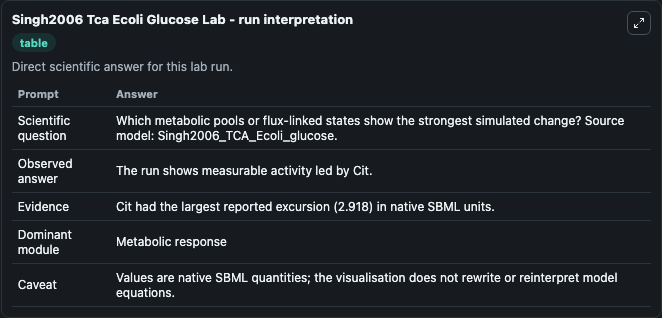
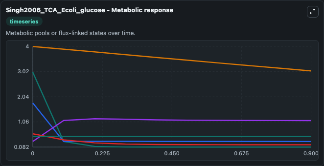
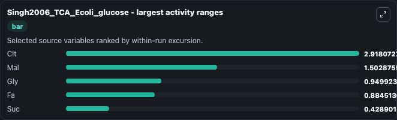
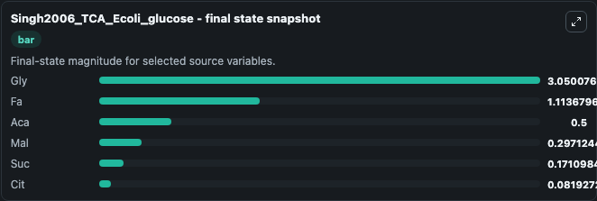
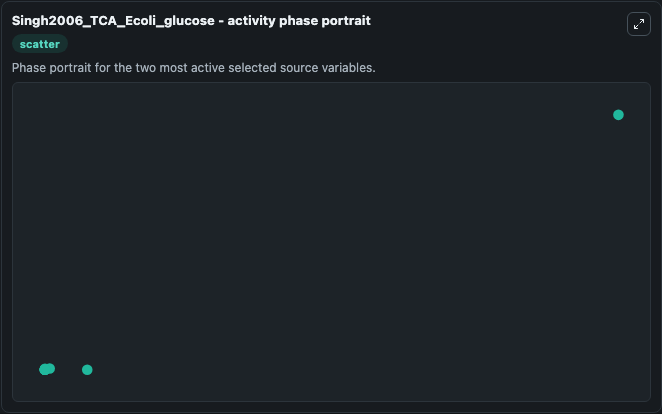

# Singh2006 Tca Ecoli Glucose

This Biosimulant lab wraps `Singh2006 Tca Ecoli Glucose` as a runnable systems biology model with a companion visualization module.
This a model from the article: Kinetic modeling of tricarboxylic acid cycle and glyoxylate bypass in Mycobacterium tuberculosis, and its application to assessment of drugtargets. It can be used to explore the configured dynamics and compare scenario outcomes across configurations.

## What You'll See

The lab asks: Which metabolic pools or flux-linked states show the strongest simulated change? Source model: Singh2006_TCA_Ecoli_glucose. It runs for 1.0 time units with a communication step of 0.1. The run uses the model defaults declared by the curated SBML wrapper. The generated visualizations focus on Gly, Cit, Mal, Suc, Aca, and Fa, combining trajectory, endpoint-comparison, and summary-table views from one completed dark-mode run.

In this captured run, **Cit** moved from 3.000 to 0.0819 across 1.0 simulation windows.


### Output Visualizations



*Summary table for Singh2006 Tca Ecoli Glucose, reporting the scientific question, observed answer, dominant module, and caveat.*



*Trajectories of Cit, Mal, Gly, Fa, Suc, and Aca across the 1.0 simulation. In this run **Fa** climbed from 0.3000 to 1.114 and **Cit** fell from 3.000 to 0.0819 — the largest movements among the focused observables.*



*Largest-excursion ranking of the focused observables — the absolute movement magnitude during the run. Top 3: **Cit** = 2.918, **Mal** = 1.503, **Gly** = 0.9499, with 2 more observables below.*



*Endpoint snapshot of the focused observables — final values from the captured run. Top 3 by value: **Gly** = 3.050, **Fa** = 1.114, **Aca** = 0.5000, with 3 more observables below.*



*Visualization card from the Singh2006 Tca Ecoli Glucose dark-mode run.*


## Model Context

- Core model: `models/core`
- Visualization model: `models/visualisation`
- Standard: `other`
- Upstream source: `biomodels_ebi:BIOMD0000000222`
- License: `CC0`

## Inputs

| Input | Maps To | Default | Notes |
|---|---|---|---|
| Initial Model State Gly | `systemsbiology_sbml_singh2006_tca_ecoli_glucose_biomd0000000222_model.initial_model_state_gly` | | Source state initial condition exposed as a model-specific control because no explicit intervention parameter is identifiable. Maps to SBML symbol `gly`. |
| Initial Model State Cit | `systemsbiology_sbml_singh2006_tca_ecoli_glucose_biomd0000000222_model.initial_model_state_cit` | | Source state initial condition exposed as a model-specific control because no explicit intervention parameter is identifiable. Maps to SBML symbol `cit`. |
| Initial Model State Mal | `systemsbiology_sbml_singh2006_tca_ecoli_glucose_biomd0000000222_model.initial_model_state_mal` | | Source state initial condition exposed as a model-specific control because no explicit intervention parameter is identifiable. Maps to SBML symbol `mal`. |
| Initial Model State Suc | `systemsbiology_sbml_singh2006_tca_ecoli_glucose_biomd0000000222_model.initial_model_state_suc` | | Source state initial condition exposed as a model-specific control because no explicit intervention parameter is identifiable. Maps to SBML symbol `suc`. |
| Initial Model State Aca | `systemsbiology_sbml_singh2006_tca_ecoli_glucose_biomd0000000222_model.initial_model_state_aca` | | Source state initial condition exposed as a model-specific control because no explicit intervention parameter is identifiable. Maps to SBML symbol `aca`. |
| Initial Model State Fa | `systemsbiology_sbml_singh2006_tca_ecoli_glucose_biomd0000000222_model.initial_model_state_fa` | | Source state initial condition exposed as a model-specific control because no explicit intervention parameter is identifiable. Maps to SBML symbol `fa`. |

## Outputs

| Output | Maps To | Role |
|---|---|---|
| `state` | `systemsbiology_sbml_singh2006_tca_ecoli_glucose_biomd0000000222_model.state` | Available to the visualization model and downstream workflows. |
| `summary` | `systemsbiology_sbml_singh2006_tca_ecoli_glucose_biomd0000000222_model.summary` | Available to the visualization model and downstream workflows. |
| `species_labels` | `systemsbiology_sbml_singh2006_tca_ecoli_glucose_biomd0000000222_model.species_labels` | Available to the visualization model and downstream workflows. |
| `gly` | `systemsbiology_sbml_singh2006_tca_ecoli_glucose_biomd0000000222_model.gly` | Available to the visualization model and downstream workflows. |
| `cit` | `systemsbiology_sbml_singh2006_tca_ecoli_glucose_biomd0000000222_model.cit` | Available to the visualization model and downstream workflows. |
| `mal` | `systemsbiology_sbml_singh2006_tca_ecoli_glucose_biomd0000000222_model.mal` | Available to the visualization model and downstream workflows. |
| `suc` | `systemsbiology_sbml_singh2006_tca_ecoli_glucose_biomd0000000222_model.suc` | Available to the visualization model and downstream workflows. |
| `aca` | `systemsbiology_sbml_singh2006_tca_ecoli_glucose_biomd0000000222_model.aca` | Available to the visualization model and downstream workflows. |
| `model_state_fa` | `systemsbiology_sbml_singh2006_tca_ecoli_glucose_biomd0000000222_model.model_state_fa` | Available to the visualization model and downstream workflows. |

## Runtime

- Duration: `1.0`
- Communication step: `0.1`

## Running Locally

```bash
biosimulant labs serve
```
