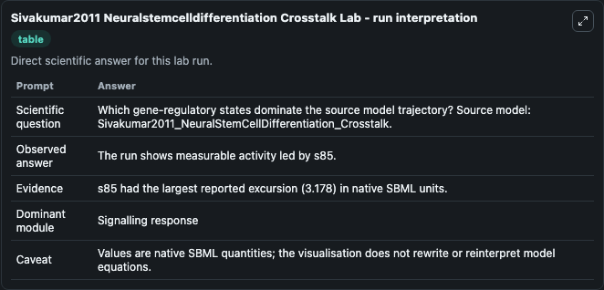
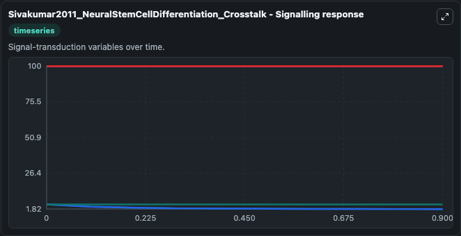
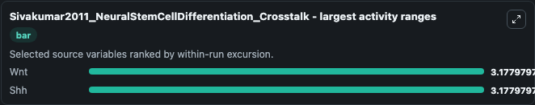
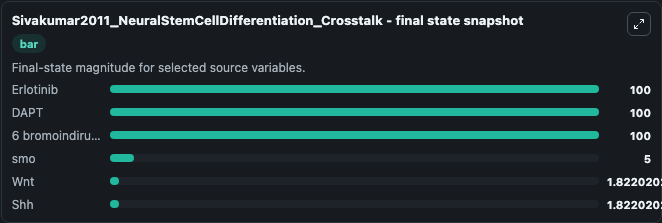
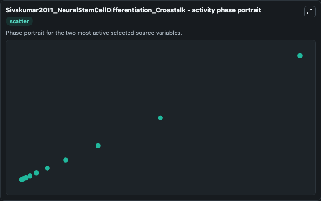

# Sivakumar2011 Neuralstemcelldifferentiation Crosstalk

This Biosimulant lab wraps `Sivakumar2011 Neuralstemcelldifferentiation Crosstalk` as a runnable systems biology model with a companion visualization module.
Sivakumar2011_NeuralStemCellDifferentiation_Crosstalk This model is generated by integrating BIOMD0000000394 (EGFR), BIOMD0000000395 (Hedgehog), BIOMD0000000396 (Notch) and BIOMD0000000397 (Wnt), to i. It can be used to explore the configured dynamics and compare scenario outcomes across configurations.

## What You'll See

The lab asks: Which gene-regulatory states dominate the source model trajectory? Source model: Sivakumar2011_NeuralStemCellDifferentiation_Crosstalk. It runs for 1.0 time units with a communication step of 0.1. The run uses the model defaults declared by the curated SBML wrapper. The generated visualizations focus on Erlotinib, DAPT, 6 bromoindirubin 3`oxime, smo, Wnt, and Shh, combining trajectory, endpoint-comparison, and summary-table views from one completed dark-mode run.

In this captured run, **Wnt** moved from 5.000 to 1.822 across 1.0 simulation windows.

<!-- BIOSIMULANT_VISUALS_START -->
### Output Visualizations



*Summary table for Sivakumar2011 Neuralstemcelldifferentiation Crosstalk, reporting the scientific question, observed answer, dominant module, and caveat.*



*Trajectories of Wnt, Shh, Erlotinib, DAPT, 6 bromoindirubin 3`oxime, and smo across the 1.0 simulation. In this run **Wnt** fell from 5.000 to 1.822 — the largest movements among the focused observables.*



*Largest-excursion ranking of the focused observables — the absolute movement magnitude during the run. Top 2: **Wnt** = 3.178, **Shh** = 3.178.*



*Endpoint snapshot of the focused observables — final values from the captured run. Top 3 by value: **Erlotinib** = 100.0, **DAPT** = 100.0, **6 bromoindirubin 3`oxime** = 100.0, with 3 more observables below.*



*Visualization card from the Sivakumar2011 Neuralstemcelldifferentiation Crosstalk dark-mode run.*

<!-- BIOSIMULANT_VISUALS_END -->

## Model Context

- Core model: `models/core`
- Visualization model: `models/visualisation`
- Standard: `other`
- Upstream source: `biomodels_ebi:BIOMD0000000398`
- License: `CC0`

## Inputs

| Input | Maps To | Default | Notes |
|---|---|---|---|
| Initial Erlotinib | `systemsbiology_sbml_sivakumar2011_neuralstemcelldifferentiation_cros_biomd0000000398_model.initial_erlotinib` | | Source state initial condition exposed as a model-specific control because no explicit intervention parameter is identifiable. Maps to SBML symbol `s101`. |
| Initial Dapt | `systemsbiology_sbml_sivakumar2011_neuralstemcelldifferentiation_cros_biomd0000000398_model.initial_dapt` | | Source state initial condition exposed as a model-specific control because no explicit intervention parameter is identifiable. Maps to SBML symbol `s61`. |
| Initial Model State 6 Bromoindirubin 3 Oxime | `systemsbiology_sbml_sivakumar2011_neuralstemcelldifferentiation_cros_biomd0000000398_model.initial_model_state_6_bromoindirubin_3_oxime` | | Source state initial condition exposed as a model-specific control because no explicit intervention parameter is identifiable. Maps to SBML symbol `s147`. |
| Initial Model State Smo | `systemsbiology_sbml_sivakumar2011_neuralstemcelldifferentiation_cros_biomd0000000398_model.initial_model_state_smo` | | Source state initial condition exposed as a model-specific control because no explicit intervention parameter is identifiable. Maps to SBML symbol `s88`. |
| Initial Model State Wnt | `systemsbiology_sbml_sivakumar2011_neuralstemcelldifferentiation_cros_biomd0000000398_model.initial_model_state_wnt` | | Source state initial condition exposed as a model-specific control because no explicit intervention parameter is identifiable. Maps to SBML symbol `s107`. |
| Initial Model State Shh | `systemsbiology_sbml_sivakumar2011_neuralstemcelldifferentiation_cros_biomd0000000398_model.initial_model_state_shh` | | Source state initial condition exposed as a model-specific control because no explicit intervention parameter is identifiable. Maps to SBML symbol `s81`. |

## Outputs

| Output | Maps To | Role |
|---|---|---|
| `state` | `systemsbiology_sbml_sivakumar2011_neuralstemcelldifferentiation_cros_biomd0000000398_model.state` | Available to the visualization model and downstream workflows. |
| `summary` | `systemsbiology_sbml_sivakumar2011_neuralstemcelldifferentiation_cros_biomd0000000398_model.summary` | Available to the visualization model and downstream workflows. |
| `species_labels` | `systemsbiology_sbml_sivakumar2011_neuralstemcelldifferentiation_cros_biomd0000000398_model.species_labels` | Available to the visualization model and downstream workflows. |
| `erlotinib` | `systemsbiology_sbml_sivakumar2011_neuralstemcelldifferentiation_cros_biomd0000000398_model.erlotinib` | Available to the visualization model and downstream workflows. |
| `dapt` | `systemsbiology_sbml_sivakumar2011_neuralstemcelldifferentiation_cros_biomd0000000398_model.dapt` | Available to the visualization model and downstream workflows. |
| `model_state_6_bromoindirubin_3_oxime` | `systemsbiology_sbml_sivakumar2011_neuralstemcelldifferentiation_cros_biomd0000000398_model.model_state_6_bromoindirubin_3_oxime` | Available to the visualization model and downstream workflows. |
| `smo` | `systemsbiology_sbml_sivakumar2011_neuralstemcelldifferentiation_cros_biomd0000000398_model.smo` | Available to the visualization model and downstream workflows. |
| `wnt` | `systemsbiology_sbml_sivakumar2011_neuralstemcelldifferentiation_cros_biomd0000000398_model.wnt` | Available to the visualization model and downstream workflows. |
| `shh` | `systemsbiology_sbml_sivakumar2011_neuralstemcelldifferentiation_cros_biomd0000000398_model.shh` | Available to the visualization model and downstream workflows. |

## Runtime

- Duration: `1.0`
- Communication step: `0.1`

## Running Locally

```bash
biosimulant labs serve
```
