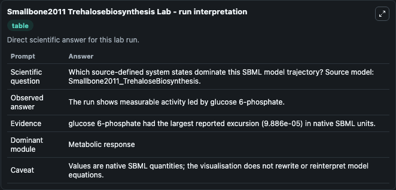
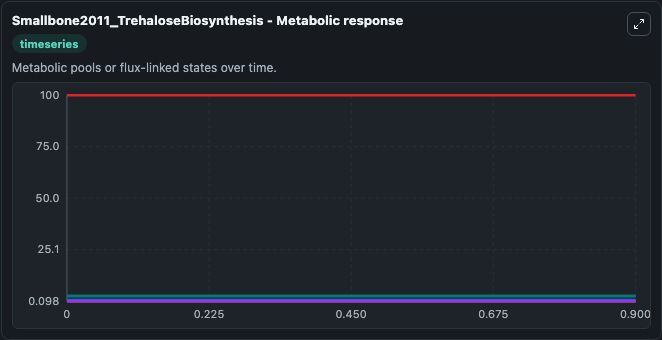
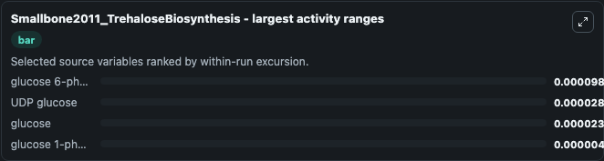
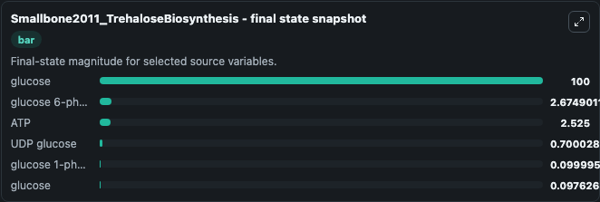
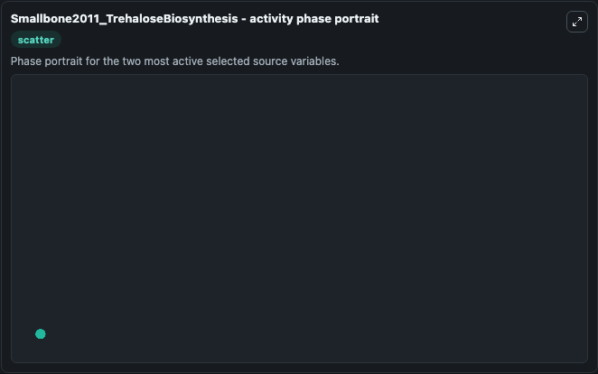

# Smallbone2011 Trehalosebiosynthesis

This Biosimulant lab wraps `Smallbone2011 Trehalosebiosynthesis` as a runnable systems biology model with a companion visualization module.
This model is from the article: Building a Kinetic Model of Trehalose Biosynthesis in Saccharomyces cerevisiae. It can be used to explore the configured dynamics and compare scenario outcomes across configurations.

## What You'll See

The lab asks: Which source-defined system states dominate this SBML model trajectory? Source model: Smallbone2011_TrehaloseBiosynthesis. It runs for 1.0 time units with a communication step of 0.1. The run uses the model defaults declared by the curated SBML wrapper. The generated visualizations focus on glucose, glucose 6-phosphate, UDP glucose, glucose 1-phosphate, and ATP, combining trajectory, endpoint-comparison, and summary-table views from one completed dark-mode run.

In this captured run, **glucose 6-phosphate** moved from 2.675 to 2.675 across 1.0 simulation windows.


### Output Visualizations



*Summary table for Smallbone2011 Trehalosebiosynthesis, reporting the scientific question, observed answer, dominant module, and caveat.*



*Trajectories of glucose 6-phosphate, UDP glucose, glucose, glucose 1-phosphate, glucose, and ATP across the 1.0 simulation. In this run **UDP glucose** climbed from 0.7000 to 0.7000 and **glucose 6-phosphate** fell from 2.675 to 2.675 — the largest movements among the focused observables.*



*Largest-excursion ranking of the focused observables — the absolute movement magnitude during the run. Top 3: **glucose 6-phosphate** = 9.89e-05, **UDP glucose** = 2.87e-05, **glucose** = 2.4e-05, with 1 more observable below.*



*Endpoint snapshot of the focused observables — final values from the captured run. Top 3 by value: **glucose** = 100.0, **glucose 6-phosphate** = 2.675, **ATP** = 2.525, with 3 more observables below.*



*Visualization card from the Smallbone2011 Trehalosebiosynthesis dark-mode run.*


## Model Context

- Core model: `models/core`
- Visualization model: `models/visualisation`
- Standard: `other`
- Upstream source: `biomodels_ebi:BIOMD0000000380`
- License: `CC0`

## Inputs

| Input | Maps To | Default | Notes |
|---|---|---|---|
| Initial Glucose | `systemsbiology_sbml_smallbone2011_trehalosebiosynthesis_biomd0000000380_model.initial_glucose` | | Source state initial condition exposed as a model-specific control because no explicit intervention parameter is identifiable. Maps to SBML symbol `glx`. |
| Initial Glucose 6 Phosphate | `systemsbiology_sbml_smallbone2011_trehalosebiosynthesis_biomd0000000380_model.initial_glucose_6_phosphate` | | Source state initial condition exposed as a model-specific control because no explicit intervention parameter is identifiable. Maps to SBML symbol `g6p`. |
| Initial Udp Glucose | `systemsbiology_sbml_smallbone2011_trehalosebiosynthesis_biomd0000000380_model.initial_udp_glucose` | | Source state initial condition exposed as a model-specific control because no explicit intervention parameter is identifiable. Maps to SBML symbol `udg`. |
| Initial Glucose 1 Phosphate | `systemsbiology_sbml_smallbone2011_trehalosebiosynthesis_biomd0000000380_model.initial_glucose_1_phosphate` | | Source state initial condition exposed as a model-specific control because no explicit intervention parameter is identifiable. Maps to SBML symbol `g1p`. |
| Initial Glucose 2 | `systemsbiology_sbml_smallbone2011_trehalosebiosynthesis_biomd0000000380_model.initial_glucose_2` | | Source state initial condition exposed as a model-specific control because no explicit intervention parameter is identifiable. Maps to SBML symbol `glc`. |
| Initial Model State ATP | `systemsbiology_sbml_smallbone2011_trehalosebiosynthesis_biomd0000000380_model.initial_model_state_atp` | | Source state initial condition exposed as a model-specific control because no explicit intervention parameter is identifiable. Maps to SBML symbol `atp`. |

## Outputs

| Output | Maps To | Role |
|---|---|---|
| `state` | `systemsbiology_sbml_smallbone2011_trehalosebiosynthesis_biomd0000000380_model.state` | Available to the visualization model and downstream workflows. |
| `summary` | `systemsbiology_sbml_smallbone2011_trehalosebiosynthesis_biomd0000000380_model.summary` | Available to the visualization model and downstream workflows. |
| `species_labels` | `systemsbiology_sbml_smallbone2011_trehalosebiosynthesis_biomd0000000380_model.species_labels` | Available to the visualization model and downstream workflows. |
| `glucose` | `systemsbiology_sbml_smallbone2011_trehalosebiosynthesis_biomd0000000380_model.glucose` | Available to the visualization model and downstream workflows. |
| `glucose_6_phosphate` | `systemsbiology_sbml_smallbone2011_trehalosebiosynthesis_biomd0000000380_model.glucose_6_phosphate` | Available to the visualization model and downstream workflows. |
| `udp_glucose` | `systemsbiology_sbml_smallbone2011_trehalosebiosynthesis_biomd0000000380_model.udp_glucose` | Available to the visualization model and downstream workflows. |
| `glucose_1_phosphate` | `systemsbiology_sbml_smallbone2011_trehalosebiosynthesis_biomd0000000380_model.glucose_1_phosphate` | Available to the visualization model and downstream workflows. |
| `glucose_2` | `systemsbiology_sbml_smallbone2011_trehalosebiosynthesis_biomd0000000380_model.glucose_2` | Available to the visualization model and downstream workflows. |
| `atp` | `systemsbiology_sbml_smallbone2011_trehalosebiosynthesis_biomd0000000380_model.atp` | Available to the visualization model and downstream workflows. |

## Runtime

- Duration: `1.0`
- Communication step: `0.1`

## Running Locally

```bash
biosimulant labs serve
```
