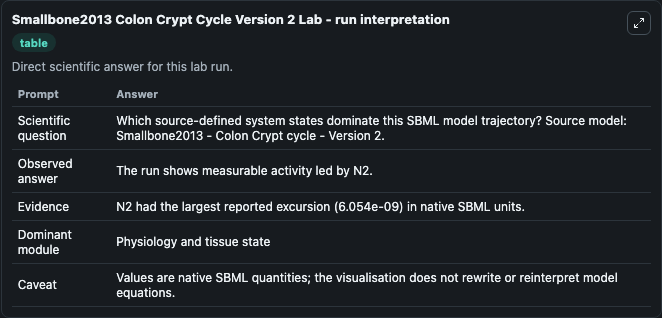
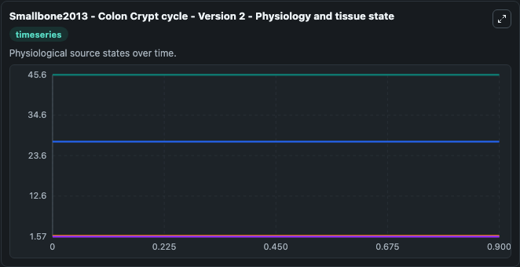
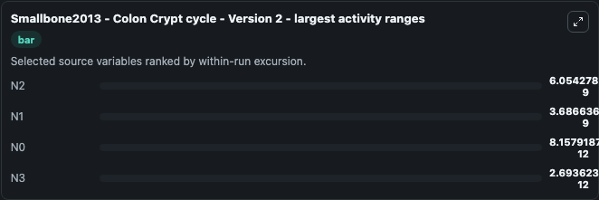
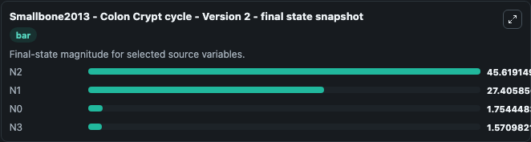
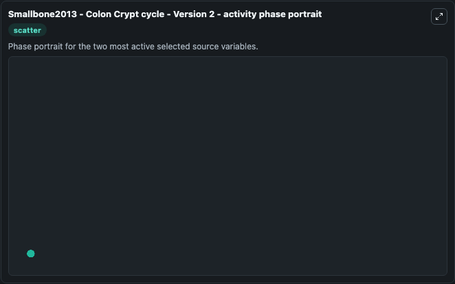

# Smallbone2013 Colon Crypt Cycle Version 2

This Biosimulant lab wraps `Smallbone2013 Colon Crypt Cycle Version 2` as a runnable systems biology model with a companion visualization module.
Smallbone2013 - Colon Crypt cycle - Version 2 This model is described in the article: A mathematical model of the colon crypt capturing compositional dynamic interactions between cell types Kieran Sma. It can be used to explore the configured dynamics and compare scenario outcomes across configurations.

## What You'll See

The lab asks: Which source-defined system states dominate this SBML model trajectory? Source model: Smallbone2013 - Colon Crypt cycle - Version 2. It runs for 1.0 time units with a communication step of 0.1. The run uses the model defaults declared by the curated SBML wrapper. The generated visualizations focus on N2, N1, N0, and N3, combining trajectory, endpoint-comparison, and summary-table views from one completed dark-mode run.

In this captured run, **N2** moved from 45.619 to 45.619 across 1.0 simulation windows.


### Output Visualizations



*Summary table for Smallbone2013 Colon Crypt Cycle Version 2, reporting the scientific question, observed answer, dominant module, and caveat.*



*Trajectories of N2, N1, N0, and N3 across the 1.0 simulation. In this run **N1** climbed from 27.406 to 27.406 and **N2** fell from 45.619 to 45.619 — the largest movements among the focused observables.*



*Largest-excursion ranking of the focused observables — the absolute movement magnitude during the run. Top 3: **N2** = 6.05e-09, **N1** = 3.69e-09, **N0** = 8.16e-12, with 1 more observable below.*



*Endpoint snapshot of the focused observables — final values from the captured run. Top 3 by value: **N2** = 45.619, **N1** = 27.406, **N0** = 1.754, with 1 more observable below.*



*Visualization card from the Smallbone2013 Colon Crypt Cycle Version 2 dark-mode run.*


## Model Context

- Core model: `models/core`
- Visualization model: `models/visualisation`
- Standard: `other`
- Upstream source: `biomodels_ebi:BIOMD0000000518`
- License: `CC0`

## Inputs

| Input | Maps To | Default | Notes |
|---|---|---|---|
| Initial Model State N2 | `systemsbiology_sbml_smallbone2013_colon_crypt_cycle_version_2_biomd0000000518_model.initial_model_state_n2` | | Source state initial condition exposed as a model-specific control because no explicit intervention parameter is identifiable. Maps to SBML symbol `N2`. |
| Initial Model State N1 | `systemsbiology_sbml_smallbone2013_colon_crypt_cycle_version_2_biomd0000000518_model.initial_model_state_n1` | | Source state initial condition exposed as a model-specific control because no explicit intervention parameter is identifiable. Maps to SBML symbol `N1`. |
| Initial Model State N0 | `systemsbiology_sbml_smallbone2013_colon_crypt_cycle_version_2_biomd0000000518_model.initial_model_state_n0` | | Source state initial condition exposed as a model-specific control because no explicit intervention parameter is identifiable. Maps to SBML symbol `N0`. |
| Initial Model State N3 | `systemsbiology_sbml_smallbone2013_colon_crypt_cycle_version_2_biomd0000000518_model.initial_model_state_n3` | | Source state initial condition exposed as a model-specific control because no explicit intervention parameter is identifiable. Maps to SBML symbol `N3`. |

## Outputs

| Output | Maps To | Role |
|---|---|---|
| `state` | `systemsbiology_sbml_smallbone2013_colon_crypt_cycle_version_2_biomd0000000518_model.state` | Available to the visualization model and downstream workflows. |
| `summary` | `systemsbiology_sbml_smallbone2013_colon_crypt_cycle_version_2_biomd0000000518_model.summary` | Available to the visualization model and downstream workflows. |
| `species_labels` | `systemsbiology_sbml_smallbone2013_colon_crypt_cycle_version_2_biomd0000000518_model.species_labels` | Available to the visualization model and downstream workflows. |
| `model_state_n2` | `systemsbiology_sbml_smallbone2013_colon_crypt_cycle_version_2_biomd0000000518_model.model_state_n2` | Available to the visualization model and downstream workflows. |
| `model_state_n1` | `systemsbiology_sbml_smallbone2013_colon_crypt_cycle_version_2_biomd0000000518_model.model_state_n1` | Available to the visualization model and downstream workflows. |
| `model_state_n0` | `systemsbiology_sbml_smallbone2013_colon_crypt_cycle_version_2_biomd0000000518_model.model_state_n0` | Available to the visualization model and downstream workflows. |
| `model_state_n3` | `systemsbiology_sbml_smallbone2013_colon_crypt_cycle_version_2_biomd0000000518_model.model_state_n3` | Available to the visualization model and downstream workflows. |

## Runtime

- Duration: `1.0`
- Communication step: `0.1`

## Running Locally

```bash
biosimulant labs serve
```
