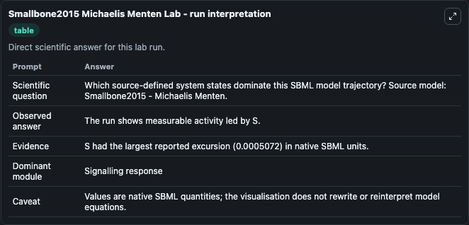
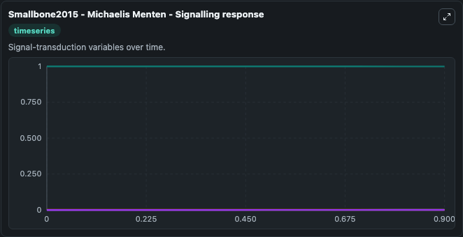
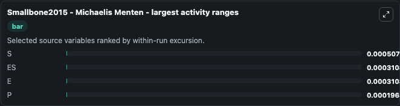
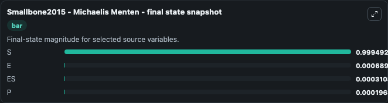
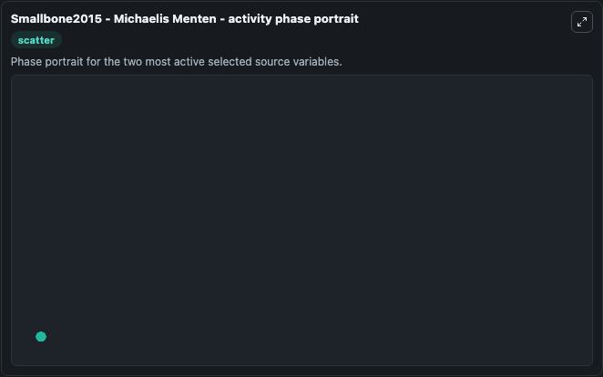

# Smallbone2015 Michaelis Menten

This Biosimulant lab wraps `Smallbone2015 Michaelis Menten` as a runnable systems biology model with a companion visualization module.
Systems Biology Smallbone2015Michaelis Menten Model1503180002Model represents systems biology smallbone2015 michaelis menten model1503180002 mechanisms from biomodels_ebi reference biomodels_ebi:MODEL1503180002. It can be used to explore the configured dynamics and compare scenario outcomes across configurations.

## What You'll See

The lab asks: Which source-defined system states dominate this SBML model trajectory? Source model: Smallbone2015 - Michaelis Menten. It runs for 1.0 time units with a communication step of 0.1. The run uses the model defaults declared by the curated SBML wrapper. The generated visualizations focus on ES, S, E, and P, combining trajectory, endpoint-comparison, and summary-table views from one completed dark-mode run.

In this captured run, **S** moved from 1.000 to 0.9995 across 1.0 simulation windows.


### Output Visualizations



*Summary table for Smallbone2015 Michaelis Menten, reporting the scientific question, observed answer, dominant module, and caveat.*



*Trajectories of S, ES, E, and P across the 1.0 simulation. In this run **ES** climbed from 0 to 0.000311 and **S** fell from 1.000 to 0.9995 — the largest movements among the focused observables.*



*Largest-excursion ranking of the focused observables — the absolute movement magnitude during the run. Top 3: **S** = 0.000507, **ES** = 0.000311, **E** = 0.000311, with 1 more observable below.*



*Endpoint snapshot of the focused observables — final values from the captured run. Top 3 by value: **S** = 0.9995, **E** = 0.000689, **ES** = 0.000311, with 1 more observable below.*



*Visualization card from the Smallbone2015 Michaelis Menten dark-mode run.*


## Model Context

- Core model: `models/core`
- Visualization model: `models/visualisation`
- Standard: `other`
- Upstream source: `biomodels_ebi:MODEL1503180002`
- License: `CC0`

## Inputs

| Input | Maps To | Default | Notes |
|---|---|---|---|
| Initial Model State Es | `systemsbiology_sbml_smallbone2015_michaelis_menten_model1503180002_model.initial_model_state_es` | | Source state initial condition exposed as a model-specific control because no explicit intervention parameter is identifiable. Maps to SBML symbol `ES`. |
| Initial Model State S | `systemsbiology_sbml_smallbone2015_michaelis_menten_model1503180002_model.initial_model_state_s` | | Source state initial condition exposed as a model-specific control because no explicit intervention parameter is identifiable. Maps to SBML symbol `S`. |
| Initial Model State E | `systemsbiology_sbml_smallbone2015_michaelis_menten_model1503180002_model.initial_model_state_e` | | Source state initial condition exposed as a model-specific control because no explicit intervention parameter is identifiable. Maps to SBML symbol `E`. |
| Initial Model State P | `systemsbiology_sbml_smallbone2015_michaelis_menten_model1503180002_model.initial_model_state_p` | | Source state initial condition exposed as a model-specific control because no explicit intervention parameter is identifiable. Maps to SBML symbol `P`. |

## Outputs

| Output | Maps To | Role |
|---|---|---|
| `state` | `systemsbiology_sbml_smallbone2015_michaelis_menten_model1503180002_model.state` | Available to the visualization model and downstream workflows. |
| `summary` | `systemsbiology_sbml_smallbone2015_michaelis_menten_model1503180002_model.summary` | Available to the visualization model and downstream workflows. |
| `species_labels` | `systemsbiology_sbml_smallbone2015_michaelis_menten_model1503180002_model.species_labels` | Available to the visualization model and downstream workflows. |
| `model_state_es` | `systemsbiology_sbml_smallbone2015_michaelis_menten_model1503180002_model.model_state_es` | Available to the visualization model and downstream workflows. |
| `model_state_s` | `systemsbiology_sbml_smallbone2015_michaelis_menten_model1503180002_model.model_state_s` | Available to the visualization model and downstream workflows. |
| `model_state_e` | `systemsbiology_sbml_smallbone2015_michaelis_menten_model1503180002_model.model_state_e` | Available to the visualization model and downstream workflows. |
| `model_state_p` | `systemsbiology_sbml_smallbone2015_michaelis_menten_model1503180002_model.model_state_p` | Available to the visualization model and downstream workflows. |

## Runtime

- Duration: `1.0`
- Communication step: `0.1`

## Running Locally

```bash
biosimulant labs serve
```
