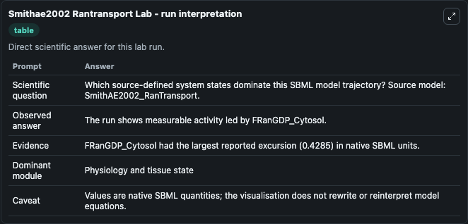
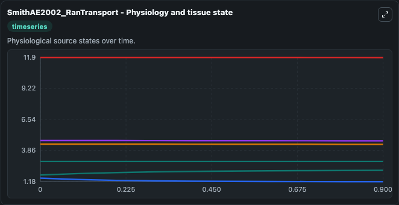
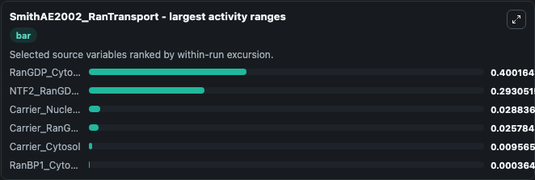
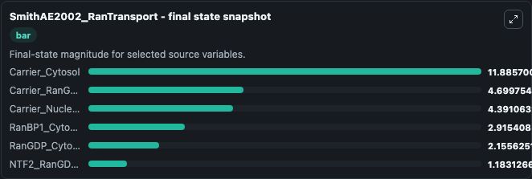
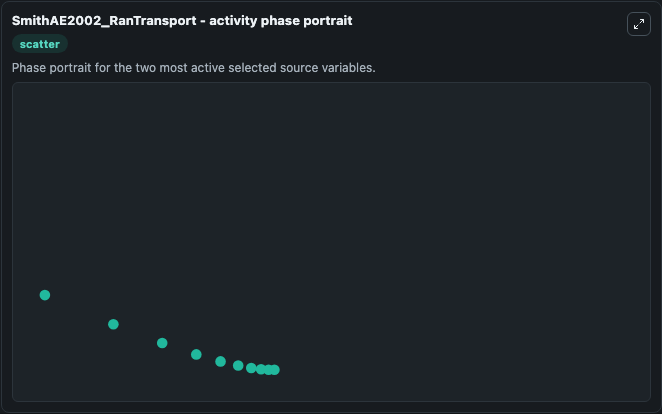

# Smithae2002 Rantransport

This Biosimulant lab wraps `Smithae2002 Rantransport` as a runnable systems biology model with a companion visualization module.
The model reproduces the compartmental model for Ran transport as depicted in Fig 3 of the paper. It can be used to explore the configured dynamics and compare scenario outcomes across configurations.

## What You'll See

The lab asks: Which source-defined system states dominate this SBML model trajectory? Source model: SmithAE2002_RanTransport. It runs for 1.0 time units with a communication step of 0.1. The run uses the model defaults declared by the curated SBML wrapper. The generated visualizations focus on Carrier_Cytosol, Carrier_RanGTP_Nucleus, Carrier_Nucleus, RanBP1_Cytosol, RanGDP_Cytosol, and NTF2_RanGDP_Cytosol, combining trajectory, endpoint-comparison, and summary-table views from one completed dark-mode run.

In this captured run, **RanGDP_Cytosol** moved from 1.755 to 2.156 across 1.0 simulation windows.


### Output Visualizations



*Summary table for Smithae2002 Rantransport, reporting the scientific question, observed answer, dominant module, and caveat.*



*Trajectories of RanGDP_Cytosol, NTF2_RanGDP_Cytosol, Carrier_Nucleus, Carrier_RanGTP_Nucleus, Carrier_Cytosol, and RanBP1_Cytosol across the 1.0 simulation. In this run **RanGDP_Cytosol** climbed from 1.755 to 2.156 and **NTF2_RanGDP_Cytosol** fell from 1.476 to 1.183 — the largest movements among the focused observables.*



*Largest-excursion ranking of the focused observables — the absolute movement magnitude during the run. Top 3: **RanGDP_Cytosol** = 0.4002, **NTF2_RanGDP_Cytosol** = 0.2931, **Carrier_Nucleus** = 0.0288, with 3 more observables below.*



*Endpoint snapshot of the focused observables — final values from the captured run. Top 3 by value: **Carrier_Cytosol** = 11.886, **Carrier_RanGTP_Nucleus** = 4.700, **Carrier_Nucleus** = 4.391, with 3 more observables below.*



*Visualization card from the Smithae2002 Rantransport dark-mode run.*


## Model Context

- Core model: `models/core`
- Visualization model: `models/visualisation`
- Standard: `other`
- Upstream source: `biomodels_ebi:BIOMD0000000164`
- License: `CC0`

## Inputs

| Input | Maps To | Default | Notes |
|---|---|---|---|
| Initial Carrier Cytosol | `systemsbiology_sbml_smithae2002_rantransport_biomd0000000164_model.initial_carrier_cytosol` | | Source state initial condition exposed as a model-specific control because no explicit intervention parameter is identifiable. Maps to SBML symbol `Carrier_Cytosol`. |
| Initial Carrier Ran Gtp Nucleus | `systemsbiology_sbml_smithae2002_rantransport_biomd0000000164_model.initial_carrier_ran_gtp_nucleus` | | Source state initial condition exposed as a model-specific control because no explicit intervention parameter is identifiable. Maps to SBML symbol `Carrier_RanGTP_Nucleus`. |
| Initial Carrier Nucleus | `systemsbiology_sbml_smithae2002_rantransport_biomd0000000164_model.initial_carrier_nucleus` | | Source state initial condition exposed as a model-specific control because no explicit intervention parameter is identifiable. Maps to SBML symbol `Carrier_Nucleus`. |
| Initial Ran BP1 Cytosol | `systemsbiology_sbml_smithae2002_rantransport_biomd0000000164_model.initial_ran_bp1_cytosol` | | Source state initial condition exposed as a model-specific control because no explicit intervention parameter is identifiable. Maps to SBML symbol `RanBP1_Cytosol`. |
| Initial Ran Gdp Cytosol | `systemsbiology_sbml_smithae2002_rantransport_biomd0000000164_model.initial_ran_gdp_cytosol` | | Source state initial condition exposed as a model-specific control because no explicit intervention parameter is identifiable. Maps to SBML symbol `RanGDP_Cytosol`. |
| Initial Ntf2 Ran Gdp Cytosol | `systemsbiology_sbml_smithae2002_rantransport_biomd0000000164_model.initial_ntf2_ran_gdp_cytosol` | | Source state initial condition exposed as a model-specific control because no explicit intervention parameter is identifiable. Maps to SBML symbol `NTF2_RanGDP_Cytosol`. |

## Outputs

| Output | Maps To | Role |
|---|---|---|
| `state` | `systemsbiology_sbml_smithae2002_rantransport_biomd0000000164_model.state` | Available to the visualization model and downstream workflows. |
| `summary` | `systemsbiology_sbml_smithae2002_rantransport_biomd0000000164_model.summary` | Available to the visualization model and downstream workflows. |
| `species_labels` | `systemsbiology_sbml_smithae2002_rantransport_biomd0000000164_model.species_labels` | Available to the visualization model and downstream workflows. |
| `carrier_cytosol` | `systemsbiology_sbml_smithae2002_rantransport_biomd0000000164_model.carrier_cytosol` | Available to the visualization model and downstream workflows. |
| `carrier_ran_gtp_nucleus` | `systemsbiology_sbml_smithae2002_rantransport_biomd0000000164_model.carrier_ran_gtp_nucleus` | Available to the visualization model and downstream workflows. |
| `carrier_nucleus` | `systemsbiology_sbml_smithae2002_rantransport_biomd0000000164_model.carrier_nucleus` | Available to the visualization model and downstream workflows. |
| `ran_bp1_cytosol` | `systemsbiology_sbml_smithae2002_rantransport_biomd0000000164_model.ran_bp1_cytosol` | Available to the visualization model and downstream workflows. |
| `ran_gdp_cytosol` | `systemsbiology_sbml_smithae2002_rantransport_biomd0000000164_model.ran_gdp_cytosol` | Available to the visualization model and downstream workflows. |
| `ntf2_ran_gdp_cytosol` | `systemsbiology_sbml_smithae2002_rantransport_biomd0000000164_model.ntf2_ran_gdp_cytosol` | Available to the visualization model and downstream workflows. |

## Runtime

- Duration: `1.0`
- Communication step: `0.1`

## Running Locally

```bash
biosimulant labs serve
```
