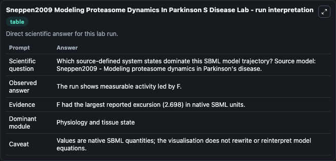
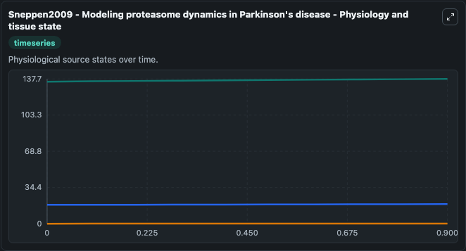
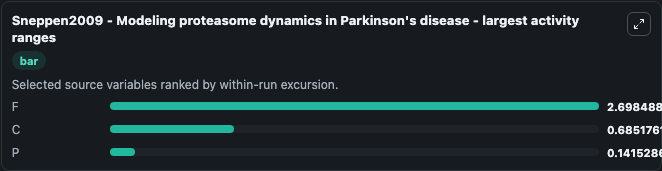
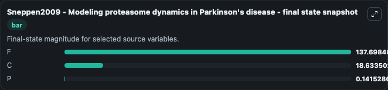
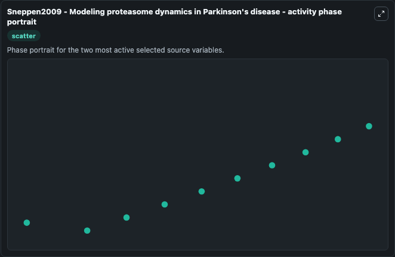

# Sneppen2009 Modeling Proteasome Dynamics In Parkinson S Disease

This Biosimulant lab wraps `Sneppen2009 Modeling Proteasome Dynamics In Parkinson S Disease` as a runnable systems biology model with a companion visualization module.
Sneppen2009 - Modeling proteasome dynamics inParkinson's disease This model is described in the article: Modeling proteasome dynamics in Parkinson's disease. It can be used to explore the configured dynamics and compare scenario outcomes across configurations.

## What You'll See

The lab asks: Which source-defined system states dominate this SBML model trajectory? Source model: Sneppen2009 - Modeling proteasome dynamics in Parkinson's disease. It runs for 1.0 time units with a communication step of 0.1. The run uses the model defaults declared by the curated SBML wrapper. The generated visualizations focus on F, C, and P, combining trajectory, endpoint-comparison, and summary-table views from one completed dark-mode run.

In this captured run, **F** moved from 135.0 to 137.7 across 1.0 simulation windows.


### Output Visualizations



*Summary table for Sneppen2009 Modeling Proteasome Dynamics In Parkinson S Disease, reporting the scientific question, observed answer, dominant module, and caveat.*



*Trajectories of F, C, and P across the 1.0 simulation. In this run **F** climbed from 135.0 to 137.7 — the largest movements among the focused observables.*



*Largest-excursion ranking of the focused observables — the absolute movement magnitude during the run. Top 3: **F** = 2.698, **C** = 0.6852, **P** = 0.1415.*



*Trajectories of F, C, and P across the 1.0 simulation. In this run **F** climbed from 135.0 to 137.7 — the largest movements among the focused observables.*



*Visualization card from the Sneppen2009 Modeling Proteasome Dynamics In Parkinson S Disease dark-mode run.*


## Model Context

- Core model: `models/core`
- Visualization model: `models/visualisation`
- Standard: `other`
- Upstream source: `biomodels_ebi:BIOMD0000000548`
- License: `CC0`

## Inputs

| Input | Maps To | Default | Notes |
|---|---|---|---|
| Initial Model State F | `systemsbiology_sbml_sneppen2009_modeling_proteasome_dynamics_in_park_biomd0000000548_model.initial_model_state_f` | | Source state initial condition exposed as a model-specific control because no explicit intervention parameter is identifiable. Maps to SBML symbol `F`. |
| Initial Model State C | `systemsbiology_sbml_sneppen2009_modeling_proteasome_dynamics_in_park_biomd0000000548_model.initial_model_state_c` | | Source state initial condition exposed as a model-specific control because no explicit intervention parameter is identifiable. Maps to SBML symbol `C`. |
| Initial Model State P | `systemsbiology_sbml_sneppen2009_modeling_proteasome_dynamics_in_park_biomd0000000548_model.initial_model_state_p` | | Source state initial condition exposed as a model-specific control because no explicit intervention parameter is identifiable. Maps to SBML symbol `P`. |

## Outputs

| Output | Maps To | Role |
|---|---|---|
| `state` | `systemsbiology_sbml_sneppen2009_modeling_proteasome_dynamics_in_park_biomd0000000548_model.state` | Available to the visualization model and downstream workflows. |
| `summary` | `systemsbiology_sbml_sneppen2009_modeling_proteasome_dynamics_in_park_biomd0000000548_model.summary` | Available to the visualization model and downstream workflows. |
| `species_labels` | `systemsbiology_sbml_sneppen2009_modeling_proteasome_dynamics_in_park_biomd0000000548_model.species_labels` | Available to the visualization model and downstream workflows. |
| `model_state_f` | `systemsbiology_sbml_sneppen2009_modeling_proteasome_dynamics_in_park_biomd0000000548_model.model_state_f` | Available to the visualization model and downstream workflows. |
| `model_state_c` | `systemsbiology_sbml_sneppen2009_modeling_proteasome_dynamics_in_park_biomd0000000548_model.model_state_c` | Available to the visualization model and downstream workflows. |
| `model_state_p` | `systemsbiology_sbml_sneppen2009_modeling_proteasome_dynamics_in_park_biomd0000000548_model.model_state_p` | Available to the visualization model and downstream workflows. |

## Runtime

- Duration: `1.0`
- Communication step: `0.1`

## Running Locally

```bash
biosimulant labs serve
```
