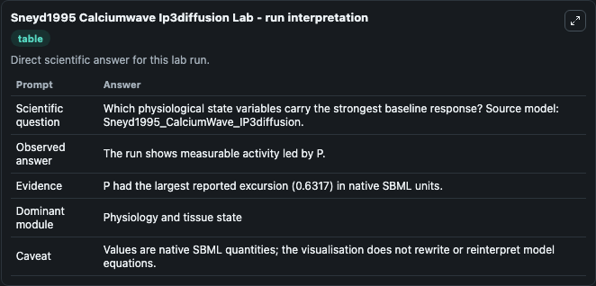
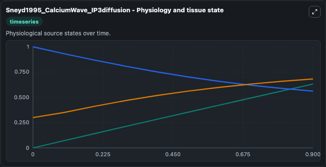
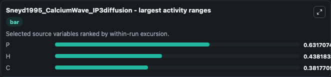
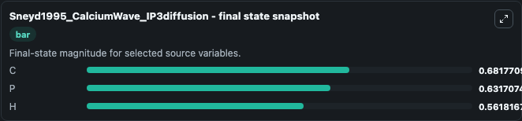
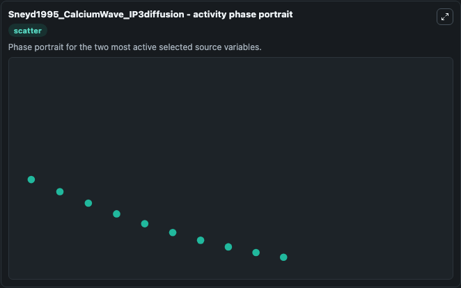

# Sneyd1995 Calciumwave Ip3diffusion

This Biosimulant lab wraps `Sneyd1995 Calciumwave Ip3diffusion` as a runnable systems biology model with a companion visualization module.
This a model from the article: Intercellular calcium waves mediated by diffusion of inositol trisphosphate: atwo-dimensional model. It can be used to explore the configured dynamics and compare scenario outcomes across configurations.

## What You'll See

The lab asks: Which physiological state variables carry the strongest baseline response? Source model: Sneyd1995_CalciumWave_IP3diffusion. It runs for 1.0 time units with a communication step of 0.1. The run uses the model defaults declared by the curated SBML wrapper. The generated visualizations focus on P, H, and C, combining trajectory, endpoint-comparison, and summary-table views from one completed dark-mode run.

In this captured run, **P** moved from 0 to 0.6317 across 1.0 simulation windows.


### Output Visualizations



*Summary table for Sneyd1995 Calciumwave Ip3diffusion, reporting the scientific question, observed answer, dominant module, and caveat.*



*Trajectories of P, H, and C across the 1.0 simulation. In this run **P** climbed from 0 to 0.6317 and **H** fell from 1.000 to 0.5618 — the largest movements among the focused observables.*



*Largest-excursion ranking of the focused observables — the absolute movement magnitude during the run. Top 3: **P** = 0.6317, **H** = 0.4382, **C** = 0.3818.*



*Endpoint snapshot of the focused observables — final values from the captured run. Top 3 by value: **C** = 0.6818, **P** = 0.6317, **H** = 0.5618.*



*Visualization card from the Sneyd1995 Calciumwave Ip3diffusion dark-mode run.*


## Model Context

- Core model: `models/core`
- Visualization model: `models/visualisation`
- Standard: `other`
- Upstream source: `biomodels_ebi:MODEL1006230107`
- License: `CC0`

## Inputs

| Input | Maps To | Default | Notes |
|---|---|---|---|
| Initial Model State P | `systemsbiology_sbml_sneyd1995_calciumwave_ip3diffusion_model1006230107_model.initial_model_state_p` | | Source state initial condition exposed as a model-specific control because no explicit intervention parameter is identifiable. Maps to SBML symbol `P`. |
| Initial Model State H | `systemsbiology_sbml_sneyd1995_calciumwave_ip3diffusion_model1006230107_model.initial_model_state_h` | | Source state initial condition exposed as a model-specific control because no explicit intervention parameter is identifiable. Maps to SBML symbol `h`. |
| Initial Model State C | `systemsbiology_sbml_sneyd1995_calciumwave_ip3diffusion_model1006230107_model.initial_model_state_c` | | Source state initial condition exposed as a model-specific control because no explicit intervention parameter is identifiable. Maps to SBML symbol `c`. |

## Outputs

| Output | Maps To | Role |
|---|---|---|
| `state` | `systemsbiology_sbml_sneyd1995_calciumwave_ip3diffusion_model1006230107_model.state` | Available to the visualization model and downstream workflows. |
| `summary` | `systemsbiology_sbml_sneyd1995_calciumwave_ip3diffusion_model1006230107_model.summary` | Available to the visualization model and downstream workflows. |
| `species_labels` | `systemsbiology_sbml_sneyd1995_calciumwave_ip3diffusion_model1006230107_model.species_labels` | Available to the visualization model and downstream workflows. |
| `model_state_p` | `systemsbiology_sbml_sneyd1995_calciumwave_ip3diffusion_model1006230107_model.model_state_p` | Available to the visualization model and downstream workflows. |
| `model_state_h` | `systemsbiology_sbml_sneyd1995_calciumwave_ip3diffusion_model1006230107_model.model_state_h` | Available to the visualization model and downstream workflows. |
| `model_state_c` | `systemsbiology_sbml_sneyd1995_calciumwave_ip3diffusion_model1006230107_model.model_state_c` | Available to the visualization model and downstream workflows. |

## Runtime

- Duration: `1.0`
- Communication step: `0.1`

## Running Locally

```bash
biosimulant labs serve
```
