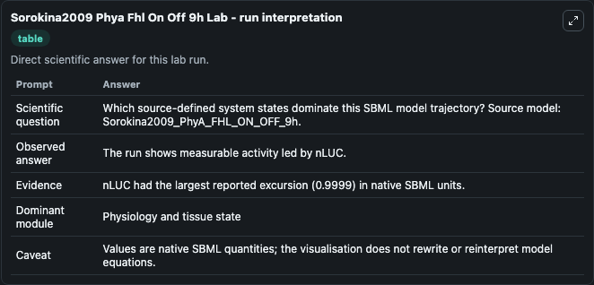
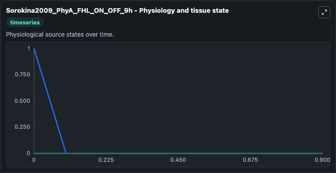
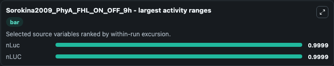
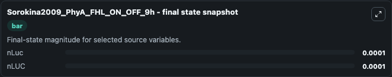
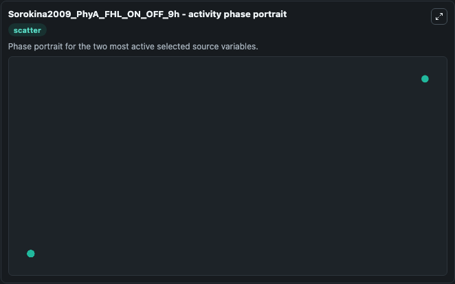

# Sorokina2009 Phya Fhl On Off 9h

This Biosimulant lab wraps `Sorokina2009 Phya Fhl On Off 9h` as a runnable systems biology model with a companion visualization module.
Final version obtained by merging of the PhyA_FHL model with On_OFF 9h long experiment This model originates from BioModels Database: A Database of Annotated Published Models (http://www.ebi.ac.uk/bio. It can be used to explore the configured dynamics and compare scenario outcomes across configurations.

## What You'll See

The lab asks: Which source-defined system states dominate this SBML model trajectory? Source model: Sorokina2009_PhyA_FHL_ON_OFF_9h. It runs for 1.0 time units with a communication step of 0.1. The run uses the model defaults declared by the curated SBML wrapper. The generated visualizations focus on nLuc, nLUC, Pr_PIF3, Pr_GBD_f, Pfr_PIF3, and Pfr_GBD_f, combining trajectory, endpoint-comparison, and summary-table views from one completed dark-mode run.

In this captured run, **nLuc** moved from 1.000 to 0.0001 across 1.0 simulation windows.


### Output Visualizations



*Summary table for Sorokina2009 Phya Fhl On Off 9h, reporting the scientific question, observed answer, dominant module, and caveat.*



*Trajectories of nLuc, nLUC, Pr_PIF3, Pr_GBD_f, Pfr_PIF3, and Pfr_GBD_f across the 1.0 simulation. In this run **nLuc** fell from 1.000 to 0.0001 — the largest movements among the focused observables.*



*Largest-excursion ranking of the focused observables — the absolute movement magnitude during the run. Top 2: **nLuc** = 0.9999, **nLUC** = 0.9999.*



*Endpoint snapshot of the focused observables — final values from the captured run. Top 2 by value: **nLuc** = 0.0001, **nLUC** = 0.0001.*



*Visualization card from the Sorokina2009 Phya Fhl On Off 9h dark-mode run.*


## Model Context

- Core model: `models/core`
- Visualization model: `models/visualisation`
- Standard: `other`
- Upstream source: `biomodels_ebi:MODEL0911120000`
- License: `CC0`

## Inputs

| Input | Maps To | Default | Notes |
|---|---|---|---|
| Initial N Luc | `systemsbiology_sbml_sorokina2009_phya_fhl_on_off_9h_model0911120000_model.initial_n_luc` | | Source state initial condition exposed as a model-specific control because no explicit intervention parameter is identifiable. Maps to SBML symbol `nLuc`. |
| Initial N Luc 2 | `systemsbiology_sbml_sorokina2009_phya_fhl_on_off_9h_model0911120000_model.initial_n_luc_2` | | Source state initial condition exposed as a model-specific control because no explicit intervention parameter is identifiable. Maps to SBML symbol `nLUC`. |
| Initial Pr Pif3 | `systemsbiology_sbml_sorokina2009_phya_fhl_on_off_9h_model0911120000_model.initial_pr_pif3` | | Source state initial condition exposed as a model-specific control because no explicit intervention parameter is identifiable. Maps to SBML symbol `Pr_PIF3`. |
| Initial Pr Gbd F | `systemsbiology_sbml_sorokina2009_phya_fhl_on_off_9h_model0911120000_model.initial_pr_gbd_f` | | Source state initial condition exposed as a model-specific control because no explicit intervention parameter is identifiable. Maps to SBML symbol `Pr_GBD_f`. |
| Initial Pfr Pif3 | `systemsbiology_sbml_sorokina2009_phya_fhl_on_off_9h_model0911120000_model.initial_pfr_pif3` | | Source state initial condition exposed as a model-specific control because no explicit intervention parameter is identifiable. Maps to SBML symbol `Pfr_PIF3`. |
| Initial Pfr Gbd F | `systemsbiology_sbml_sorokina2009_phya_fhl_on_off_9h_model0911120000_model.initial_pfr_gbd_f` | | Source state initial condition exposed as a model-specific control because no explicit intervention parameter is identifiable. Maps to SBML symbol `Pfr_GBD_f`. |

## Outputs

| Output | Maps To | Role |
|---|---|---|
| `state` | `systemsbiology_sbml_sorokina2009_phya_fhl_on_off_9h_model0911120000_model.state` | Available to the visualization model and downstream workflows. |
| `summary` | `systemsbiology_sbml_sorokina2009_phya_fhl_on_off_9h_model0911120000_model.summary` | Available to the visualization model and downstream workflows. |
| `species_labels` | `systemsbiology_sbml_sorokina2009_phya_fhl_on_off_9h_model0911120000_model.species_labels` | Available to the visualization model and downstream workflows. |
| `n_luc` | `systemsbiology_sbml_sorokina2009_phya_fhl_on_off_9h_model0911120000_model.n_luc` | Available to the visualization model and downstream workflows. |
| `n_luc_2` | `systemsbiology_sbml_sorokina2009_phya_fhl_on_off_9h_model0911120000_model.n_luc_2` | Available to the visualization model and downstream workflows. |
| `pr_pif3` | `systemsbiology_sbml_sorokina2009_phya_fhl_on_off_9h_model0911120000_model.pr_pif3` | Available to the visualization model and downstream workflows. |
| `pr_gbd_f` | `systemsbiology_sbml_sorokina2009_phya_fhl_on_off_9h_model0911120000_model.pr_gbd_f` | Available to the visualization model and downstream workflows. |
| `pfr_pif3` | `systemsbiology_sbml_sorokina2009_phya_fhl_on_off_9h_model0911120000_model.pfr_pif3` | Available to the visualization model and downstream workflows. |
| `pfr_gbd_f` | `systemsbiology_sbml_sorokina2009_phya_fhl_on_off_9h_model0911120000_model.pfr_gbd_f` | Available to the visualization model and downstream workflows. |

## Runtime

- Duration: `1.0`
- Communication step: `0.1`

## Running Locally

```bash
biosimulant labs serve
```
