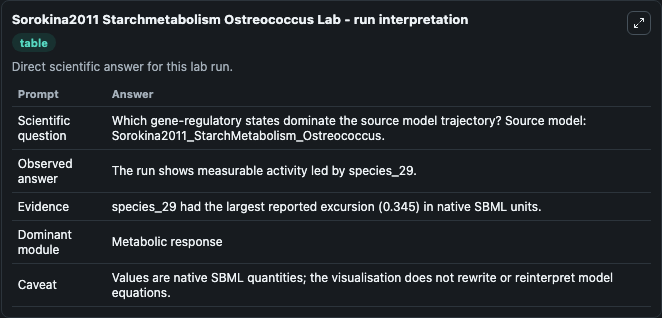
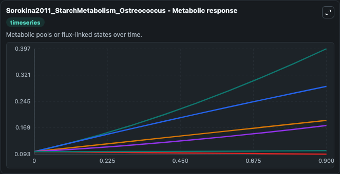
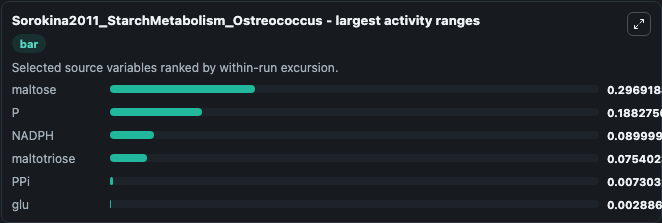
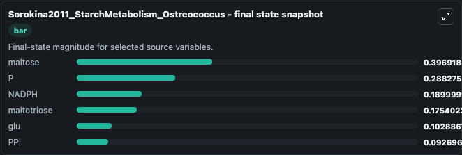
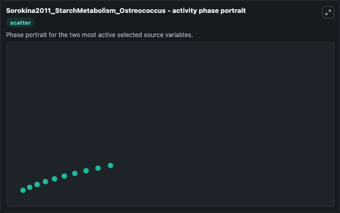

# Sorokina2011 Starchmetabolism Ostreococcus

This Biosimulant lab wraps `Sorokina2011 Starchmetabolism Ostreococcus` as a runnable systems biology model with a companion visualization module.
This model is from the article: Microarray data can predict diurnal changes of starch content in the picoalga Ostreococcus. It can be used to explore the configured dynamics and compare scenario outcomes across configurations.

## What You'll See

The lab asks: Which gene-regulatory states dominate the source model trajectory? Source model: Sorokina2011_StarchMetabolism_Ostreococcus. It runs for 1.0 time units with a communication step of 0.1. The run uses the model defaults declared by the curated SBML wrapper. The generated visualizations focus on maltotriose, maltose, glu, PPi, P, and NADPH, combining trajectory, endpoint-comparison, and summary-table views from one completed dark-mode run.

In this captured run, **maltose** moved from 0.1000 to 0.3969 across 1.0 simulation windows.


### Output Visualizations



*Summary table for Sorokina2011 Starchmetabolism Ostreococcus, reporting the scientific question, observed answer, dominant module, and caveat.*



*Trajectories of maltose, P, NADPH, maltotriose, PPi, and glu across the 1.0 simulation. In this run **maltose** climbed from 0.1000 to 0.3969 and **PPi** fell from 0.1000 to 0.0927 — the largest movements among the focused observables.*



*Largest-excursion ranking of the focused observables — the absolute movement magnitude during the run. Top 3: **maltose** = 0.2969, **P** = 0.1883, **NADPH** = 0.0900, with 3 more observables below.*



*Endpoint snapshot of the focused observables — final values from the captured run. Top 3 by value: **maltose** = 0.3969, **P** = 0.2883, **NADPH** = 0.1900, with 3 more observables below.*



*Visualization card from the Sorokina2011 Starchmetabolism Ostreococcus dark-mode run.*


## Model Context

- Core model: `models/core`
- Visualization model: `models/visualisation`
- Standard: `other`
- Upstream source: `biomodels_ebi:MODEL1204240000`
- License: `CC0`

## Inputs

| Input | Maps To | Default | Notes |
|---|---|---|---|
| Initial Maltotriose | `systemsbiology_sbml_sorokina2011_starchmetabolism_ostreococcus_model1204240000_model.initial_maltotriose` | | Source state initial condition exposed as a model-specific control because no explicit intervention parameter is identifiable. Maps to SBML symbol `species_16`. |
| Initial Maltose | `systemsbiology_sbml_sorokina2011_starchmetabolism_ostreococcus_model1204240000_model.initial_maltose` | | Source state initial condition exposed as a model-specific control because no explicit intervention parameter is identifiable. Maps to SBML symbol `species_37`. |
| Initial Model State Glu | `systemsbiology_sbml_sorokina2011_starchmetabolism_ostreococcus_model1204240000_model.initial_model_state_glu` | | Source state initial condition exposed as a model-specific control because no explicit intervention parameter is identifiable. Maps to SBML symbol `species_39`. |
| Initial P Pi | `systemsbiology_sbml_sorokina2011_starchmetabolism_ostreococcus_model1204240000_model.initial_p_pi` | | Source state initial condition exposed as a model-specific control because no explicit intervention parameter is identifiable. Maps to SBML symbol `species_13`. |
| Initial Model State P | `systemsbiology_sbml_sorokina2011_starchmetabolism_ostreococcus_model1204240000_model.initial_model_state_p` | | Source state initial condition exposed as a model-specific control because no explicit intervention parameter is identifiable. Maps to SBML symbol `species_7`. |
| Initial Nadph | `systemsbiology_sbml_sorokina2011_starchmetabolism_ostreococcus_model1204240000_model.initial_nadph` | | Source state initial condition exposed as a model-specific control because no explicit intervention parameter is identifiable. Maps to SBML symbol `species_3`. |

## Outputs

| Output | Maps To | Role |
|---|---|---|
| `state` | `systemsbiology_sbml_sorokina2011_starchmetabolism_ostreococcus_model1204240000_model.state` | Available to the visualization model and downstream workflows. |
| `summary` | `systemsbiology_sbml_sorokina2011_starchmetabolism_ostreococcus_model1204240000_model.summary` | Available to the visualization model and downstream workflows. |
| `species_labels` | `systemsbiology_sbml_sorokina2011_starchmetabolism_ostreococcus_model1204240000_model.species_labels` | Available to the visualization model and downstream workflows. |
| `maltotriose` | `systemsbiology_sbml_sorokina2011_starchmetabolism_ostreococcus_model1204240000_model.maltotriose` | Available to the visualization model and downstream workflows. |
| `maltose` | `systemsbiology_sbml_sorokina2011_starchmetabolism_ostreococcus_model1204240000_model.maltose` | Available to the visualization model and downstream workflows. |
| `glu` | `systemsbiology_sbml_sorokina2011_starchmetabolism_ostreococcus_model1204240000_model.glu` | Available to the visualization model and downstream workflows. |
| `p_pi` | `systemsbiology_sbml_sorokina2011_starchmetabolism_ostreococcus_model1204240000_model.p_pi` | Available to the visualization model and downstream workflows. |
| `model_state_p` | `systemsbiology_sbml_sorokina2011_starchmetabolism_ostreococcus_model1204240000_model.model_state_p` | Available to the visualization model and downstream workflows. |
| `nadph` | `systemsbiology_sbml_sorokina2011_starchmetabolism_ostreococcus_model1204240000_model.nadph` | Available to the visualization model and downstream workflows. |

## Runtime

- Duration: `1.0`
- Communication step: `0.1`

## Running Locally

```bash
biosimulant labs serve
```
