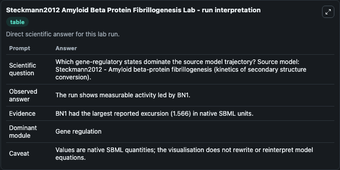
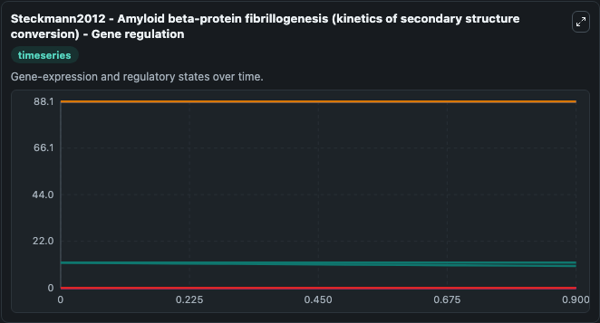
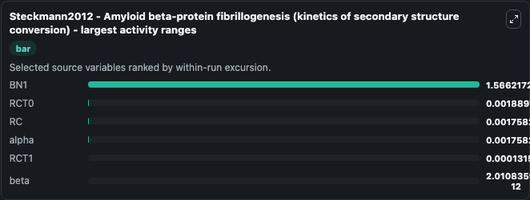
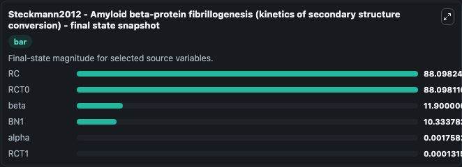
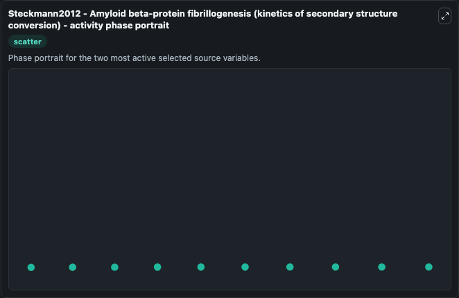

# Steckmann2012 Amyloid Beta Protein Fibrillogenesis

This Biosimulant lab wraps `Steckmann2012 Amyloid Beta Protein Fibrillogenesis` as a runnable systems biology model with a companion visualization module.
Steckmann2012 - Amyloid beta-proteinfibrillogenesis (kinetics of secondary structure conversion) This model is described in the article: Kinetics of peptide secondary structure conversion during amylo. It can be used to explore the configured dynamics and compare scenario outcomes across configurations.

## What You'll See

The lab asks: Which gene-regulatory states dominate the source model trajectory? Source model: Steckmann2012 - Amyloid beta-protein fibrillogenesis (kinetics of secondary structure conversion). It runs for 1.0 time units with a communication step of 0.1. The run uses the model defaults declared by the curated SBML wrapper. The generated visualizations focus on beta, alpha, RCT0, RC, BN1, and RCT1, combining trajectory, endpoint-comparison, and summary-table views from one completed dark-mode run.

In this captured run, **BN1** moved from 11.900 to 10.334 across 1.0 simulation windows.


### Output Visualizations



*Summary table for Steckmann2012 Amyloid Beta Protein Fibrillogenesis, reporting the scientific question, observed answer, dominant module, and caveat.*



*Trajectories of BN1, RCT0, RC, alpha, RCT1, and beta across the 1.0 simulation. In this run **alpha** climbed from 0 to 0.00176 and **BN1** fell from 11.900 to 10.334 — the largest movements among the focused observables.*



*Largest-excursion ranking of the focused observables — the absolute movement magnitude during the run. Top 3: **BN1** = 1.566, **RCT0** = 0.00189, **RC** = 0.00176, with 3 more observables below.*



*Endpoint snapshot of the focused observables — final values from the captured run. Top 3 by value: **RC** = 88.098, **RCT0** = 88.098, **beta** = 11.900, with 3 more observables below.*



*Visualization card from the Steckmann2012 Amyloid Beta Protein Fibrillogenesis dark-mode run.*


## Model Context

- Core model: `models/core`
- Visualization model: `models/visualisation`
- Standard: `other`
- Upstream source: `biomodels_ebi:BIOMD0000000533`
- License: `CC0`

## Inputs

| Input | Maps To | Default | Notes |
|---|---|---|---|
| Initial Beta | `systemsbiology_sbml_steckmann2012_amyloid_beta_protein_fibrillogenes_biomd0000000533_model.initial_beta` | | Source state initial condition exposed as a model-specific control because no explicit intervention parameter is identifiable. Maps to SBML symbol `beta`. |
| Initial Alpha | `systemsbiology_sbml_steckmann2012_amyloid_beta_protein_fibrillogenes_biomd0000000533_model.initial_alpha` | | Source state initial condition exposed as a model-specific control because no explicit intervention parameter is identifiable. Maps to SBML symbol `alpha`. |
| Initial Rct0 | `systemsbiology_sbml_steckmann2012_amyloid_beta_protein_fibrillogenes_biomd0000000533_model.initial_rct0` | | Source state initial condition exposed as a model-specific control because no explicit intervention parameter is identifiable. Maps to SBML symbol `RCT0`. |
| Initial Model State Rc | `systemsbiology_sbml_steckmann2012_amyloid_beta_protein_fibrillogenes_biomd0000000533_model.initial_model_state_rc` | | Source state initial condition exposed as a model-specific control because no explicit intervention parameter is identifiable. Maps to SBML symbol `RC`. |
| Initial Model State BN1 | `systemsbiology_sbml_steckmann2012_amyloid_beta_protein_fibrillogenes_biomd0000000533_model.initial_model_state_bn1` | | Source state initial condition exposed as a model-specific control because no explicit intervention parameter is identifiable. Maps to SBML symbol `BN1`. |
| Initial Rct1 | `systemsbiology_sbml_steckmann2012_amyloid_beta_protein_fibrillogenes_biomd0000000533_model.initial_rct1` | | Source state initial condition exposed as a model-specific control because no explicit intervention parameter is identifiable. Maps to SBML symbol `RCT1`. |

## Outputs

| Output | Maps To | Role |
|---|---|---|
| `state` | `systemsbiology_sbml_steckmann2012_amyloid_beta_protein_fibrillogenes_biomd0000000533_model.state` | Available to the visualization model and downstream workflows. |
| `summary` | `systemsbiology_sbml_steckmann2012_amyloid_beta_protein_fibrillogenes_biomd0000000533_model.summary` | Available to the visualization model and downstream workflows. |
| `species_labels` | `systemsbiology_sbml_steckmann2012_amyloid_beta_protein_fibrillogenes_biomd0000000533_model.species_labels` | Available to the visualization model and downstream workflows. |
| `beta` | `systemsbiology_sbml_steckmann2012_amyloid_beta_protein_fibrillogenes_biomd0000000533_model.beta` | Available to the visualization model and downstream workflows. |
| `alpha` | `systemsbiology_sbml_steckmann2012_amyloid_beta_protein_fibrillogenes_biomd0000000533_model.alpha` | Available to the visualization model and downstream workflows. |
| `rct0` | `systemsbiology_sbml_steckmann2012_amyloid_beta_protein_fibrillogenes_biomd0000000533_model.rct0` | Available to the visualization model and downstream workflows. |
| `model_state_rc` | `systemsbiology_sbml_steckmann2012_amyloid_beta_protein_fibrillogenes_biomd0000000533_model.model_state_rc` | Available to the visualization model and downstream workflows. |
| `bn1` | `systemsbiology_sbml_steckmann2012_amyloid_beta_protein_fibrillogenes_biomd0000000533_model.bn1` | Available to the visualization model and downstream workflows. |
| `rct1` | `systemsbiology_sbml_steckmann2012_amyloid_beta_protein_fibrillogenes_biomd0000000533_model.rct1` | Available to the visualization model and downstream workflows. |

## Runtime

- Duration: `1.0`
- Communication step: `0.1`

## Running Locally

```bash
biosimulant labs serve
```
