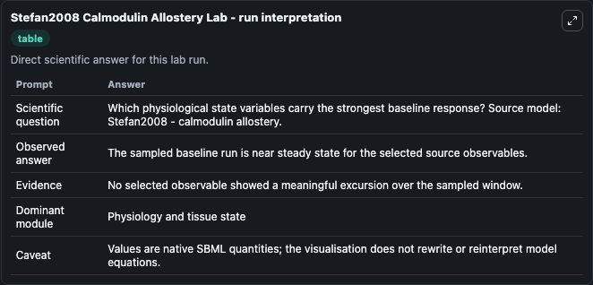
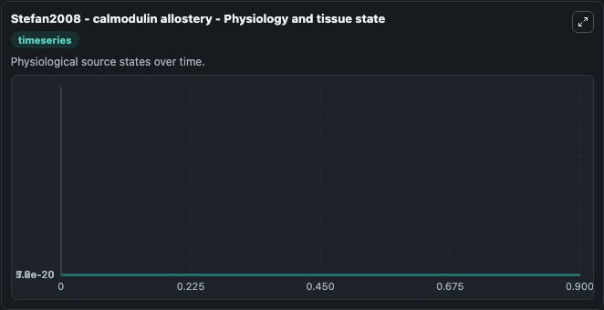
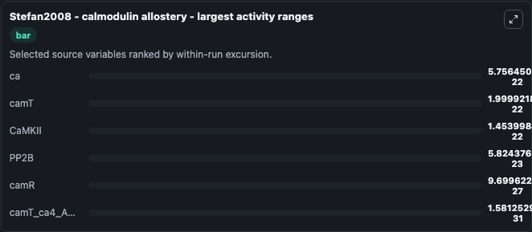
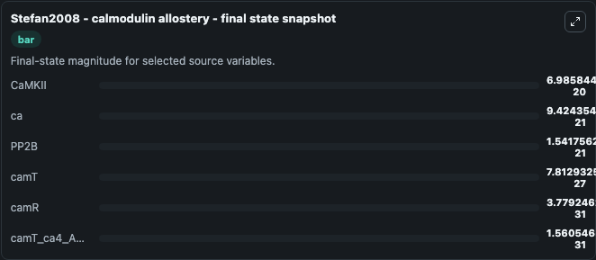
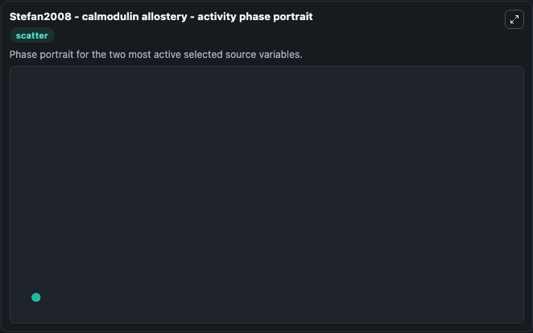

# Stefan2008 Calmodulin Allostery

This Biosimulant lab wraps `Stefan2008 Calmodulin Allostery` as a runnable systems biology model with a companion visualization module.
Stefan2008 - calmodulin allostery An allosteric model for calmodulin activation, in which binding to calcium facilitates the transition between a low-affinity [tense (T)] and a high-affinity [relaxed. It can be used to explore the configured dynamics and compare scenario outcomes across configurations.

## What You'll See

The lab asks: Which physiological state variables carry the strongest baseline response? Source model: Stefan2008 - calmodulin allostery. It runs for 1.0 time units with a communication step of 0.1. The run uses the model defaults declared by the curated SBML wrapper. The generated visualizations focus on CaMKII, ca, PP2B, camT, camR, and camT_ca4_ABCD, combining trajectory, endpoint-comparison, and summary-table views from one completed dark-mode run.

In this captured run, **ca** moved from 1e-20 to 9.42e-21 across 1.0 simulation windows.


### Output Visualizations



*Summary table for Stefan2008 Calmodulin Allostery, reporting the scientific question, observed answer, dominant module, and caveat.*



*Trajectories of ca, camT, CaMKII, PP2B, camR, and camT_ca4_ABCD across the 1.0 simulation. In this run **camT_ca4_ABCD** climbed from 0 to 1.56e-31 and **ca** fell from 1e-20 to 9.42e-21 — the largest movements among the focused observables.*



*Largest-excursion ranking of the focused observables — the absolute movement magnitude during the run. Top 3: **ca** = 5.76e-22, **camT** = 2e-22, **CaMKII** = 1.45e-22, with 3 more observables below.*



*Endpoint snapshot of the focused observables — final values from the captured run. Top 3 by value: **CaMKII** = 6.99e-20, **ca** = 9.42e-21, **PP2B** = 1.54e-21, with 3 more observables below.*



*Visualization card from the Stefan2008 Calmodulin Allostery dark-mode run.*


## Model Context

- Core model: `models/core`
- Visualization model: `models/visualisation`
- Standard: `other`
- Upstream source: `biomodels_ebi:BIOMD0000000183`
- License: `CC0`

## Inputs

| Input | Maps To | Default | Notes |
|---|---|---|---|
| Initial Ca Mkii | `systemsbiology_sbml_stefan2008_calmodulin_allostery_biomd0000000183_model.initial_ca_mkii` | | Source state initial condition exposed as a model-specific control because no explicit intervention parameter is identifiable. Maps to SBML symbol `species_33`. |
| Initial Model State Ca | `systemsbiology_sbml_stefan2008_calmodulin_allostery_biomd0000000183_model.initial_model_state_ca` | | Source state initial condition exposed as a model-specific control because no explicit intervention parameter is identifiable. Maps to SBML symbol `species_1`. |
| Initial PP2 B | `systemsbiology_sbml_stefan2008_calmodulin_allostery_biomd0000000183_model.initial_pp2_b` | | Source state initial condition exposed as a model-specific control because no explicit intervention parameter is identifiable. Maps to SBML symbol `species_50`. |
| Initial Cam T | `systemsbiology_sbml_stefan2008_calmodulin_allostery_biomd0000000183_model.initial_cam_t` | | Source state initial condition exposed as a model-specific control because no explicit intervention parameter is identifiable. Maps to SBML symbol `species_17`. |
| Initial Cam R | `systemsbiology_sbml_stefan2008_calmodulin_allostery_biomd0000000183_model.initial_cam_r` | | Source state initial condition exposed as a model-specific control because no explicit intervention parameter is identifiable. Maps to SBML symbol `species_0`. |
| Initial Cam T CA4 Abcd | `systemsbiology_sbml_stefan2008_calmodulin_allostery_biomd0000000183_model.initial_cam_t_ca4_abcd` | | Source state initial condition exposed as a model-specific control because no explicit intervention parameter is identifiable. Maps to SBML symbol `species_32`. |

## Outputs

| Output | Maps To | Role |
|---|---|---|
| `state` | `systemsbiology_sbml_stefan2008_calmodulin_allostery_biomd0000000183_model.state` | Available to the visualization model and downstream workflows. |
| `summary` | `systemsbiology_sbml_stefan2008_calmodulin_allostery_biomd0000000183_model.summary` | Available to the visualization model and downstream workflows. |
| `species_labels` | `systemsbiology_sbml_stefan2008_calmodulin_allostery_biomd0000000183_model.species_labels` | Available to the visualization model and downstream workflows. |
| `ca_mkii` | `systemsbiology_sbml_stefan2008_calmodulin_allostery_biomd0000000183_model.ca_mkii` | Available to the visualization model and downstream workflows. |
| `model_state_ca` | `systemsbiology_sbml_stefan2008_calmodulin_allostery_biomd0000000183_model.model_state_ca` | Available to the visualization model and downstream workflows. |
| `pp2_b` | `systemsbiology_sbml_stefan2008_calmodulin_allostery_biomd0000000183_model.pp2_b` | Available to the visualization model and downstream workflows. |
| `cam_t` | `systemsbiology_sbml_stefan2008_calmodulin_allostery_biomd0000000183_model.cam_t` | Available to the visualization model and downstream workflows. |
| `cam_r` | `systemsbiology_sbml_stefan2008_calmodulin_allostery_biomd0000000183_model.cam_r` | Available to the visualization model and downstream workflows. |
| `cam_t_ca4_abcd` | `systemsbiology_sbml_stefan2008_calmodulin_allostery_biomd0000000183_model.cam_t_ca4_abcd` | Available to the visualization model and downstream workflows. |

## Runtime

- Duration: `1.0`
- Communication step: `0.1`

## Running Locally

```bash
biosimulant labs serve
```
