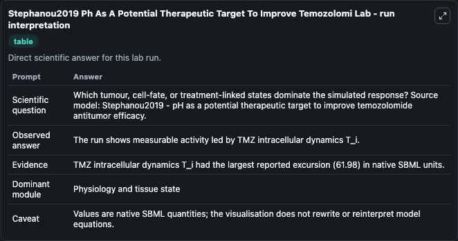
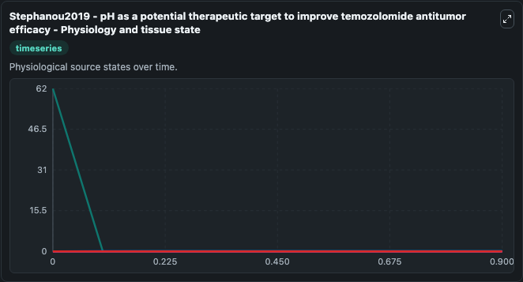
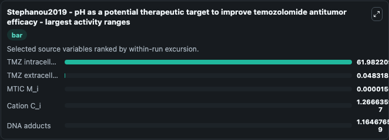
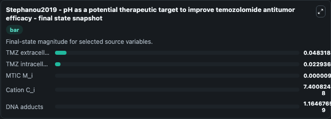
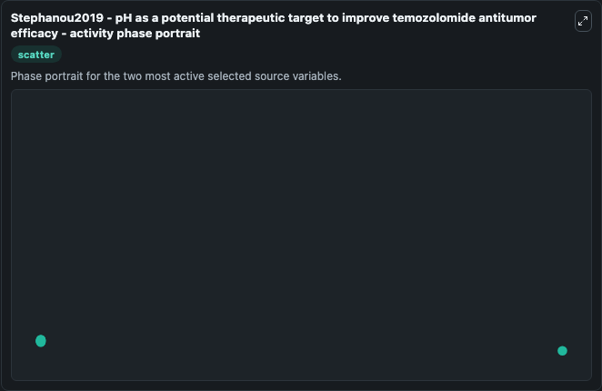

# Stephanou2019 Ph As A Potential Therapeutic Target To Improve Temozolomi

This Biosimulant lab wraps `Stephanou2019 Ph As A Potential Therapeutic Target To Improve Temozolomi` as a runnable systems biology model with a companion visualization module.
Abstract:Despite intensive treatments including temozolomide (TMZ) administration, glioblastoma patient prognosis remains dismal and innovative therapeutic strategies are urgently needed. It can be used to explore the configured dynamics and compare scenario outcomes across configurations.

## What You'll See

The lab asks: Which tumour, cell-fate, or treatment-linked states dominate the simulated response? Source model: Stephanou2019 - pH as a potential therapeutic target to improve temozolomide antitumor efficacy. It runs for 1.0 time units with a communication step of 0.1. The run uses the model defaults declared by the curated SBML wrapper. The generated visualizations focus on MTIC M_i, DNA adducts, Cation C_i, TMZ intracellular dynamics T_i, and TMZ extracellular concentration T_o, combining trajectory, endpoint-comparison, and summary-table views from one completed dark-mode run.

In this captured run, **TMZ intracellular dynamics T_i** moved from 62.000 to 0.0229 across 1.0 simulation windows.


### Output Visualizations



*Summary table for Stephanou2019 Ph As A Potential Therapeutic Target To Improve Temozolomi, reporting the scientific question, observed answer, dominant module, and caveat.*



*Trajectories of TMZ intracellular dynamics T_i, TMZ extracellular concentration T_o, MTIC M_i, Cation C_i, and DNA adducts across the 1.0 simulation. In this run **TMZ extracellular concentration T_o** climbed from 0 to 0.0483 and **TMZ intracellular dynamics T_i** fell from 62.000 to 0.0229 — the largest movements among the focused observables.*



*Largest-excursion ranking of the focused observables — the absolute movement magnitude during the run. Top 3: **TMZ intracellular dynamics T_i** = 61.982, **TMZ extracellular concentration T_o** = 0.0483, **MTIC M_i** = 1.56e-05, with 2 more observables below.*



*Endpoint snapshot of the focused observables — final values from the captured run. Top 3 by value: **TMZ extracellular concentration T_o** = 0.0483, **TMZ intracellular dynamics T_i** = 0.0229, **MTIC M_i** = 9.13e-06, with 2 more observables below.*



*Visualization card from the Stephanou2019 Ph As A Potential Therapeutic Target To Improve Temozolomi dark-mode run.*


## Model Context

- Core model: `models/core`
- Visualization model: `models/visualisation`
- Standard: `other`
- Upstream source: `biomodels_ebi:MODEL1909300003`
- License: `CC0`

## Inputs

| Input | Maps To | Default | Notes |
|---|---|---|---|
| Initial Mtic M I | `systemsbiology_sbml_stephanou2019_ph_as_a_potential_therapeutic_targ_model1909300003_model.initial_mtic_m_i` | | Source state initial condition exposed as a model-specific control because no explicit intervention parameter is identifiable. Maps to SBML symbol `MTIC_M_i`. |
| Initial DNA Adducts | `systemsbiology_sbml_stephanou2019_ph_as_a_potential_therapeutic_targ_model1909300003_model.initial_dna_adducts` | | Source state initial condition exposed as a model-specific control because no explicit intervention parameter is identifiable. Maps to SBML symbol `DNA_adducts`. |
| Initial Cation C I | `systemsbiology_sbml_stephanou2019_ph_as_a_potential_therapeutic_targ_model1909300003_model.initial_cation_c_i` | | Source state initial condition exposed as a model-specific control because no explicit intervention parameter is identifiable. Maps to SBML symbol `Cation_C_i`. |
| Initial Tmz Intracellular Dynamics T I | `systemsbiology_sbml_stephanou2019_ph_as_a_potential_therapeutic_targ_model1909300003_model.initial_tmz_intracellular_dynamics_t_i` | | Source state initial condition exposed as a model-specific control because no explicit intervention parameter is identifiable. Maps to SBML symbol `TMZ_intracellular_dynamics_T_i`. |
| Initial Tmz Extracellular Concentration T O | `systemsbiology_sbml_stephanou2019_ph_as_a_potential_therapeutic_targ_model1909300003_model.initial_tmz_extracellular_concentration_t_o` | | Source state initial condition exposed as a model-specific control because no explicit intervention parameter is identifiable. Maps to SBML symbol `TMZ_extracellular_concentration_T_o`. |

## Outputs

| Output | Maps To | Role |
|---|---|---|
| `state` | `systemsbiology_sbml_stephanou2019_ph_as_a_potential_therapeutic_targ_model1909300003_model.state` | Available to the visualization model and downstream workflows. |
| `summary` | `systemsbiology_sbml_stephanou2019_ph_as_a_potential_therapeutic_targ_model1909300003_model.summary` | Available to the visualization model and downstream workflows. |
| `species_labels` | `systemsbiology_sbml_stephanou2019_ph_as_a_potential_therapeutic_targ_model1909300003_model.species_labels` | Available to the visualization model and downstream workflows. |
| `mtic_m_i` | `systemsbiology_sbml_stephanou2019_ph_as_a_potential_therapeutic_targ_model1909300003_model.mtic_m_i` | Available to the visualization model and downstream workflows. |
| `dna_adducts` | `systemsbiology_sbml_stephanou2019_ph_as_a_potential_therapeutic_targ_model1909300003_model.dna_adducts` | Available to the visualization model and downstream workflows. |
| `cation_c_i` | `systemsbiology_sbml_stephanou2019_ph_as_a_potential_therapeutic_targ_model1909300003_model.cation_c_i` | Available to the visualization model and downstream workflows. |
| `tmz_intracellular_dynamics_t_i` | `systemsbiology_sbml_stephanou2019_ph_as_a_potential_therapeutic_targ_model1909300003_model.tmz_intracellular_dynamics_t_i` | Available to the visualization model and downstream workflows. |
| `tmz_extracellular_concentration_t_o` | `systemsbiology_sbml_stephanou2019_ph_as_a_potential_therapeutic_targ_model1909300003_model.tmz_extracellular_concentration_t_o` | Available to the visualization model and downstream workflows. |

## Runtime

- Duration: `1.0`
- Communication step: `0.1`

## Running Locally

```bash
biosimulant labs serve
```
