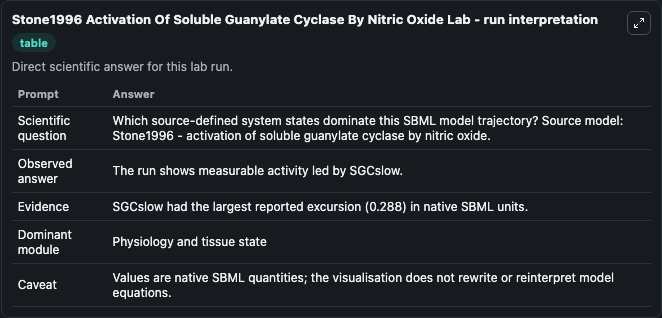
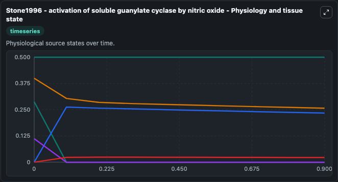
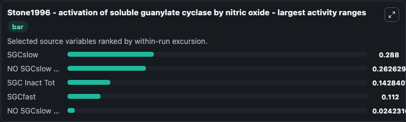
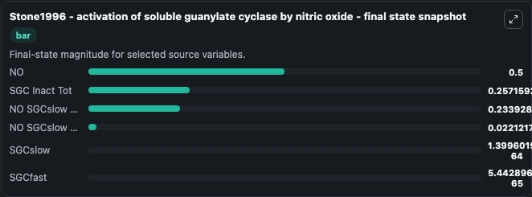
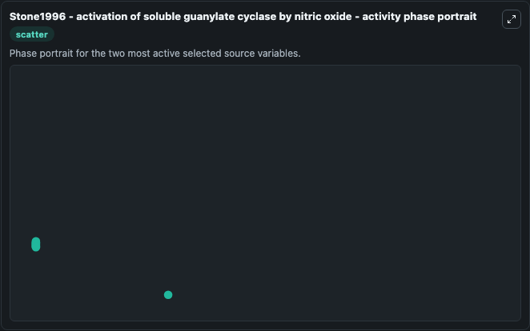

# Stone1996 Activation Of Soluble Guanylate Cyclase By Nitric Oxide

This Biosimulant lab wraps `Stone1996 Activation Of Soluble Guanylate Cyclase By Nitric Oxide` as a runnable systems biology model with a companion visualization module.
Stone1996 - activation of soluble guanylatecyclase by nitric oxide This features the two step binding ofNO to soluble Guanylyl Cyclase as proposed by StoneJR, Marletta MA. It can be used to explore the configured dynamics and compare scenario outcomes across configurations.

## What You'll See

The lab asks: Which source-defined system states dominate this SBML model trajectory? Source model: Stone1996 - activation of soluble guanylate cyclase by nitric oxide. It runs for 1.0 time units with a communication step of 0.1. The run uses the model defaults declared by the curated SBML wrapper. The generated visualizations focus on NO, SGCslow, SGCfast, SGC Inact Tot, NO SGCslow 6coord NO Int, and NO SGCslow 6coord, combining trajectory, endpoint-comparison, and summary-table views from one completed dark-mode run.

In this captured run, **SGCslow** moved from 0.2880 to 1.4e-64 across 1.0 simulation windows.


### Output Visualizations



*Summary table for Stone1996 Activation Of Soluble Guanylate Cyclase By Nitric Oxide, reporting the scientific question, observed answer, dominant module, and caveat.*



*Trajectories of SGCslow, NO SGCslow 6coord, SGC Inact Tot, SGCfast, NO SGCslow 6coord NO Int, and NO across the 1.0 simulation. In this run **NO SGCslow 6coord** climbed from 0 to 0.2339 and **SGCslow** fell from 0.2880 to 1.4e-64 — the largest movements among the focused observables.*



*Largest-excursion ranking of the focused observables — the absolute movement magnitude during the run. Top 3: **SGCslow** = 0.2880, **NO SGCslow 6coord** = 0.2626, **SGC Inact Tot** = 0.1428, with 2 more observables below.*



*Trajectories of SGCslow, NO SGCslow 6coord, SGC Inact Tot, SGCfast, NO SGCslow 6coord NO Int, and NO across the 1.0 simulation. In this run **NO SGCslow 6coord** climbed from 0 to 0.2339 and **SGCslow** fell from 0.2880 to 1.4e-64 — the largest movements among the focused observables.*



*Visualization card from the Stone1996 Activation Of Soluble Guanylate Cyclase By Nitric Oxide dark-mode run.*


## Model Context

- Core model: `models/core`
- Visualization model: `models/visualisation`
- Standard: `other`
- Upstream source: `biomodels_ebi:BIOMD0000000198`
- License: `CC0`

## Inputs

| Input | Maps To | Default | Notes |
|---|---|---|---|
| Initial Model State No | `systemsbiology_sbml_stone1996_activation_of_soluble_guanylate_cyclas_biomd0000000198_model.initial_model_state_no` | | Source state initial condition exposed as a model-specific control because no explicit intervention parameter is identifiable. Maps to SBML symbol `NO`. |
| Initial Sg Cslow | `systemsbiology_sbml_stone1996_activation_of_soluble_guanylate_cyclas_biomd0000000198_model.initial_sg_cslow` | | Source state initial condition exposed as a model-specific control because no explicit intervention parameter is identifiable. Maps to SBML symbol `sGCslow`. |
| Initial Sg Cfast | `systemsbiology_sbml_stone1996_activation_of_soluble_guanylate_cyclas_biomd0000000198_model.initial_sg_cfast` | | Source state initial condition exposed as a model-specific control because no explicit intervention parameter is identifiable. Maps to SBML symbol `sGCfast`. |
| Initial Sgc Inact Tot | `systemsbiology_sbml_stone1996_activation_of_soluble_guanylate_cyclas_biomd0000000198_model.initial_sgc_inact_tot` | | Source state initial condition exposed as a model-specific control because no explicit intervention parameter is identifiable. Maps to SBML symbol `sGC_inact_tot`. |
| Initial No Sg Cslow 6coord No Int | `systemsbiology_sbml_stone1996_activation_of_soluble_guanylate_cyclas_biomd0000000198_model.initial_no_sg_cslow_6coord_no_int` | | Source state initial condition exposed as a model-specific control because no explicit intervention parameter is identifiable. Maps to SBML symbol `NO_sGCslow_6coord_NO_int`. |
| Initial No Sg Cslow 6coord | `systemsbiology_sbml_stone1996_activation_of_soluble_guanylate_cyclas_biomd0000000198_model.initial_no_sg_cslow_6coord` | | Source state initial condition exposed as a model-specific control because no explicit intervention parameter is identifiable. Maps to SBML symbol `NO_sGCslow_6coord`. |

## Outputs

| Output | Maps To | Role |
|---|---|---|
| `state` | `systemsbiology_sbml_stone1996_activation_of_soluble_guanylate_cyclas_biomd0000000198_model.state` | Available to the visualization model and downstream workflows. |
| `summary` | `systemsbiology_sbml_stone1996_activation_of_soluble_guanylate_cyclas_biomd0000000198_model.summary` | Available to the visualization model and downstream workflows. |
| `species_labels` | `systemsbiology_sbml_stone1996_activation_of_soluble_guanylate_cyclas_biomd0000000198_model.species_labels` | Available to the visualization model and downstream workflows. |
| `model_state_no` | `systemsbiology_sbml_stone1996_activation_of_soluble_guanylate_cyclas_biomd0000000198_model.model_state_no` | Available to the visualization model and downstream workflows. |
| `sg_cslow` | `systemsbiology_sbml_stone1996_activation_of_soluble_guanylate_cyclas_biomd0000000198_model.sg_cslow` | Available to the visualization model and downstream workflows. |
| `sg_cfast` | `systemsbiology_sbml_stone1996_activation_of_soluble_guanylate_cyclas_biomd0000000198_model.sg_cfast` | Available to the visualization model and downstream workflows. |
| `sgc_inact_tot` | `systemsbiology_sbml_stone1996_activation_of_soluble_guanylate_cyclas_biomd0000000198_model.sgc_inact_tot` | Available to the visualization model and downstream workflows. |
| `no_sg_cslow_6coord_no_int` | `systemsbiology_sbml_stone1996_activation_of_soluble_guanylate_cyclas_biomd0000000198_model.no_sg_cslow_6coord_no_int` | Available to the visualization model and downstream workflows. |
| `no_sg_cslow_6coord` | `systemsbiology_sbml_stone1996_activation_of_soluble_guanylate_cyclas_biomd0000000198_model.no_sg_cslow_6coord` | Available to the visualization model and downstream workflows. |

## Runtime

- Duration: `1.0`
- Communication step: `0.1`

## Running Locally

```bash
biosimulant labs serve
```
