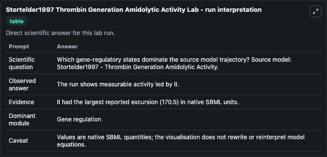
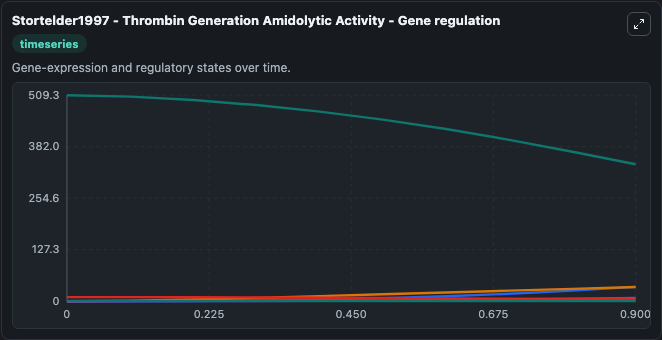
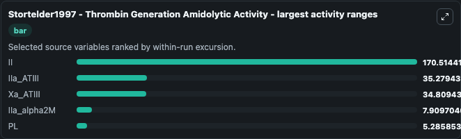
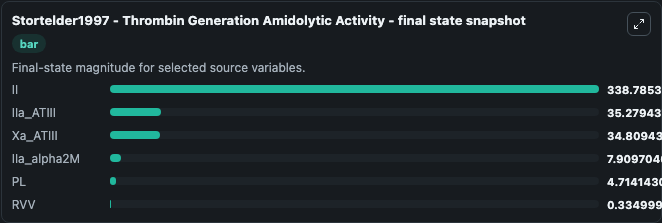
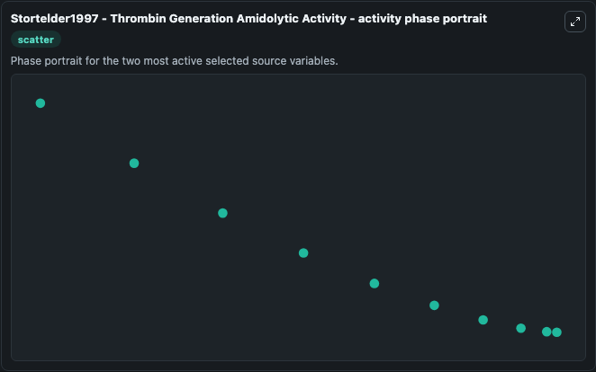

# Stortelder1997 Thrombin Generation Amidolytic Activity

This Biosimulant lab wraps `Stortelder1997 Thrombin Generation Amidolytic Activity` as a runnable systems biology model with a companion visualization module.
Stortelder1997 - Thrombin Generation Amidolytic Activity Mathematical modelling of a part of the blood coagulation mechanism. It can be used to explore the configured dynamics and compare scenario outcomes across configurations.

## What You'll See

The lab asks: Which gene-regulatory states dominate the source model trajectory? Source model: Stortelder1997 - Thrombin Generation Amidolytic Activity. It runs for 1.0 time units with a communication step of 0.1. The run uses the model defaults declared by the curated SBML wrapper. The generated visualizations focus on Xa_ATIII, IIa_alpha2M, IIa_ATIII, II, PL, and RVV, combining trajectory, endpoint-comparison, and summary-table views from one completed dark-mode run.

In this captured run, **II** moved from 509.3 to 338.8 across 1.0 simulation windows.


### Output Visualizations



*Summary table for Stortelder1997 Thrombin Generation Amidolytic Activity, reporting the scientific question, observed answer, dominant module, and caveat.*



*Trajectories of II, IIa_ATIII, Xa_ATIII, IIa_alpha2M, PL, and RVV across the 1.0 simulation. In this run **IIa_ATIII** climbed from 0 to 35.279 and **II** fell from 509.3 to 338.8 — the largest movements among the focused observables.*



*Largest-excursion ranking of the focused observables — the absolute movement magnitude during the run. Top 3: **II** = 170.5, **IIa_ATIII** = 35.279, **Xa_ATIII** = 34.809, with 2 more observables below.*



*Endpoint snapshot of the focused observables — final values from the captured run. Top 3 by value: **II** = 338.8, **IIa_ATIII** = 35.279, **Xa_ATIII** = 34.809, with 3 more observables below.*



*Visualization card from the Stortelder1997 Thrombin Generation Amidolytic Activity dark-mode run.*


## Model Context

- Core model: `models/core`
- Visualization model: `models/visualisation`
- Standard: `other`
- Upstream source: `biomodels_ebi:BIOMD0000000358`
- License: `CC0`

## Inputs

| Input | Maps To | Default | Notes |
|---|---|---|---|
| Initial Xa Atiii | `systemsbiology_sbml_stortelder1997_thrombin_generation_amidolytic_ac_biomd0000000358_model.initial_xa_atiii` | | Source state initial condition exposed as a model-specific control because no explicit intervention parameter is identifiable. Maps to SBML symbol `Xa_ATIII`. |
| Initial I Ia Alpha2 M | `systemsbiology_sbml_stortelder1997_thrombin_generation_amidolytic_ac_biomd0000000358_model.initial_i_ia_alpha2_m` | | Source state initial condition exposed as a model-specific control because no explicit intervention parameter is identifiable. Maps to SBML symbol `IIa_alpha2M`. |
| Initial I Ia Atiii | `systemsbiology_sbml_stortelder1997_thrombin_generation_amidolytic_ac_biomd0000000358_model.initial_i_ia_atiii` | | Source state initial condition exposed as a model-specific control because no explicit intervention parameter is identifiable. Maps to SBML symbol `IIa_ATIII`. |
| Initial Model State Ii | `systemsbiology_sbml_stortelder1997_thrombin_generation_amidolytic_ac_biomd0000000358_model.initial_model_state_ii` | | Source state initial condition exposed as a model-specific control because no explicit intervention parameter is identifiable. Maps to SBML symbol `II`. |
| Initial Model State Pl | `systemsbiology_sbml_stortelder1997_thrombin_generation_amidolytic_ac_biomd0000000358_model.initial_model_state_pl` | | Source state initial condition exposed as a model-specific control because no explicit intervention parameter is identifiable. Maps to SBML symbol `PL`. |
| Initial Model State Rvv | `systemsbiology_sbml_stortelder1997_thrombin_generation_amidolytic_ac_biomd0000000358_model.initial_model_state_rvv` | | Source state initial condition exposed as a model-specific control because no explicit intervention parameter is identifiable. Maps to SBML symbol `RVV`. |

## Outputs

| Output | Maps To | Role |
|---|---|---|
| `state` | `systemsbiology_sbml_stortelder1997_thrombin_generation_amidolytic_ac_biomd0000000358_model.state` | Available to the visualization model and downstream workflows. |
| `summary` | `systemsbiology_sbml_stortelder1997_thrombin_generation_amidolytic_ac_biomd0000000358_model.summary` | Available to the visualization model and downstream workflows. |
| `species_labels` | `systemsbiology_sbml_stortelder1997_thrombin_generation_amidolytic_ac_biomd0000000358_model.species_labels` | Available to the visualization model and downstream workflows. |
| `xa_atiii` | `systemsbiology_sbml_stortelder1997_thrombin_generation_amidolytic_ac_biomd0000000358_model.xa_atiii` | Available to the visualization model and downstream workflows. |
| `i_ia_alpha2_m` | `systemsbiology_sbml_stortelder1997_thrombin_generation_amidolytic_ac_biomd0000000358_model.i_ia_alpha2_m` | Available to the visualization model and downstream workflows. |
| `i_ia_atiii` | `systemsbiology_sbml_stortelder1997_thrombin_generation_amidolytic_ac_biomd0000000358_model.i_ia_atiii` | Available to the visualization model and downstream workflows. |
| `model_state_ii` | `systemsbiology_sbml_stortelder1997_thrombin_generation_amidolytic_ac_biomd0000000358_model.model_state_ii` | Available to the visualization model and downstream workflows. |
| `model_state_pl` | `systemsbiology_sbml_stortelder1997_thrombin_generation_amidolytic_ac_biomd0000000358_model.model_state_pl` | Available to the visualization model and downstream workflows. |
| `rvv` | `systemsbiology_sbml_stortelder1997_thrombin_generation_amidolytic_ac_biomd0000000358_model.rvv` | Available to the visualization model and downstream workflows. |

## Runtime

- Duration: `1.0`
- Communication step: `0.1`

## Running Locally

```bash
biosimulant labs serve
```
