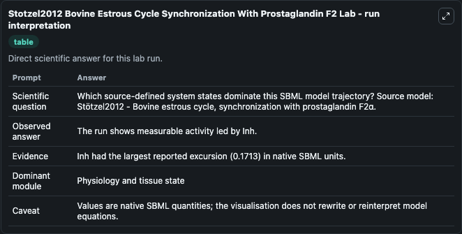
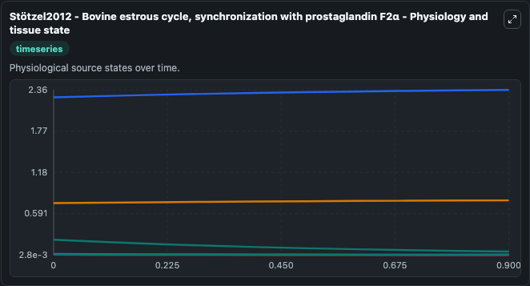
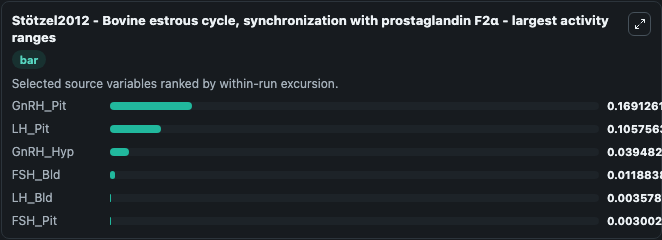
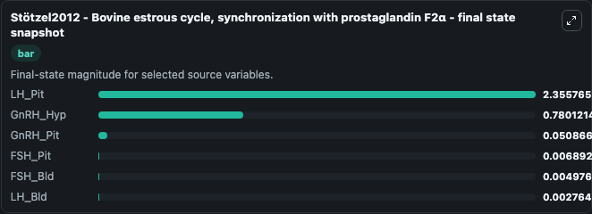
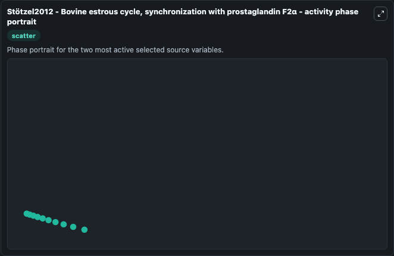

# Stotzel2012 Bovine Estrous Cycle Synchronization With Prostaglandin F2

This Biosimulant lab wraps `Stotzel2012 Bovine Estrous Cycle Synchronization With Prostaglandin F2` as a runnable systems biology model with a companion visualization module.
C. It can be used to explore the configured dynamics and compare scenario outcomes across configurations.

## What You'll See

The lab asks: Which source-defined system states dominate this SBML model trajectory? Source model: Stötzel2012 - Bovine estrous cycle, synchronization with prostaglandin F2α. It runs for 1.0 time units with a communication step of 0.1. The run uses the model defaults declared by the curated SBML wrapper. The generated visualizations focus on LH_Pit, GnRH_Hyp, GnRH_Pit, FSH_Bld, LH_Bld, and FSH_Pit, combining trajectory, endpoint-comparison, and summary-table views from one completed dark-mode run.

In this captured run, **GnRH_Pit** moved from 0.2200 to 0.0509 across 1.0 simulation windows.


### Output Visualizations



*Summary table for Stotzel2012 Bovine Estrous Cycle Synchronization With Prostaglandin F2, reporting the scientific question, observed answer, dominant module, and caveat.*



*Trajectories of GnRH_Pit, LH_Pit, GnRH_Hyp, FSH_Bld, LH_Bld, and FSH_Pit across the 1.0 simulation. In this run **LH_Pit** climbed from 2.250 to 2.356 and **GnRH_Pit** fell from 0.2200 to 0.0509 — the largest movements among the focused observables.*



*Largest-excursion ranking of the focused observables — the absolute movement magnitude during the run. Top 3: **GnRH_Pit** = 0.1691, **LH_Pit** = 0.1058, **GnRH_Hyp** = 0.0395, with 3 more observables below.*



*Endpoint snapshot of the focused observables — final values from the captured run. Top 3 by value: **LH_Pit** = 2.356, **GnRH_Hyp** = 0.7801, **GnRH_Pit** = 0.0509, with 3 more observables below.*



*Visualization card from the Stotzel2012 Bovine Estrous Cycle Synchronization With Prostaglandin F2 dark-mode run.*


## Model Context

- Core model: `models/core`
- Visualization model: `models/visualisation`
- Standard: `other`
- Upstream source: `biomodels_ebi:BIOMD0000000481`
- License: `CC0`

## Inputs

| Input | Maps To | Default | Notes |
|---|---|---|---|
| Initial Lh Pit | `systemsbiology_sbml_st_tzel2012_bovine_estrous_cycle_synchronization_biomd0000000481_model.initial_lh_pit` | | Source state initial condition exposed as a model-specific control because no explicit intervention parameter is identifiable. Maps to SBML symbol `LH_Pit`. |
| Initial Gn Rh Hyp | `systemsbiology_sbml_st_tzel2012_bovine_estrous_cycle_synchronization_biomd0000000481_model.initial_gn_rh_hyp` | | Source state initial condition exposed as a model-specific control because no explicit intervention parameter is identifiable. Maps to SBML symbol `GnRH_Hyp`. |
| Initial Gn Rh Pit | `systemsbiology_sbml_st_tzel2012_bovine_estrous_cycle_synchronization_biomd0000000481_model.initial_gn_rh_pit` | | Source state initial condition exposed as a model-specific control because no explicit intervention parameter is identifiable. Maps to SBML symbol `GnRH_Pit`. |
| Initial Fsh Bld | `systemsbiology_sbml_st_tzel2012_bovine_estrous_cycle_synchronization_biomd0000000481_model.initial_fsh_bld` | | Source state initial condition exposed as a model-specific control because no explicit intervention parameter is identifiable. Maps to SBML symbol `FSH_Bld`. |
| Initial Lh Bld | `systemsbiology_sbml_st_tzel2012_bovine_estrous_cycle_synchronization_biomd0000000481_model.initial_lh_bld` | | Source state initial condition exposed as a model-specific control because no explicit intervention parameter is identifiable. Maps to SBML symbol `LH_Bld`. |
| Initial Fsh Pit | `systemsbiology_sbml_st_tzel2012_bovine_estrous_cycle_synchronization_biomd0000000481_model.initial_fsh_pit` | | Source state initial condition exposed as a model-specific control because no explicit intervention parameter is identifiable. Maps to SBML symbol `FSH_Pit`. |

## Outputs

| Output | Maps To | Role |
|---|---|---|
| `state` | `systemsbiology_sbml_st_tzel2012_bovine_estrous_cycle_synchronization_biomd0000000481_model.state` | Available to the visualization model and downstream workflows. |
| `summary` | `systemsbiology_sbml_st_tzel2012_bovine_estrous_cycle_synchronization_biomd0000000481_model.summary` | Available to the visualization model and downstream workflows. |
| `species_labels` | `systemsbiology_sbml_st_tzel2012_bovine_estrous_cycle_synchronization_biomd0000000481_model.species_labels` | Available to the visualization model and downstream workflows. |
| `lh_pit` | `systemsbiology_sbml_st_tzel2012_bovine_estrous_cycle_synchronization_biomd0000000481_model.lh_pit` | Available to the visualization model and downstream workflows. |
| `gn_rh_hyp` | `systemsbiology_sbml_st_tzel2012_bovine_estrous_cycle_synchronization_biomd0000000481_model.gn_rh_hyp` | Available to the visualization model and downstream workflows. |
| `gn_rh_pit` | `systemsbiology_sbml_st_tzel2012_bovine_estrous_cycle_synchronization_biomd0000000481_model.gn_rh_pit` | Available to the visualization model and downstream workflows. |
| `fsh_bld` | `systemsbiology_sbml_st_tzel2012_bovine_estrous_cycle_synchronization_biomd0000000481_model.fsh_bld` | Available to the visualization model and downstream workflows. |
| `lh_bld` | `systemsbiology_sbml_st_tzel2012_bovine_estrous_cycle_synchronization_biomd0000000481_model.lh_bld` | Available to the visualization model and downstream workflows. |
| `fsh_pit` | `systemsbiology_sbml_st_tzel2012_bovine_estrous_cycle_synchronization_biomd0000000481_model.fsh_pit` | Available to the visualization model and downstream workflows. |

## Runtime

- Duration: `1.0`
- Communication step: `0.1`

## Running Locally

```bash
biosimulant labs serve
```
