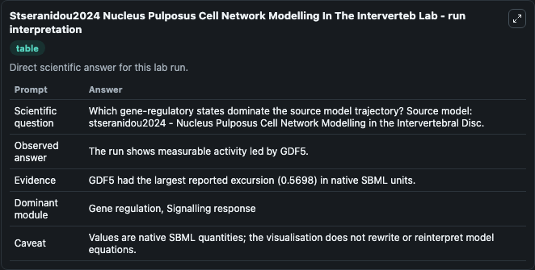
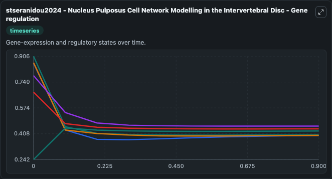
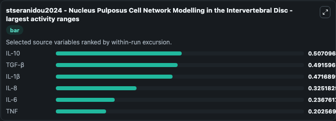
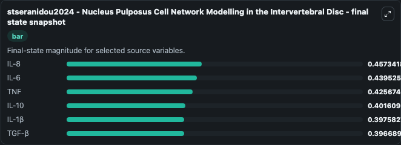
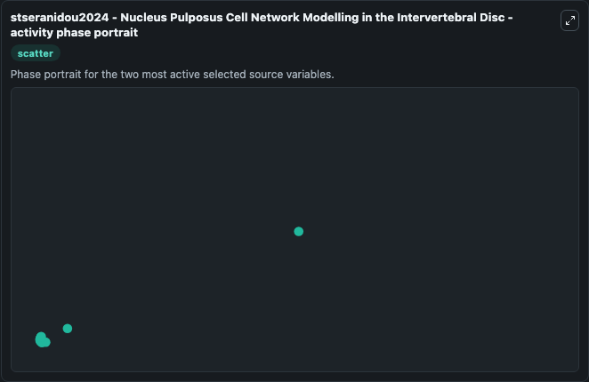

# Stseranidou2024 Nucleus Pulposus Cell Network Modelling In The Interverteb

This Biosimulant lab wraps `Stseranidou2024 Nucleus Pulposus Cell Network Modelling In The Interverteb` as a runnable systems biology model with a companion visualization module.
ABSTRACT: Intervertebral disc degeneration (IDD) arises from an intricate imbalance between the anabolic and catabolic processes governing the extracellular matrix (ECM) within the disc. It can be used to explore the configured dynamics and compare scenario outcomes across configurations.

## What You'll See

The lab asks: Which gene-regulatory states dominate the source model trajectory? Source model: stseranidou2024 - Nucleus Pulposus Cell Network Modelling in the Intervertebral Disc. It runs for 1.0 time units with a communication step of 0.1. The run uses the model defaults declared by the curated SBML wrapper. The generated visualizations focus on TNF, IL-10, IL-1β, TGF-β, IL-8, and IL-6, combining trajectory, endpoint-comparison, and summary-table views from one completed dark-mode run.

In this captured run, **IL-10** moved from 0.9062 to 0.4016 across 1.0 simulation windows.


### Output Visualizations



*Summary table for Stseranidou2024 Nucleus Pulposus Cell Network Modelling In The Interverteb, reporting the scientific question, observed answer, dominant module, and caveat.*



*Trajectories of IL-10, TGF-β, IL-1β, IL-8, IL-6, and TNF across the 1.0 simulation. In this run **TNF** climbed from 0.2421 to 0.4257 and **IL-10** fell from 0.9062 to 0.4016 — the largest movements among the focused observables.*



*Largest-excursion ranking of the focused observables — the absolute movement magnitude during the run. Top 3: **IL-10** = 0.5071, **TGF-β** = 0.4916, **IL-1β** = 0.4717, with 3 more observables below.*



*Endpoint snapshot of the focused observables — final values from the captured run. Top 3 by value: **IL-8** = 0.4573, **IL-6** = 0.4395, **TNF** = 0.4257, with 3 more observables below.*



*Visualization card from the Stseranidou2024 Nucleus Pulposus Cell Network Modelling In The Interverteb dark-mode run.*


## Model Context

- Core model: `models/core`
- Visualization model: `models/visualisation`
- Standard: `other`
- Upstream source: `biomodels_ebi:MODEL2407080001`
- License: `CC0`

## Inputs

| Input | Maps To | Default | Notes |
|---|---|---|---|
| Initial Model State TNF | `systemsbiology_sbml_stseranidou2024_nucleus_pulposus_cell_network_mo_model2407080001_model.initial_model_state_tnf` | | Source state initial condition exposed as a model-specific control because no explicit intervention parameter is identifiable. Maps to SBML symbol `TNF`. |
| Initial Il 10 | `systemsbiology_sbml_stseranidou2024_nucleus_pulposus_cell_network_mo_model2407080001_model.initial_il_10` | | Source state initial condition exposed as a model-specific control because no explicit intervention parameter is identifiable. Maps to SBML symbol `IL_10`. |
| Initial Il 1 | `systemsbiology_sbml_stseranidou2024_nucleus_pulposus_cell_network_mo_model2407080001_model.initial_il_1` | | Source state initial condition exposed as a model-specific control because no explicit intervention parameter is identifiable. Maps to SBML symbol `IL_1beta`. |
| Initial Model State Tgf | `systemsbiology_sbml_stseranidou2024_nucleus_pulposus_cell_network_mo_model2407080001_model.initial_model_state_tgf` | | Source state initial condition exposed as a model-specific control because no explicit intervention parameter is identifiable. Maps to SBML symbol `TGF_beta`. |
| Initial Il 8 | `systemsbiology_sbml_stseranidou2024_nucleus_pulposus_cell_network_mo_model2407080001_model.initial_il_8` | | Source state initial condition exposed as a model-specific control because no explicit intervention parameter is identifiable. Maps to SBML symbol `IL_8`. |
| Initial Il 6 | `systemsbiology_sbml_stseranidou2024_nucleus_pulposus_cell_network_mo_model2407080001_model.initial_il_6` | | Source state initial condition exposed as a model-specific control because no explicit intervention parameter is identifiable. Maps to SBML symbol `IL_6`. |

## Outputs

| Output | Maps To | Role |
|---|---|---|
| `state` | `systemsbiology_sbml_stseranidou2024_nucleus_pulposus_cell_network_mo_model2407080001_model.state` | Available to the visualization model and downstream workflows. |
| `summary` | `systemsbiology_sbml_stseranidou2024_nucleus_pulposus_cell_network_mo_model2407080001_model.summary` | Available to the visualization model and downstream workflows. |
| `species_labels` | `systemsbiology_sbml_stseranidou2024_nucleus_pulposus_cell_network_mo_model2407080001_model.species_labels` | Available to the visualization model and downstream workflows. |
| `tnf` | `systemsbiology_sbml_stseranidou2024_nucleus_pulposus_cell_network_mo_model2407080001_model.tnf` | Available to the visualization model and downstream workflows. |
| `il_10` | `systemsbiology_sbml_stseranidou2024_nucleus_pulposus_cell_network_mo_model2407080001_model.il_10` | Available to the visualization model and downstream workflows. |
| `il_1` | `systemsbiology_sbml_stseranidou2024_nucleus_pulposus_cell_network_mo_model2407080001_model.il_1` | Available to the visualization model and downstream workflows. |
| `tgf` | `systemsbiology_sbml_stseranidou2024_nucleus_pulposus_cell_network_mo_model2407080001_model.tgf` | Available to the visualization model and downstream workflows. |
| `il_8` | `systemsbiology_sbml_stseranidou2024_nucleus_pulposus_cell_network_mo_model2407080001_model.il_8` | Available to the visualization model and downstream workflows. |
| `il_6` | `systemsbiology_sbml_stseranidou2024_nucleus_pulposus_cell_network_mo_model2407080001_model.il_6` | Available to the visualization model and downstream workflows. |

## Runtime

- Duration: `1.0`
- Communication step: `0.1`

## Running Locally

```bash
biosimulant labs serve
```
