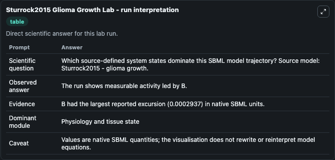
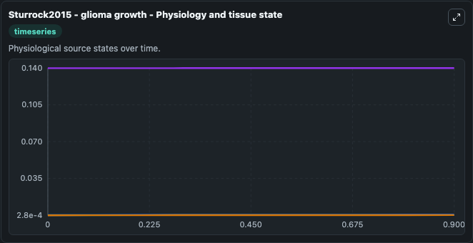
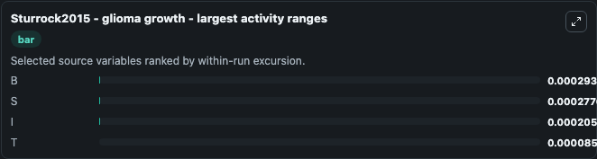
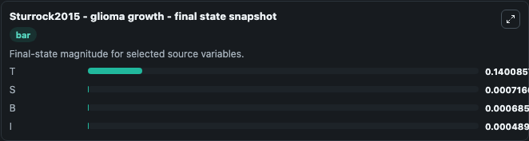
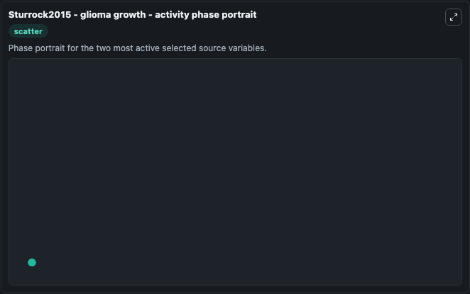

# Sturrock2015 Glioma Growth

This Biosimulant lab wraps `Sturrock2015 Glioma Growth` as a runnable systems biology model with a companion visualization module.
The paper describes a model of glioma. It can be used to explore the configured dynamics and compare scenario outcomes across configurations.

## What You'll See

The lab asks: Which source-defined system states dominate this SBML model trajectory? Source model: Sturrock2015 - glioma growth. It runs for 1.0 time units with a communication step of 0.1. The run uses the model defaults declared by the curated SBML wrapper. The generated visualizations focus on T, S, B, and I, combining trajectory, endpoint-comparison, and summary-table views from one completed dark-mode run.

In this captured run, **B** moved from 0.000392 to 0.000686 across 1.0 simulation windows.


### Output Visualizations



*Summary table for Sturrock2015 Glioma Growth, reporting the scientific question, observed answer, dominant module, and caveat.*



*Trajectories of B, S, I, and T across the 1.0 simulation. In this run **B** climbed from 0.000392 to 0.000686 — the largest movements among the focused observables.*



*Largest-excursion ranking of the focused observables — the absolute movement magnitude during the run. Top 3: **B** = 0.000294, **S** = 0.000278, **I** = 0.000206, with 1 more observable below.*



*Endpoint snapshot of the focused observables — final values from the captured run. Top 3 by value: **T** = 0.1401, **S** = 0.000717, **B** = 0.000686, with 1 more observable below.*



*Visualization card from the Sturrock2015 Glioma Growth dark-mode run.*


## Model Context

- Core model: `models/core`
- Visualization model: `models/visualisation`
- Standard: `other`
- Upstream source: `biomodels_ebi:BIOMD0000000801`
- License: `CC0`

## Inputs

| Input | Maps To | Default | Notes |
|---|---|---|---|
| Initial Model State T | `systemsbiology_sbml_sturrock2015_glioma_growth_biomd0000000801_model.initial_model_state_t` | | Source state initial condition exposed as a model-specific control because no explicit intervention parameter is identifiable. Maps to SBML symbol `T`. |
| Initial Model State S | `systemsbiology_sbml_sturrock2015_glioma_growth_biomd0000000801_model.initial_model_state_s` | | Source state initial condition exposed as a model-specific control because no explicit intervention parameter is identifiable. Maps to SBML symbol `S`. |
| Initial Model State B | `systemsbiology_sbml_sturrock2015_glioma_growth_biomd0000000801_model.initial_model_state_b` | | Source state initial condition exposed as a model-specific control because no explicit intervention parameter is identifiable. Maps to SBML symbol `B`. |
| Initial Model State I | `systemsbiology_sbml_sturrock2015_glioma_growth_biomd0000000801_model.initial_model_state_i` | | Source state initial condition exposed as a model-specific control because no explicit intervention parameter is identifiable. Maps to SBML symbol `I`. |

## Outputs

| Output | Maps To | Role |
|---|---|---|
| `state` | `systemsbiology_sbml_sturrock2015_glioma_growth_biomd0000000801_model.state` | Available to the visualization model and downstream workflows. |
| `summary` | `systemsbiology_sbml_sturrock2015_glioma_growth_biomd0000000801_model.summary` | Available to the visualization model and downstream workflows. |
| `species_labels` | `systemsbiology_sbml_sturrock2015_glioma_growth_biomd0000000801_model.species_labels` | Available to the visualization model and downstream workflows. |
| `model_state_t` | `systemsbiology_sbml_sturrock2015_glioma_growth_biomd0000000801_model.model_state_t` | Available to the visualization model and downstream workflows. |
| `model_state_s` | `systemsbiology_sbml_sturrock2015_glioma_growth_biomd0000000801_model.model_state_s` | Available to the visualization model and downstream workflows. |
| `model_state_b` | `systemsbiology_sbml_sturrock2015_glioma_growth_biomd0000000801_model.model_state_b` | Available to the visualization model and downstream workflows. |
| `model_state_i` | `systemsbiology_sbml_sturrock2015_glioma_growth_biomd0000000801_model.model_state_i` | Available to the visualization model and downstream workflows. |

## Runtime

- Duration: `1.0`
- Communication step: `0.1`

## Running Locally

```bash
biosimulant labs serve
```
