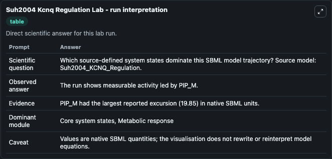
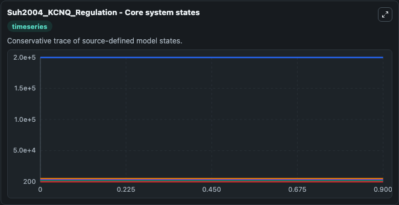
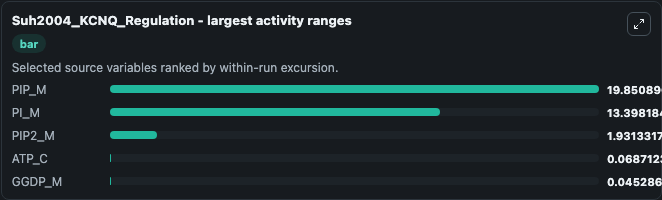
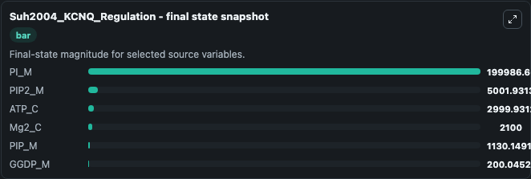
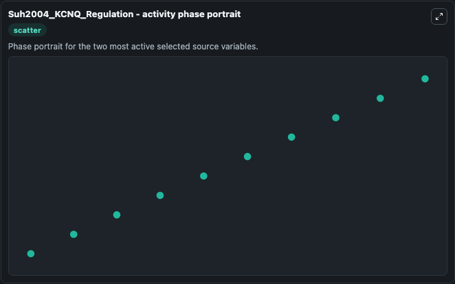

# Suh2004 Kcnq Regulation

This Biosimulant lab wraps `Suh2004 Kcnq Regulation` as a runnable systems biology model with a companion visualization module.
The model reproduces FIG 11A and FIG 11B of the paper. It can be used to explore the configured dynamics and compare scenario outcomes across configurations.

## What You'll See

The lab asks: Which source-defined system states dominate this SBML model trajectory? Source model: Suh2004_KCNQ_Regulation. It runs for 1.0 time units with a communication step of 0.1. The run uses the model defaults declared by the curated SBML wrapper. The generated visualizations focus on ATP_C, PI_M, PIP2_M, Mg2_C, PIP_M, and GGDP_M, combining trajectory, endpoint-comparison, and summary-table views from one completed dark-mode run.

In this captured run, **PIP_M** moved from 1150.0 to 1130.1 across 1.0 simulation windows.


### Output Visualizations



*Summary table for Suh2004 Kcnq Regulation, reporting the scientific question, observed answer, dominant module, and caveat.*



*Trajectories of PIP_M, PI_M, PIP2_M, ATP_C, GGDP_M, and Mg2_C across the 1.0 simulation. In this run **PIP2_M** climbed from 5000.0 to 5001.9 and **PIP_M** fell from 1150.0 to 1130.1 — the largest movements among the focused observables.*



*Largest-excursion ranking of the focused observables — the absolute movement magnitude during the run. Top 3: **PIP_M** = 19.851, **PI_M** = 13.398, **PIP2_M** = 1.931, with 2 more observables below.*



*Endpoint snapshot of the focused observables — final values from the captured run. Top 3 by value: **PI_M** = 2e+05, **PIP2_M** = 5001.9, **ATP_C** = 2999.9, with 3 more observables below.*



*Visualization card from the Suh2004 Kcnq Regulation dark-mode run.*


## Model Context

- Core model: `models/core`
- Visualization model: `models/visualisation`
- Standard: `other`
- Upstream source: `biomodels_ebi:BIOMD0000000081`
- License: `CC0`

## Inputs

| Input | Maps To | Default | Notes |
|---|---|---|---|
| Initial ATP C | `systemsbiology_sbml_suh2004_kcnq_regulation_biomd0000000081_model.initial_atp_c` | | Source state initial condition exposed as a model-specific control because no explicit intervention parameter is identifiable. Maps to SBML symbol `ATP_C`. |
| Initial Pi M | `systemsbiology_sbml_suh2004_kcnq_regulation_biomd0000000081_model.initial_pi_m` | | Source state initial condition exposed as a model-specific control because no explicit intervention parameter is identifiable. Maps to SBML symbol `PI_M`. |
| Initial Pip2 M | `systemsbiology_sbml_suh2004_kcnq_regulation_biomd0000000081_model.initial_pip2_m` | | Source state initial condition exposed as a model-specific control because no explicit intervention parameter is identifiable. Maps to SBML symbol `PIP2_M`. |
| Initial MG2 C | `systemsbiology_sbml_suh2004_kcnq_regulation_biomd0000000081_model.initial_mg2_c` | | Source state initial condition exposed as a model-specific control because no explicit intervention parameter is identifiable. Maps to SBML symbol `Mg2_C`. |
| Initial Pip M | `systemsbiology_sbml_suh2004_kcnq_regulation_biomd0000000081_model.initial_pip_m` | | Source state initial condition exposed as a model-specific control because no explicit intervention parameter is identifiable. Maps to SBML symbol `PIP_M`. |
| Initial Ggdp M | `systemsbiology_sbml_suh2004_kcnq_regulation_biomd0000000081_model.initial_ggdp_m` | | Source state initial condition exposed as a model-specific control because no explicit intervention parameter is identifiable. Maps to SBML symbol `GGDP_M`. |

## Outputs

| Output | Maps To | Role |
|---|---|---|
| `state` | `systemsbiology_sbml_suh2004_kcnq_regulation_biomd0000000081_model.state` | Available to the visualization model and downstream workflows. |
| `summary` | `systemsbiology_sbml_suh2004_kcnq_regulation_biomd0000000081_model.summary` | Available to the visualization model and downstream workflows. |
| `species_labels` | `systemsbiology_sbml_suh2004_kcnq_regulation_biomd0000000081_model.species_labels` | Available to the visualization model and downstream workflows. |
| `atp_c` | `systemsbiology_sbml_suh2004_kcnq_regulation_biomd0000000081_model.atp_c` | Available to the visualization model and downstream workflows. |
| `pi_m` | `systemsbiology_sbml_suh2004_kcnq_regulation_biomd0000000081_model.pi_m` | Available to the visualization model and downstream workflows. |
| `pip2_m` | `systemsbiology_sbml_suh2004_kcnq_regulation_biomd0000000081_model.pip2_m` | Available to the visualization model and downstream workflows. |
| `mg2_c` | `systemsbiology_sbml_suh2004_kcnq_regulation_biomd0000000081_model.mg2_c` | Available to the visualization model and downstream workflows. |
| `pip_m` | `systemsbiology_sbml_suh2004_kcnq_regulation_biomd0000000081_model.pip_m` | Available to the visualization model and downstream workflows. |
| `ggdp_m` | `systemsbiology_sbml_suh2004_kcnq_regulation_biomd0000000081_model.ggdp_m` | Available to the visualization model and downstream workflows. |

## Runtime

- Duration: `1.0`
- Communication step: `0.1`

## Running Locally

```bash
biosimulant labs serve
```
