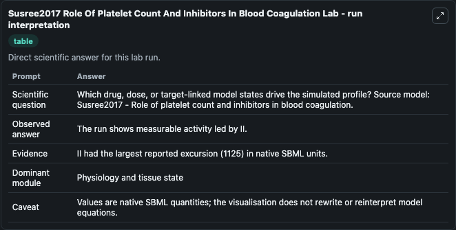
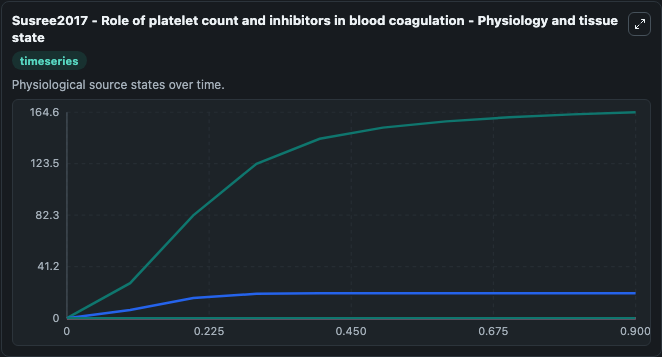
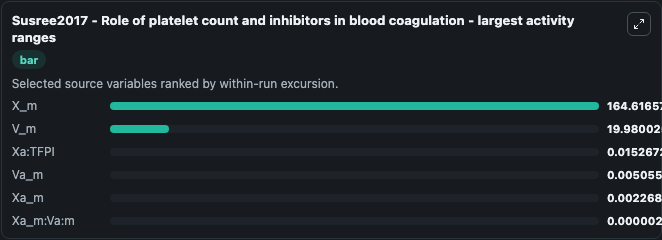
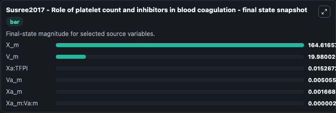
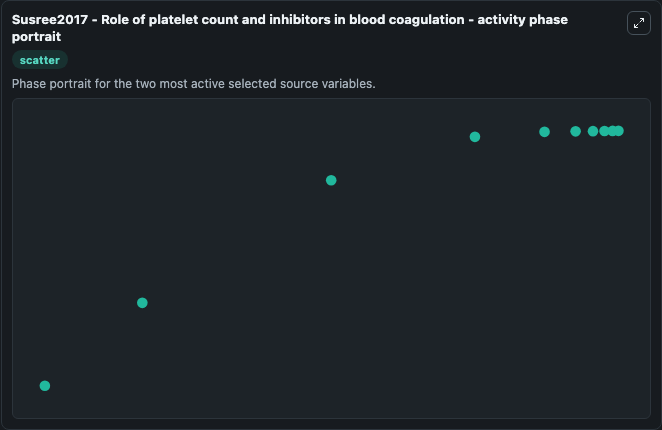

# Susree2017 Role Of Platelet Count And Inhibitors In Blood Coagulation

This Biosimulant lab wraps `Susree2017 Role Of Platelet Count And Inhibitors In Blood Coagulation` as a runnable systems biology model with a companion visualization module.
Mathematical model of blood coagulation that incorporates platelet binding sites. It can be used to explore the configured dynamics and compare scenario outcomes across configurations.

## What You'll See

The lab asks: Which drug, dose, or target-linked model states drive the simulated profile? Source model: Susree2017 - Role of platelet count and inhibitors in blood coagulation. It runs for 1.0 time units with a communication step of 0.1. The run uses the model defaults declared by the curated SBML wrapper. The generated visualizations focus on Xa_m:Va:m, Xa_m, Xa:TFPI, X_m, Va_m, and V_m, combining trajectory, endpoint-comparison, and summary-table views from one completed dark-mode run.

In this captured run, **X_m** moved from 0 to 164.6 across 1.0 simulation windows.


### Output Visualizations



*Summary table for Susree2017 Role Of Platelet Count And Inhibitors In Blood Coagulation, reporting the scientific question, observed answer, dominant module, and caveat.*



*Trajectories of X_m, V_m, Xa:TFPI, Va_m, Xa_m, and Xa_m:Va:m across the 1.0 simulation. In this run **X_m** climbed from 0 to 164.6 — the largest movements among the focused observables.*



*Largest-excursion ranking of the focused observables — the absolute movement magnitude during the run. Top 3: **X_m** = 164.6, **V_m** = 19.980, **Xa:TFPI** = 0.0153, with 3 more observables below.*



*Endpoint snapshot of the focused observables — final values from the captured run. Top 3 by value: **X_m** = 164.6, **V_m** = 19.980, **Xa:TFPI** = 0.0153, with 3 more observables below.*



*Visualization card from the Susree2017 Role Of Platelet Count And Inhibitors In Blood Coagulation dark-mode run.*


## Model Context

- Core model: `models/core`
- Visualization model: `models/visualisation`
- Standard: `other`
- Upstream source: `biomodels_ebi:MODEL1808130001`
- License: `CC0`

## Inputs

| Input | Maps To | Default | Notes |
|---|---|---|---|
| Initial Xa M Va M | `systemsbiology_sbml_susree2017_role_of_platelet_count_and_inhibitors_model1808130001_model.initial_xa_m_va_m` | | Source state initial condition exposed as a model-specific control because no explicit intervention parameter is identifiable. Maps to SBML symbol `Xa_m_Va_m`. |
| Initial Xa M | `systemsbiology_sbml_susree2017_role_of_platelet_count_and_inhibitors_model1808130001_model.initial_xa_m` | | Source state initial condition exposed as a model-specific control because no explicit intervention parameter is identifiable. Maps to SBML symbol `Xa_m`. |
| Initial Xa Tfpi | `systemsbiology_sbml_susree2017_role_of_platelet_count_and_inhibitors_model1808130001_model.initial_xa_tfpi` | | Source state initial condition exposed as a model-specific control because no explicit intervention parameter is identifiable. Maps to SBML symbol `Xa_TFPI`. |
| Initial Model State X M | `systemsbiology_sbml_susree2017_role_of_platelet_count_and_inhibitors_model1808130001_model.initial_model_state_x_m` | | Source state initial condition exposed as a model-specific control because no explicit intervention parameter is identifiable. Maps to SBML symbol `X_m`. |
| Initial Va M | `systemsbiology_sbml_susree2017_role_of_platelet_count_and_inhibitors_model1808130001_model.initial_va_m` | | Source state initial condition exposed as a model-specific control because no explicit intervention parameter is identifiable. Maps to SBML symbol `Va_m`. |
| Initial Model State V M | `systemsbiology_sbml_susree2017_role_of_platelet_count_and_inhibitors_model1808130001_model.initial_model_state_v_m` | | Source state initial condition exposed as a model-specific control because no explicit intervention parameter is identifiable. Maps to SBML symbol `V_m`. |

## Outputs

| Output | Maps To | Role |
|---|---|---|
| `state` | `systemsbiology_sbml_susree2017_role_of_platelet_count_and_inhibitors_model1808130001_model.state` | Available to the visualization model and downstream workflows. |
| `summary` | `systemsbiology_sbml_susree2017_role_of_platelet_count_and_inhibitors_model1808130001_model.summary` | Available to the visualization model and downstream workflows. |
| `species_labels` | `systemsbiology_sbml_susree2017_role_of_platelet_count_and_inhibitors_model1808130001_model.species_labels` | Available to the visualization model and downstream workflows. |
| `xa_m_va_m` | `systemsbiology_sbml_susree2017_role_of_platelet_count_and_inhibitors_model1808130001_model.xa_m_va_m` | Available to the visualization model and downstream workflows. |
| `xa_m` | `systemsbiology_sbml_susree2017_role_of_platelet_count_and_inhibitors_model1808130001_model.xa_m` | Available to the visualization model and downstream workflows. |
| `xa_tfpi` | `systemsbiology_sbml_susree2017_role_of_platelet_count_and_inhibitors_model1808130001_model.xa_tfpi` | Available to the visualization model and downstream workflows. |
| `x_m` | `systemsbiology_sbml_susree2017_role_of_platelet_count_and_inhibitors_model1808130001_model.x_m` | Available to the visualization model and downstream workflows. |
| `va_m` | `systemsbiology_sbml_susree2017_role_of_platelet_count_and_inhibitors_model1808130001_model.va_m` | Available to the visualization model and downstream workflows. |
| `v_m` | `systemsbiology_sbml_susree2017_role_of_platelet_count_and_inhibitors_model1808130001_model.v_m` | Available to the visualization model and downstream workflows. |

## Runtime

- Duration: `1.0`
- Communication step: `0.1`

## Running Locally

```bash
biosimulant labs serve
```
