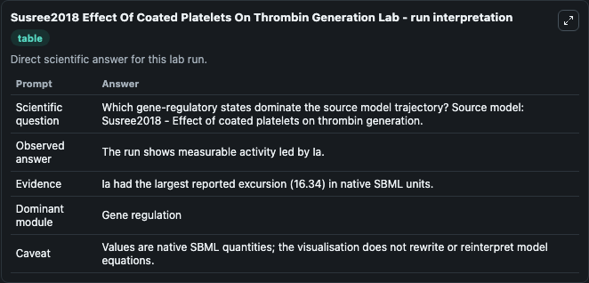
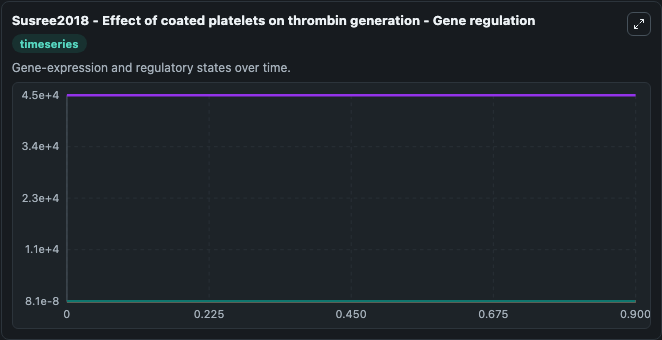
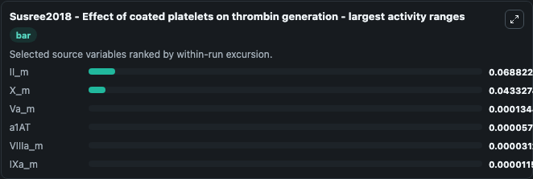
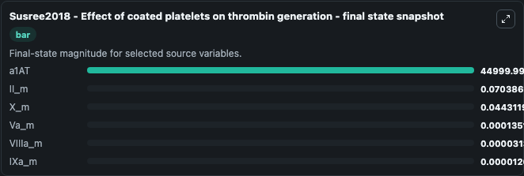
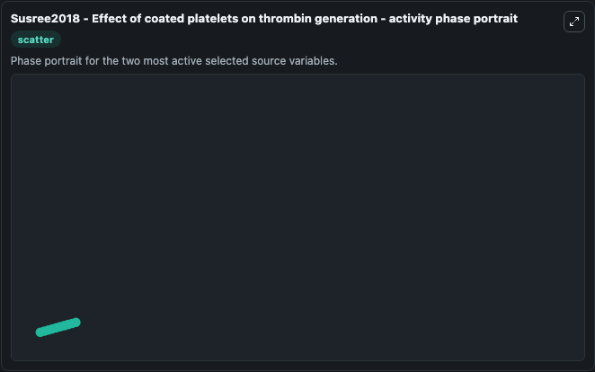

# Susree2018 Effect Of Coated Platelets On Thrombin Generation

This Biosimulant lab wraps `Susree2018 Effect Of Coated Platelets On Thrombin Generation` as a runnable systems biology model with a companion visualization module.
Mathematical model of blood coagulation that simulates the effect of coated platelets on thrombin generation. It can be used to explore the configured dynamics and compare scenario outcomes across configurations.

## What You'll See

The lab asks: Which gene-regulatory states dominate the source model trajectory? Source model: Susree2018 - Effect of coated platelets on thrombin generation. It runs for 1.0 time units with a communication step of 0.1. The run uses the model defaults declared by the curated SBML wrapper. The generated visualizations focus on a1AT, II_m, X_m, Va_m, IXa_m, and VIIIa_m, combining trajectory, endpoint-comparison, and summary-table views from one completed dark-mode run.

In this captured run, **II_m** moved from 0.00156 to 0.0704 across 1.0 simulation windows.


### Output Visualizations



*Summary table for Susree2018 Effect Of Coated Platelets On Thrombin Generation, reporting the scientific question, observed answer, dominant module, and caveat.*



*Trajectories of II_m, X_m, Va_m, a1AT, VIIIa_m, and IXa_m across the 1.0 simulation. In this run **II_m** climbed from 0.00156 to 0.0704 and **a1AT** fell from 4.5e+04 to 4.5e+04 — the largest movements among the focused observables.*



*Largest-excursion ranking of the focused observables — the absolute movement magnitude during the run. Top 3: **II_m** = 0.0688, **X_m** = 0.0433, **Va_m** = 0.000134, with 3 more observables below.*



*Trajectories of II_m, X_m, Va_m, a1AT, VIIIa_m, and IXa_m across the 1.0 simulation. In this run **II_m** climbed from 0.00156 to 0.0704 and **a1AT** fell from 4.5e+04 to 4.5e+04 — the largest movements among the focused observables.*



*Visualization card from the Susree2018 Effect Of Coated Platelets On Thrombin Generation dark-mode run.*


## Model Context

- Core model: `models/core`
- Visualization model: `models/visualisation`
- Standard: `other`
- Upstream source: `biomodels_ebi:MODEL1808080001`
- License: `CC0`

## Inputs

| Input | Maps To | Default | Notes |
|---|---|---|---|
| Initial A1 At | `systemsbiology_sbml_susree2018_effect_of_coated_platelets_on_thrombi_model1808080001_model.initial_a1_at` | | Source state initial condition exposed as a model-specific control because no explicit intervention parameter is identifiable. Maps to SBML symbol `a1AT`. |
| Initial Ii M | `systemsbiology_sbml_susree2018_effect_of_coated_platelets_on_thrombi_model1808080001_model.initial_ii_m` | | Source state initial condition exposed as a model-specific control because no explicit intervention parameter is identifiable. Maps to SBML symbol `II_m`. |
| Initial Model State X M | `systemsbiology_sbml_susree2018_effect_of_coated_platelets_on_thrombi_model1808080001_model.initial_model_state_x_m` | | Source state initial condition exposed as a model-specific control because no explicit intervention parameter is identifiable. Maps to SBML symbol `X_m`. |
| Initial Va M | `systemsbiology_sbml_susree2018_effect_of_coated_platelets_on_thrombi_model1808080001_model.initial_va_m` | | Source state initial condition exposed as a model-specific control because no explicit intervention parameter is identifiable. Maps to SBML symbol `Va_m`. |
| Initial I Xa M | `systemsbiology_sbml_susree2018_effect_of_coated_platelets_on_thrombi_model1808080001_model.initial_i_xa_m` | | Source state initial condition exposed as a model-specific control because no explicit intervention parameter is identifiable. Maps to SBML symbol `IXa_m`. |
| Initial Vii Ia M | `systemsbiology_sbml_susree2018_effect_of_coated_platelets_on_thrombi_model1808080001_model.initial_vii_ia_m` | | Source state initial condition exposed as a model-specific control because no explicit intervention parameter is identifiable. Maps to SBML symbol `VIIIa_m`. |

## Outputs

| Output | Maps To | Role |
|---|---|---|
| `state` | `systemsbiology_sbml_susree2018_effect_of_coated_platelets_on_thrombi_model1808080001_model.state` | Available to the visualization model and downstream workflows. |
| `summary` | `systemsbiology_sbml_susree2018_effect_of_coated_platelets_on_thrombi_model1808080001_model.summary` | Available to the visualization model and downstream workflows. |
| `species_labels` | `systemsbiology_sbml_susree2018_effect_of_coated_platelets_on_thrombi_model1808080001_model.species_labels` | Available to the visualization model and downstream workflows. |
| `a1_at` | `systemsbiology_sbml_susree2018_effect_of_coated_platelets_on_thrombi_model1808080001_model.a1_at` | Available to the visualization model and downstream workflows. |
| `ii_m` | `systemsbiology_sbml_susree2018_effect_of_coated_platelets_on_thrombi_model1808080001_model.ii_m` | Available to the visualization model and downstream workflows. |
| `x_m` | `systemsbiology_sbml_susree2018_effect_of_coated_platelets_on_thrombi_model1808080001_model.x_m` | Available to the visualization model and downstream workflows. |
| `va_m` | `systemsbiology_sbml_susree2018_effect_of_coated_platelets_on_thrombi_model1808080001_model.va_m` | Available to the visualization model and downstream workflows. |
| `i_xa_m` | `systemsbiology_sbml_susree2018_effect_of_coated_platelets_on_thrombi_model1808080001_model.i_xa_m` | Available to the visualization model and downstream workflows. |
| `vii_ia_m` | `systemsbiology_sbml_susree2018_effect_of_coated_platelets_on_thrombi_model1808080001_model.vii_ia_m` | Available to the visualization model and downstream workflows. |

## Runtime

- Duration: `1.0`
- Communication step: `0.1`

## Running Locally

```bash
biosimulant labs serve
```
