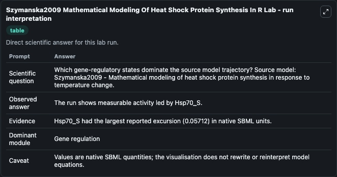
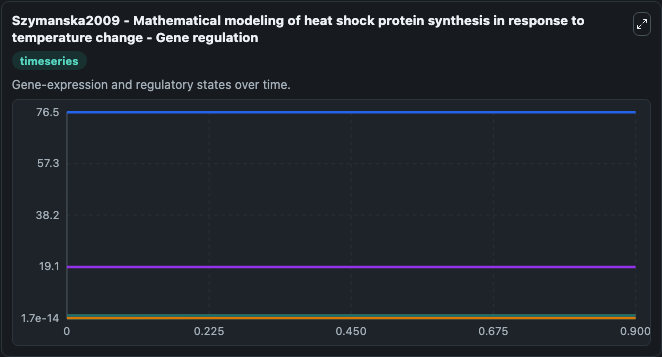
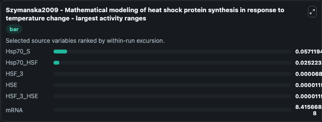
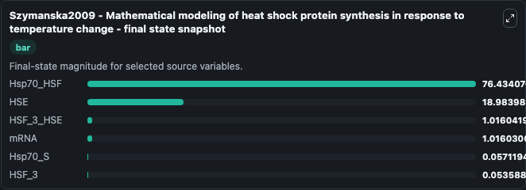
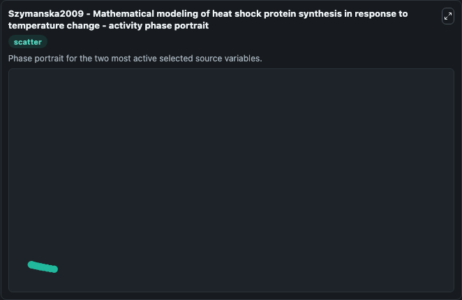

# Szymanska2009 Mathematical Modeling Of Heat Shock Protein Synthesis In R

This Biosimulant lab wraps `Szymanska2009 Mathematical Modeling Of Heat Shock Protein Synthesis In R` as a runnable systems biology model with a companion visualization module.
This is a mathematical model of heat shock protein synthesis induced by an external temperature stimulus. It can be used to explore the configured dynamics and compare scenario outcomes across configurations.

## What You'll See

The lab asks: Which gene-regulatory states dominate the source model trajectory? Source model: Szymanska2009 - Mathematical modeling of heat shock protein synthesis in response to temperature change. It runs for 1.0 time units with a communication step of 0.1. The run uses the model defaults declared by the curated SBML wrapper. The generated visualizations focus on Hsp70_HSF, mRNA, HSF_3_HSE, HSF_3, Hsp70_S, and HSE, combining trajectory, endpoint-comparison, and summary-table views from one completed dark-mode run.

In this captured run, **Hsp70_S** moved from 1.75e-14 to 0.0571 across 1.0 simulation windows.


### Output Visualizations



*Summary table for Szymanska2009 Mathematical Modeling Of Heat Shock Protein Synthesis In R, reporting the scientific question, observed answer, dominant module, and caveat.*



*Trajectories of Hsp70_S, Hsp70_HSF, HSF_3, HSE, HSF_3_HSE, and mRNA across the 1.0 simulation. In this run **Hsp70_S** climbed from 1.75e-14 to 0.0571 and **Hsp70_HSF** fell from 76.459 to 76.434 — the largest movements among the focused observables.*



*Trajectories of Hsp70_S, Hsp70_HSF, HSF_3, HSE, HSF_3_HSE, and mRNA across the 1.0 simulation. In this run **Hsp70_S** climbed from 1.75e-14 to 0.0571 and **Hsp70_HSF** fell from 76.459 to 76.434 — the largest movements among the focused observables.*



*Trajectories of Hsp70_S, Hsp70_HSF, HSF_3, HSE, HSF_3_HSE, and mRNA across the 1.0 simulation. In this run **Hsp70_S** climbed from 1.75e-14 to 0.0571 and **Hsp70_HSF** fell from 76.459 to 76.434 — the largest movements among the focused observables.*



*Trajectories of Hsp70_S, Hsp70_HSF, HSF_3, HSE, HSF_3_HSE, and mRNA across the 1.0 simulation. In this run **Hsp70_S** climbed from 1.75e-14 to 0.0571 and **Hsp70_HSF** fell from 76.459 to 76.434 — the largest movements among the focused observables.*


## Model Context

- Core model: `models/core`
- Visualization model: `models/visualisation`
- Standard: `other`
- Upstream source: `biomodels_ebi:BIOMD0000000896`
- License: `CC0`

## Inputs

| Input | Maps To | Default | Notes |
|---|---|---|---|
| Initial Hsp70 Hsf | `systemsbiology_sbml_szymanska2009_mathematical_modeling_of_heat_shoc_biomd0000000896_model.initial_hsp70_hsf` | | Source state initial condition exposed as a model-specific control because no explicit intervention parameter is identifiable. Maps to SBML symbol `Hsp70_HSF`. |
| Initial MRNA | `systemsbiology_sbml_szymanska2009_mathematical_modeling_of_heat_shoc_biomd0000000896_model.initial_mrna` | | Source state initial condition exposed as a model-specific control because no explicit intervention parameter is identifiable. Maps to SBML symbol `mRNA`. |
| Initial Hsf 3 Hse | `systemsbiology_sbml_szymanska2009_mathematical_modeling_of_heat_shoc_biomd0000000896_model.initial_hsf_3_hse` | | Source state initial condition exposed as a model-specific control because no explicit intervention parameter is identifiable. Maps to SBML symbol `HSF_3_HSE`. |
| Initial Hsf 3 | `systemsbiology_sbml_szymanska2009_mathematical_modeling_of_heat_shoc_biomd0000000896_model.initial_hsf_3` | | Source state initial condition exposed as a model-specific control because no explicit intervention parameter is identifiable. Maps to SBML symbol `HSF_3`. |
| Initial Hsp70 S | `systemsbiology_sbml_szymanska2009_mathematical_modeling_of_heat_shoc_biomd0000000896_model.initial_hsp70_s` | | Source state initial condition exposed as a model-specific control because no explicit intervention parameter is identifiable. Maps to SBML symbol `Hsp70_S`. |
| Initial Model State Hse | `systemsbiology_sbml_szymanska2009_mathematical_modeling_of_heat_shoc_biomd0000000896_model.initial_model_state_hse` | | Source state initial condition exposed as a model-specific control because no explicit intervention parameter is identifiable. Maps to SBML symbol `HSE`. |

## Outputs

| Output | Maps To | Role |
|---|---|---|
| `state` | `systemsbiology_sbml_szymanska2009_mathematical_modeling_of_heat_shoc_biomd0000000896_model.state` | Available to the visualization model and downstream workflows. |
| `summary` | `systemsbiology_sbml_szymanska2009_mathematical_modeling_of_heat_shoc_biomd0000000896_model.summary` | Available to the visualization model and downstream workflows. |
| `species_labels` | `systemsbiology_sbml_szymanska2009_mathematical_modeling_of_heat_shoc_biomd0000000896_model.species_labels` | Available to the visualization model and downstream workflows. |
| `hsp70_hsf` | `systemsbiology_sbml_szymanska2009_mathematical_modeling_of_heat_shoc_biomd0000000896_model.hsp70_hsf` | Available to the visualization model and downstream workflows. |
| `mrna` | `systemsbiology_sbml_szymanska2009_mathematical_modeling_of_heat_shoc_biomd0000000896_model.mrna` | Available to the visualization model and downstream workflows. |
| `hsf_3_hse` | `systemsbiology_sbml_szymanska2009_mathematical_modeling_of_heat_shoc_biomd0000000896_model.hsf_3_hse` | Available to the visualization model and downstream workflows. |
| `hsf_3` | `systemsbiology_sbml_szymanska2009_mathematical_modeling_of_heat_shoc_biomd0000000896_model.hsf_3` | Available to the visualization model and downstream workflows. |
| `hsp70_s` | `systemsbiology_sbml_szymanska2009_mathematical_modeling_of_heat_shoc_biomd0000000896_model.hsp70_s` | Available to the visualization model and downstream workflows. |
| `hse` | `systemsbiology_sbml_szymanska2009_mathematical_modeling_of_heat_shoc_biomd0000000896_model.hse` | Available to the visualization model and downstream workflows. |

## Runtime

- Duration: `1.0`
- Communication step: `0.1`

## Running Locally

```bash
biosimulant labs serve
```
