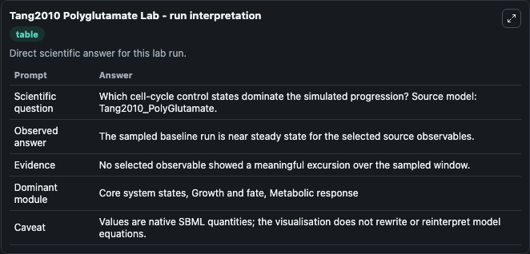
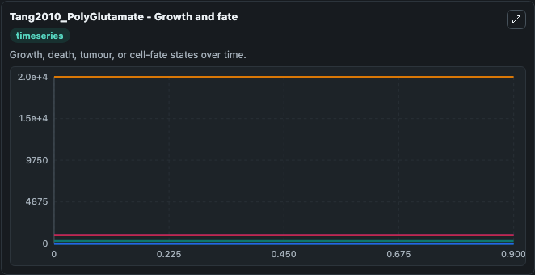
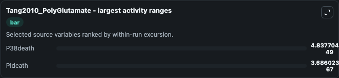
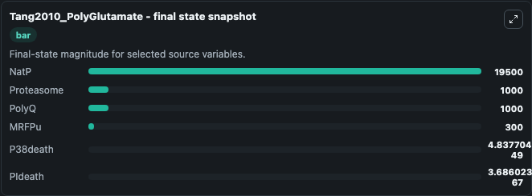
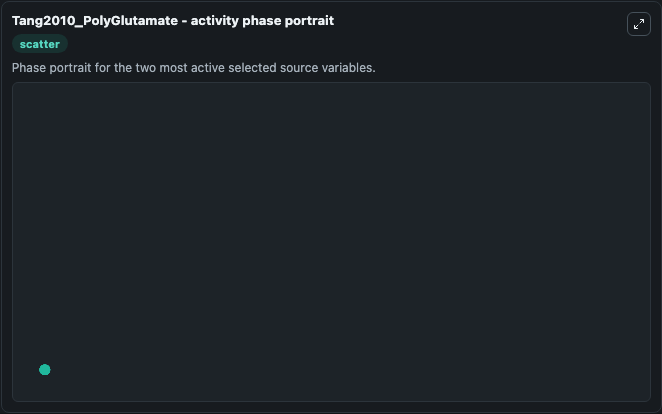

# Tang2010 Polyglutamate

This Biosimulant lab wraps `Tang2010 Polyglutamate` as a runnable systems biology model with a companion visualization module.
This a model from the article: Experimental and computational analysis of polyglutamine-mediated cytotoxicity. It can be used to explore the configured dynamics and compare scenario outcomes across configurations.

## What You'll See

The lab asks: Which cell-cycle control states dominate the simulated progression? Source model: Tang2010_PolyGlutamate. It runs for 1.0 time units with a communication step of 0.1. The run uses the model defaults declared by the curated SBML wrapper. The generated visualizations focus on NatP, PIdeath, P38death, Proteasome, PolyQ, and MRFPu, combining trajectory, endpoint-comparison, and summary-table views from one completed dark-mode run.

In this captured run, **P38death** moved from 0 to 4.84e-49 across 1.0 simulation windows.


### Output Visualizations



*Summary table for Tang2010 Polyglutamate, reporting the scientific question, observed answer, dominant module, and caveat.*



*Trajectories of P38death, PIdeath, NatP, Proteasome, PolyQ, and MRFPu across the 1.0 simulation. In this run **P38death** climbed from 0 to 4.84e-49 — the largest movements among the focused observables.*



*Largest-excursion ranking of the focused observables — the absolute movement magnitude during the run. Top 2: **P38death** = 4.84e-49, **PIdeath** = 3.69e-67.*



*Endpoint snapshot of the focused observables — final values from the captured run. Top 3 by value: **NatP** = 1.95e+04, **Proteasome** = 1000.0, **PolyQ** = 1000.0, with 3 more observables below.*



*Visualization card from the Tang2010 Polyglutamate dark-mode run.*


## Model Context

- Core model: `models/core`
- Visualization model: `models/visualisation`
- Standard: `other`
- Upstream source: `biomodels_ebi:BIOMD0000000285`
- License: `CC0`

## Inputs

| Input | Maps To | Default | Notes |
|---|---|---|---|
| Initial Nat P | `systemsbiology_sbml_tang2010_polyglutamate_biomd0000000285_model.initial_nat_p` | | Source state initial condition exposed as a model-specific control because no explicit intervention parameter is identifiable. Maps to SBML symbol `NatP`. |
| Initial P Ideath | `systemsbiology_sbml_tang2010_polyglutamate_biomd0000000285_model.initial_p_ideath` | | Source state initial condition exposed as a model-specific control because no explicit intervention parameter is identifiable. Maps to SBML symbol `PIdeath`. |
| Initial P38death | `systemsbiology_sbml_tang2010_polyglutamate_biomd0000000285_model.initial_p38death` | | Source state initial condition exposed as a model-specific control because no explicit intervention parameter is identifiable. Maps to SBML symbol `p38death`. |
| Initial Proteasome | `systemsbiology_sbml_tang2010_polyglutamate_biomd0000000285_model.initial_proteasome` | | Source state initial condition exposed as a model-specific control because no explicit intervention parameter is identifiable. Maps to SBML symbol `Proteasome`. |
| Initial Poly Q | `systemsbiology_sbml_tang2010_polyglutamate_biomd0000000285_model.initial_poly_q` | | Source state initial condition exposed as a model-specific control because no explicit intervention parameter is identifiable. Maps to SBML symbol `PolyQ`. |
| Initial Mrf Pu | `systemsbiology_sbml_tang2010_polyglutamate_biomd0000000285_model.initial_mrf_pu` | | Source state initial condition exposed as a model-specific control because no explicit intervention parameter is identifiable. Maps to SBML symbol `mRFPu`. |

## Outputs

| Output | Maps To | Role |
|---|---|---|
| `state` | `systemsbiology_sbml_tang2010_polyglutamate_biomd0000000285_model.state` | Available to the visualization model and downstream workflows. |
| `summary` | `systemsbiology_sbml_tang2010_polyglutamate_biomd0000000285_model.summary` | Available to the visualization model and downstream workflows. |
| `species_labels` | `systemsbiology_sbml_tang2010_polyglutamate_biomd0000000285_model.species_labels` | Available to the visualization model and downstream workflows. |
| `nat_p` | `systemsbiology_sbml_tang2010_polyglutamate_biomd0000000285_model.nat_p` | Available to the visualization model and downstream workflows. |
| `p_ideath` | `systemsbiology_sbml_tang2010_polyglutamate_biomd0000000285_model.p_ideath` | Available to the visualization model and downstream workflows. |
| `p38death` | `systemsbiology_sbml_tang2010_polyglutamate_biomd0000000285_model.p38death` | Available to the visualization model and downstream workflows. |
| `proteasome` | `systemsbiology_sbml_tang2010_polyglutamate_biomd0000000285_model.proteasome` | Available to the visualization model and downstream workflows. |
| `poly_q` | `systemsbiology_sbml_tang2010_polyglutamate_biomd0000000285_model.poly_q` | Available to the visualization model and downstream workflows. |
| `mrf_pu` | `systemsbiology_sbml_tang2010_polyglutamate_biomd0000000285_model.mrf_pu` | Available to the visualization model and downstream workflows. |

## Runtime

- Duration: `1.0`
- Communication step: `0.1`

## Running Locally

```bash
biosimulant labs serve
```
