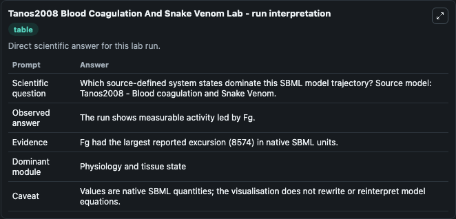
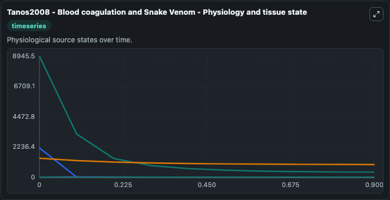
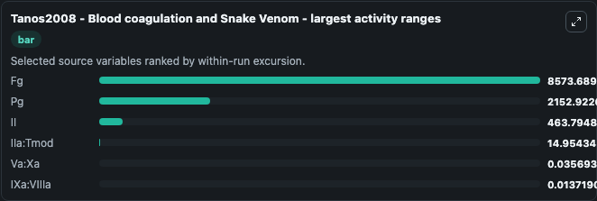
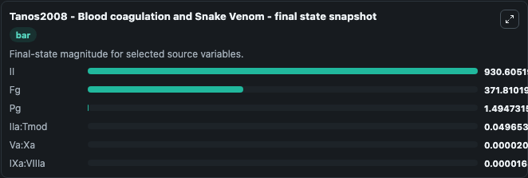
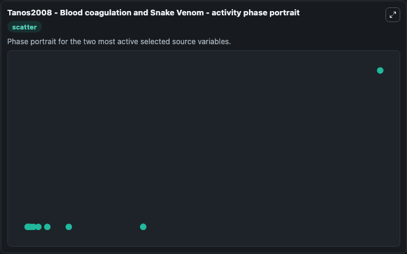

# Tanos2008 Blood Coagulation And Snake Venom

This Biosimulant lab wraps `Tanos2008 Blood Coagulation And Snake Venom` as a runnable systems biology model with a companion visualization module.
Mathematical model of the blood coagulation cascade including interaction of snake venom and antivenom. It can be used to explore the configured dynamics and compare scenario outcomes across configurations.

## What You'll See

The lab asks: Which source-defined system states dominate this SBML model trajectory? Source model: Tanos2008 - Blood coagulation and Snake Venom. It runs for 1.0 time units with a communication step of 0.1. The run uses the model defaults declared by the curated SBML wrapper. The generated visualizations focus on Va:Xa, IXa:VIIIa, IIa:Tmod, Fg, Pg, and II, combining trajectory, endpoint-comparison, and summary-table views from one completed dark-mode run.

In this captured run, **Fg** moved from 8945.5 to 371.8 across 1.0 simulation windows.


### Output Visualizations



*Summary table for Tanos2008 Blood Coagulation And Snake Venom, reporting the scientific question, observed answer, dominant module, and caveat.*



*Trajectories of Fg, Pg, II, IIa:Tmod, Va:Xa, and IXa:VIIIa across the 1.0 simulation. In this run **IIa:Tmod** climbed from 0 to 0.0497 and **Fg** fell from 8945.5 to 371.8 — the largest movements among the focused observables.*



*Largest-excursion ranking of the focused observables — the absolute movement magnitude during the run. Top 3: **Fg** = 8573.7, **Pg** = 2152.9, **II** = 463.8, with 3 more observables below.*



*Endpoint snapshot of the focused observables — final values from the captured run. Top 3 by value: **II** = 930.6, **Fg** = 371.8, **Pg** = 1.495, with 3 more observables below.*



*Visualization card from the Tanos2008 Blood Coagulation And Snake Venom dark-mode run.*


## Model Context

- Core model: `models/core`
- Visualization model: `models/visualisation`
- Standard: `other`
- Upstream source: `biomodels_ebi:MODEL1806150001`
- License: `CC0`

## Inputs

| Input | Maps To | Default | Notes |
|---|---|---|---|
| Initial Va Xa | `systemsbiology_sbml_tanos2008_blood_coagulation_and_snake_venom_model1806150001_model.initial_va_xa` | | Source state initial condition exposed as a model-specific control because no explicit intervention parameter is identifiable. Maps to SBML symbol `Va_Xa`. |
| Initial I Xa Vii Ia | `systemsbiology_sbml_tanos2008_blood_coagulation_and_snake_venom_model1806150001_model.initial_i_xa_vii_ia` | | Source state initial condition exposed as a model-specific control because no explicit intervention parameter is identifiable. Maps to SBML symbol `IXa_VIIIa`. |
| Initial I Ia Tmod | `systemsbiology_sbml_tanos2008_blood_coagulation_and_snake_venom_model1806150001_model.initial_i_ia_tmod` | | Source state initial condition exposed as a model-specific control because no explicit intervention parameter is identifiable. Maps to SBML symbol `IIa_Tmod`. |
| Initial Model State Fg | `systemsbiology_sbml_tanos2008_blood_coagulation_and_snake_venom_model1806150001_model.initial_model_state_fg` | | Source state initial condition exposed as a model-specific control because no explicit intervention parameter is identifiable. Maps to SBML symbol `Fg`. |
| Initial Model State Pg | `systemsbiology_sbml_tanos2008_blood_coagulation_and_snake_venom_model1806150001_model.initial_model_state_pg` | | Source state initial condition exposed as a model-specific control because no explicit intervention parameter is identifiable. Maps to SBML symbol `Pg`. |
| Initial Model State Ii | `systemsbiology_sbml_tanos2008_blood_coagulation_and_snake_venom_model1806150001_model.initial_model_state_ii` | | Source state initial condition exposed as a model-specific control because no explicit intervention parameter is identifiable. Maps to SBML symbol `II`. |

## Outputs

| Output | Maps To | Role |
|---|---|---|
| `state` | `systemsbiology_sbml_tanos2008_blood_coagulation_and_snake_venom_model1806150001_model.state` | Available to the visualization model and downstream workflows. |
| `summary` | `systemsbiology_sbml_tanos2008_blood_coagulation_and_snake_venom_model1806150001_model.summary` | Available to the visualization model and downstream workflows. |
| `species_labels` | `systemsbiology_sbml_tanos2008_blood_coagulation_and_snake_venom_model1806150001_model.species_labels` | Available to the visualization model and downstream workflows. |
| `va_xa` | `systemsbiology_sbml_tanos2008_blood_coagulation_and_snake_venom_model1806150001_model.va_xa` | Available to the visualization model and downstream workflows. |
| `i_xa_vii_ia` | `systemsbiology_sbml_tanos2008_blood_coagulation_and_snake_venom_model1806150001_model.i_xa_vii_ia` | Available to the visualization model and downstream workflows. |
| `i_ia_tmod` | `systemsbiology_sbml_tanos2008_blood_coagulation_and_snake_venom_model1806150001_model.i_ia_tmod` | Available to the visualization model and downstream workflows. |
| `model_state_fg` | `systemsbiology_sbml_tanos2008_blood_coagulation_and_snake_venom_model1806150001_model.model_state_fg` | Available to the visualization model and downstream workflows. |
| `model_state_pg` | `systemsbiology_sbml_tanos2008_blood_coagulation_and_snake_venom_model1806150001_model.model_state_pg` | Available to the visualization model and downstream workflows. |
| `model_state_ii` | `systemsbiology_sbml_tanos2008_blood_coagulation_and_snake_venom_model1806150001_model.model_state_ii` | Available to the visualization model and downstream workflows. |

## Runtime

- Duration: `1.0`
- Communication step: `0.1`

## Running Locally

```bash
biosimulant labs serve
```
