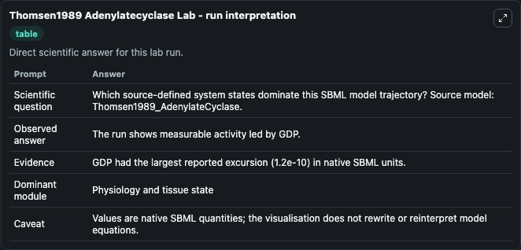
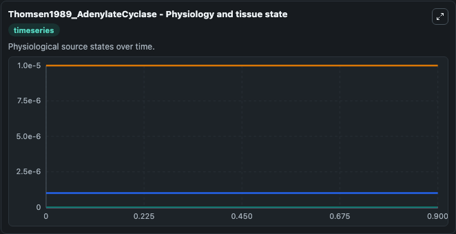
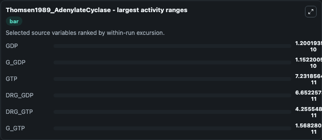
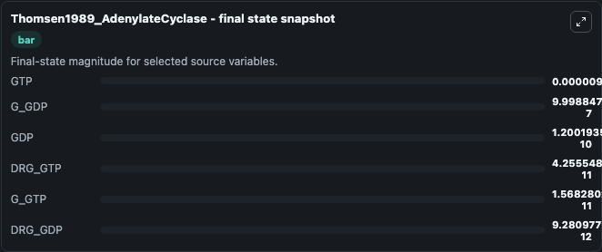
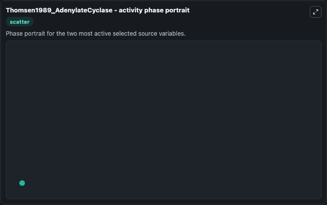

# Thomsen1989 Adenylatecyclase

This Biosimulant lab wraps `Thomsen1989 Adenylatecyclase` as a runnable systems biology model with a companion visualization module.
This model reproduces figure 5 and figure 4(B)of the paper, with Kinh represented by [G-GTP]. It can be used to explore the configured dynamics and compare scenario outcomes across configurations.

## What You'll See

The lab asks: Which source-defined system states dominate this SBML model trajectory? Source model: Thomsen1989_AdenylateCyclase. It runs for 1.0 time units with a communication step of 0.1. The run uses the model defaults declared by the curated SBML wrapper. The generated visualizations focus on G_GDP, G_GTP, DRG_GTP, DRG_GDP, GTP, and GDP, combining trajectory, endpoint-comparison, and summary-table views from one completed dark-mode run.

In this captured run, **GDP** moved from 0 to 1.2e-10 across 1.0 simulation windows.


### Output Visualizations



*Summary table for Thomsen1989 Adenylatecyclase, reporting the scientific question, observed answer, dominant module, and caveat.*



*Trajectories of GDP, G_GDP, GTP, DRG_GDP, DRG_GTP, and G_GTP across the 1.0 simulation. In this run **GDP** climbed from 0 to 1.2e-10 and **G_GDP** fell from 1e-06 to 1e-06 — the largest movements among the focused observables.*



*Largest-excursion ranking of the focused observables — the absolute movement magnitude during the run. Top 3: **GDP** = 1.2e-10, **G_GDP** = 1.15e-10, **GTP** = 7.23e-11, with 3 more observables below.*



*Endpoint snapshot of the focused observables — final values from the captured run. Top 3 by value: **GTP** = 1e-05, **G_GDP** = 1e-06, **GDP** = 1.2e-10, with 3 more observables below.*



*Visualization card from the Thomsen1989 Adenylatecyclase dark-mode run.*


## Model Context

- Core model: `models/core`
- Visualization model: `models/visualisation`
- Standard: `other`
- Upstream source: `biomodels_ebi:BIOMD0000000080`
- License: `CC0`

## Inputs

| Input | Maps To | Default | Notes |
|---|---|---|---|
| Initial G Gdp | `systemsbiology_sbml_thomsen1989_adenylatecyclase_biomd0000000080_model.initial_g_gdp` | | Source state initial condition exposed as a model-specific control because no explicit intervention parameter is identifiable. Maps to SBML symbol `G_GDP`. |
| Initial G Gtp | `systemsbiology_sbml_thomsen1989_adenylatecyclase_biomd0000000080_model.initial_g_gtp` | | Source state initial condition exposed as a model-specific control because no explicit intervention parameter is identifiable. Maps to SBML symbol `G_GTP`. |
| Initial Drg Gtp | `systemsbiology_sbml_thomsen1989_adenylatecyclase_biomd0000000080_model.initial_drg_gtp` | | Source state initial condition exposed as a model-specific control because no explicit intervention parameter is identifiable. Maps to SBML symbol `DRG_GTP`. |
| Initial Drg Gdp | `systemsbiology_sbml_thomsen1989_adenylatecyclase_biomd0000000080_model.initial_drg_gdp` | | Source state initial condition exposed as a model-specific control because no explicit intervention parameter is identifiable. Maps to SBML symbol `DRG_GDP`. |
| Initial Model State Gtp | `systemsbiology_sbml_thomsen1989_adenylatecyclase_biomd0000000080_model.initial_model_state_gtp` | | Source state initial condition exposed as a model-specific control because no explicit intervention parameter is identifiable. Maps to SBML symbol `GTP`. |
| Initial Model State Gdp | `systemsbiology_sbml_thomsen1989_adenylatecyclase_biomd0000000080_model.initial_model_state_gdp` | | Source state initial condition exposed as a model-specific control because no explicit intervention parameter is identifiable. Maps to SBML symbol `GDP`. |

## Outputs

| Output | Maps To | Role |
|---|---|---|
| `state` | `systemsbiology_sbml_thomsen1989_adenylatecyclase_biomd0000000080_model.state` | Available to the visualization model and downstream workflows. |
| `summary` | `systemsbiology_sbml_thomsen1989_adenylatecyclase_biomd0000000080_model.summary` | Available to the visualization model and downstream workflows. |
| `species_labels` | `systemsbiology_sbml_thomsen1989_adenylatecyclase_biomd0000000080_model.species_labels` | Available to the visualization model and downstream workflows. |
| `g_gdp` | `systemsbiology_sbml_thomsen1989_adenylatecyclase_biomd0000000080_model.g_gdp` | Available to the visualization model and downstream workflows. |
| `g_gtp` | `systemsbiology_sbml_thomsen1989_adenylatecyclase_biomd0000000080_model.g_gtp` | Available to the visualization model and downstream workflows. |
| `drg_gtp` | `systemsbiology_sbml_thomsen1989_adenylatecyclase_biomd0000000080_model.drg_gtp` | Available to the visualization model and downstream workflows. |
| `drg_gdp` | `systemsbiology_sbml_thomsen1989_adenylatecyclase_biomd0000000080_model.drg_gdp` | Available to the visualization model and downstream workflows. |
| `gtp` | `systemsbiology_sbml_thomsen1989_adenylatecyclase_biomd0000000080_model.gtp` | Available to the visualization model and downstream workflows. |
| `gdp` | `systemsbiology_sbml_thomsen1989_adenylatecyclase_biomd0000000080_model.gdp` | Available to the visualization model and downstream workflows. |

## Runtime

- Duration: `1.0`
- Communication step: `0.1`

## Running Locally

```bash
biosimulant labs serve
```
