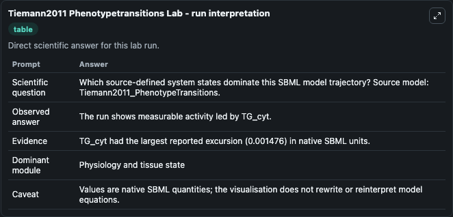
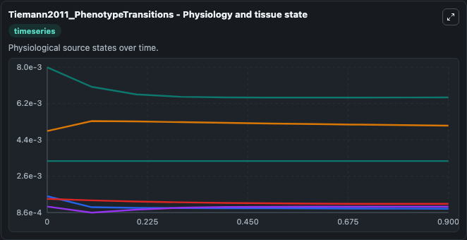
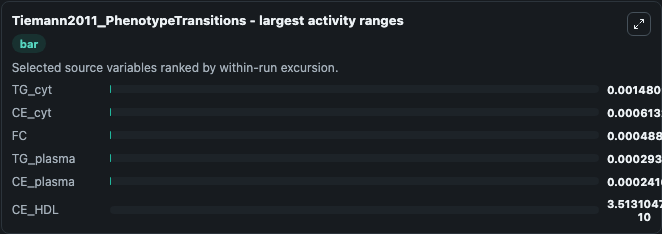
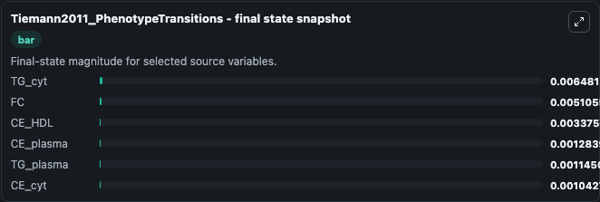
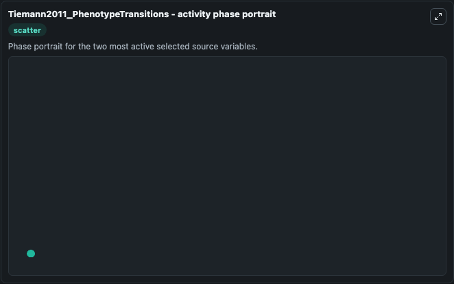

# Tiemann2011 Phenotypetransitions

This Biosimulant lab wraps `Tiemann2011 Phenotypetransitions` as a runnable systems biology model with a companion visualization module.
To the extent possible under law, all copyright and related or neighbouring rights to this encoded model have been dedicated to the public domain worldwide. It can be used to explore the configured dynamics and compare scenario outcomes across configurations.

## What You'll See

The lab asks: Which source-defined system states dominate this SBML model trajectory? Source model: Tiemann2011_PhenotypeTransitions. It runs for 1.0 time units with a communication step of 0.1. The run uses the model defaults declared by the curated SBML wrapper. The generated visualizations focus on TG_cyt, FC, CE_HDL, CE_cyt, CE_plasma, and TG_plasma, combining trajectory, endpoint-comparison, and summary-table views from one completed dark-mode run.

In this captured run, **TG_cyt** moved from 0.00796 to 0.00648 across 1.0 simulation windows.


### Output Visualizations



*Summary table for Tiemann2011 Phenotypetransitions, reporting the scientific question, observed answer, dominant module, and caveat.*



*Trajectories of TG_cyt, CE_cyt, FC, TG_plasma, CE_plasma, and CE_HDL across the 1.0 simulation. In this run **FC** climbed from 0.00484 to 0.00511 and **TG_cyt** fell from 0.00796 to 0.00648 — the largest movements among the focused observables.*



*Largest-excursion ranking of the focused observables — the absolute movement magnitude during the run. Top 3: **TG_cyt** = 0.00148, **CE_cyt** = 0.000613, **FC** = 0.000488, with 3 more observables below.*



*Endpoint snapshot of the focused observables — final values from the captured run. Top 3 by value: **TG_cyt** = 0.00648, **FC** = 0.00511, **CE_HDL** = 0.00338, with 3 more observables below.*



*Visualization card from the Tiemann2011 Phenotypetransitions dark-mode run.*


## Model Context

- Core model: `models/core`
- Visualization model: `models/visualisation`
- Standard: `other`
- Upstream source: `biomodels_ebi:MODEL1112150000`
- License: `CC0`

## Inputs

| Input | Maps To | Default | Notes |
|---|---|---|---|
| Initial Tg Cyt | `systemsbiology_sbml_tiemann2011_phenotypetransitions_model1112150000_model.initial_tg_cyt` | | Source state initial condition exposed as a model-specific control because no explicit intervention parameter is identifiable. Maps to SBML symbol `species_4`. |
| Initial Model State Fc | `systemsbiology_sbml_tiemann2011_phenotypetransitions_model1112150000_model.initial_model_state_fc` | | Source state initial condition exposed as a model-specific control because no explicit intervention parameter is identifiable. Maps to SBML symbol `species_1`. |
| Initial Ce Hdl | `systemsbiology_sbml_tiemann2011_phenotypetransitions_model1112150000_model.initial_ce_hdl` | | Source state initial condition exposed as a model-specific control because no explicit intervention parameter is identifiable. Maps to SBML symbol `species_8`. |
| Initial Ce Cyt | `systemsbiology_sbml_tiemann2011_phenotypetransitions_model1112150000_model.initial_ce_cyt` | | Source state initial condition exposed as a model-specific control because no explicit intervention parameter is identifiable. Maps to SBML symbol `species_2`. |
| Initial Ce Plasma | `systemsbiology_sbml_tiemann2011_phenotypetransitions_model1112150000_model.initial_ce_plasma` | | Source state initial condition exposed as a model-specific control because no explicit intervention parameter is identifiable. Maps to SBML symbol `species_7`. |
| Initial Tg Plasma | `systemsbiology_sbml_tiemann2011_phenotypetransitions_model1112150000_model.initial_tg_plasma` | | Source state initial condition exposed as a model-specific control because no explicit intervention parameter is identifiable. Maps to SBML symbol `species_6`. |

## Outputs

| Output | Maps To | Role |
|---|---|---|
| `state` | `systemsbiology_sbml_tiemann2011_phenotypetransitions_model1112150000_model.state` | Available to the visualization model and downstream workflows. |
| `summary` | `systemsbiology_sbml_tiemann2011_phenotypetransitions_model1112150000_model.summary` | Available to the visualization model and downstream workflows. |
| `species_labels` | `systemsbiology_sbml_tiemann2011_phenotypetransitions_model1112150000_model.species_labels` | Available to the visualization model and downstream workflows. |
| `tg_cyt` | `systemsbiology_sbml_tiemann2011_phenotypetransitions_model1112150000_model.tg_cyt` | Available to the visualization model and downstream workflows. |
| `model_state_fc` | `systemsbiology_sbml_tiemann2011_phenotypetransitions_model1112150000_model.model_state_fc` | Available to the visualization model and downstream workflows. |
| `ce_hdl` | `systemsbiology_sbml_tiemann2011_phenotypetransitions_model1112150000_model.ce_hdl` | Available to the visualization model and downstream workflows. |
| `ce_cyt` | `systemsbiology_sbml_tiemann2011_phenotypetransitions_model1112150000_model.ce_cyt` | Available to the visualization model and downstream workflows. |
| `ce_plasma` | `systemsbiology_sbml_tiemann2011_phenotypetransitions_model1112150000_model.ce_plasma` | Available to the visualization model and downstream workflows. |
| `tg_plasma` | `systemsbiology_sbml_tiemann2011_phenotypetransitions_model1112150000_model.tg_plasma` | Available to the visualization model and downstream workflows. |

## Runtime

- Duration: `1.0`
- Communication step: `0.1`

## Running Locally

```bash
biosimulant labs serve
```
