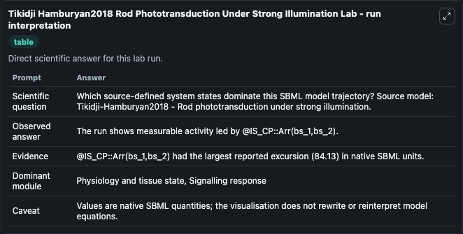
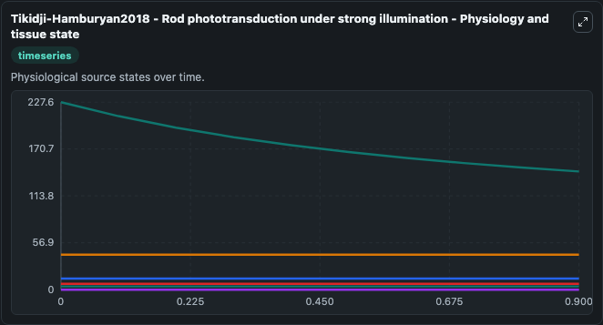
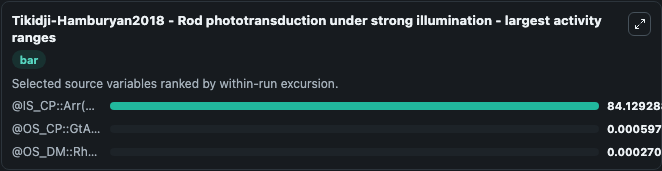
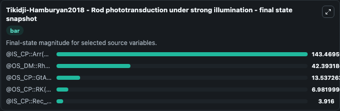
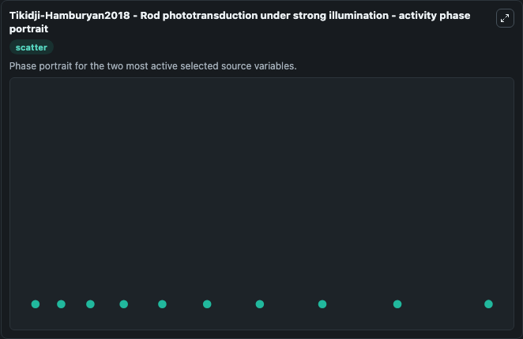

# Tikidji Hamburyan2018 Rod Phototransduction Under Strong Illumination

This Biosimulant lab wraps `Tikidji Hamburyan2018 Rod Phototransduction Under Strong Illumination` as a runnable systems biology model with a companion visualization module.
Tikidji-Hamburyan2018 - Rod phototransductionunder strong illumination This model is described in the article: Rods progressively escape saturation to drive visual responses in daylight conditions. It can be used to explore the configured dynamics and compare scenario outcomes across configurations.

## What You'll See

The lab asks: Which source-defined system states dominate this SBML model trajectory? Source model: Tikidji-Hamburyan2018 - Rod phototransduction under strong illumination. It runs for 1.0 time units with a communication step of 0.1. The run uses the model defaults declared by the curated SBML wrapper. The generated visualizations focus on @OS_CP::TrashCa(), @IS_CP::Arr(bs_1,bs_2), @OS_DM::Rhod(act~i,bs_1,ps_1~p0), @OS_CP::GtA(g~dp!1).GtBG(bs_1!1,bs_2), @OS_CP::RK(bs_1!1).Rec(bs_1!2).wCa2(bs_1!2,bs_2!1), and @IS_CP::Rec_T(bs_1,bs_2), combining trajectory, endpoint-comparison, and summary-table views from one completed dark-mode run.

In this captured run, **@IS_CP::Arr(bs_1,bs_2)** moved from 227.6 to 143.5 across 1.0 simulation windows.


### Output Visualizations



*Summary table for Tikidji Hamburyan2018 Rod Phototransduction Under Strong Illumination, reporting the scientific question, observed answer, dominant module, and caveat.*



*Trajectories of @IS_CP::Arr(bs_1,bs_2), @OS_CP::GtA(g~dp!1).GtBG(bs_1!1,bs_2), @OS_DM::Rhod(act~i,bs_1,ps_1~p0), @OS_CP::TrashCa(), @OS_CP::RK(bs_1!1).Rec(bs_1!2).wCa2(bs_1!2,bs_2!1), and @IS_CP::Rec_T(bs_1,bs_2) across the 1.0 simulation. In this run **@IS_CP::Arr(bs_1,bs_2)** fell from 227.6 to 143.5 — the largest movements among the focused observables.*



*Largest-excursion ranking of the focused observables — the absolute movement magnitude during the run. Top 3: **@IS_CP::Arr(bs_1,bs_2)** = 84.129, **@OS_CP::GtA(g~dp!1).GtBG(bs_1!1,bs_2)** = 0.000597, **@OS_DM::Rhod(act~i,bs_1,ps_1~p0)** = 0.000271.*



*Endpoint snapshot of the focused observables — final values from the captured run. Top 3 by value: **@IS_CP::Arr(bs_1,bs_2)** = 143.5, **@OS_DM::Rhod(act~i,bs_1,ps_1~p0)** = 42.393, **@OS_CP::GtA(g~dp!1).GtBG(bs_1!1,bs_2)** = 13.537, with 2 more observables below.*



*Visualization card from the Tikidji Hamburyan2018 Rod Phototransduction Under Strong Illumination dark-mode run.*


## Model Context

- Core model: `models/core`
- Visualization model: `models/visualisation`
- Standard: `other`
- Upstream source: `biomodels_ebi:MODEL1710030000`
- License: `CC0`

## Inputs

| Input | Maps To | Default | Notes |
|---|---|---|---|
| Initial Os Cp Trash Ca | `systemsbiology_sbml_tikidji_hamburyan2018_rod_phototransduction_unde_model1710030000_model.initial_os_cp_trash_ca` | | Source state initial condition exposed as a model-specific control because no explicit intervention parameter is identifiable. Maps to SBML symbol `S220`. |
| Initial Is Cp Arr Bs 1 Bs 2 | `systemsbiology_sbml_tikidji_hamburyan2018_rod_phototransduction_unde_model1710030000_model.initial_is_cp_arr_bs_1_bs_2` | | Source state initial condition exposed as a model-specific control because no explicit intervention parameter is identifiable. Maps to SBML symbol `S49`. |
| Initial Os Dm Rhod Act I Bs 1 Ps 1 P0 | `systemsbiology_sbml_tikidji_hamburyan2018_rod_phototransduction_unde_model1710030000_model.initial_os_dm_rhod_act_i_bs_1_ps_1_p0` | | Source state initial condition exposed as a model-specific control because no explicit intervention parameter is identifiable. Maps to SBML symbol `S11`. |
| Initial Os Cp Gt A G Dp 1 Gt Bg Bs 1 1 Bs 2 | `systemsbiology_sbml_tikidji_hamburyan2018_rod_phototransduction_unde_model1710030000_model.initial_os_cp_gt_a_g_dp_1_gt_bg_bs_1_1_bs_2` | | Source state initial condition exposed as a model-specific control because no explicit intervention parameter is identifiable. Maps to SBML symbol `S44`. |
| Initial Os Cp Rk Bs 1 1 Rec Bs 1 2 W CA2 Bs 1 2 Bs 2 1 | `systemsbiology_sbml_tikidji_hamburyan2018_rod_phototransduction_unde_model1710030000_model.initial_os_cp_rk_bs_1_1_rec_bs_1_2_w_ca2_bs_1_2_bs_2_1` | | Source state initial condition exposed as a model-specific control because no explicit intervention parameter is identifiable. Maps to SBML symbol `S24`. |
| Initial Is Cp Rec T Bs 1 Bs 2 | `systemsbiology_sbml_tikidji_hamburyan2018_rod_phototransduction_unde_model1710030000_model.initial_is_cp_rec_t_bs_1_bs_2` | | Source state initial condition exposed as a model-specific control because no explicit intervention parameter is identifiable. Maps to SBML symbol `S81`. |

## Outputs

| Output | Maps To | Role |
|---|---|---|
| `state` | `systemsbiology_sbml_tikidji_hamburyan2018_rod_phototransduction_unde_model1710030000_model.state` | Available to the visualization model and downstream workflows. |
| `summary` | `systemsbiology_sbml_tikidji_hamburyan2018_rod_phototransduction_unde_model1710030000_model.summary` | Available to the visualization model and downstream workflows. |
| `species_labels` | `systemsbiology_sbml_tikidji_hamburyan2018_rod_phototransduction_unde_model1710030000_model.species_labels` | Available to the visualization model and downstream workflows. |
| `os_cp_trash_ca` | `systemsbiology_sbml_tikidji_hamburyan2018_rod_phototransduction_unde_model1710030000_model.os_cp_trash_ca` | Available to the visualization model and downstream workflows. |
| `is_cp_arr_bs_1_bs_2` | `systemsbiology_sbml_tikidji_hamburyan2018_rod_phototransduction_unde_model1710030000_model.is_cp_arr_bs_1_bs_2` | Available to the visualization model and downstream workflows. |
| `os_dm_rhod_act_i_bs_1_ps_1_p0` | `systemsbiology_sbml_tikidji_hamburyan2018_rod_phototransduction_unde_model1710030000_model.os_dm_rhod_act_i_bs_1_ps_1_p0` | Available to the visualization model and downstream workflows. |
| `os_cp_gt_a_g_dp_1_gt_bg_bs_1_1_bs_2` | `systemsbiology_sbml_tikidji_hamburyan2018_rod_phototransduction_unde_model1710030000_model.os_cp_gt_a_g_dp_1_gt_bg_bs_1_1_bs_2` | Available to the visualization model and downstream workflows. |
| `os_cp_rk_bs_1_1_rec_bs_1_2_w_ca2_bs_1_2_bs_2_1` | `systemsbiology_sbml_tikidji_hamburyan2018_rod_phototransduction_unde_model1710030000_model.os_cp_rk_bs_1_1_rec_bs_1_2_w_ca2_bs_1_2_bs_2_1` | Available to the visualization model and downstream workflows. |
| `is_cp_rec_t_bs_1_bs_2` | `systemsbiology_sbml_tikidji_hamburyan2018_rod_phototransduction_unde_model1710030000_model.is_cp_rec_t_bs_1_bs_2` | Available to the visualization model and downstream workflows. |

## Runtime

- Duration: `1.0`
- Communication step: `0.1`

## Running Locally

```bash
biosimulant labs serve
```
