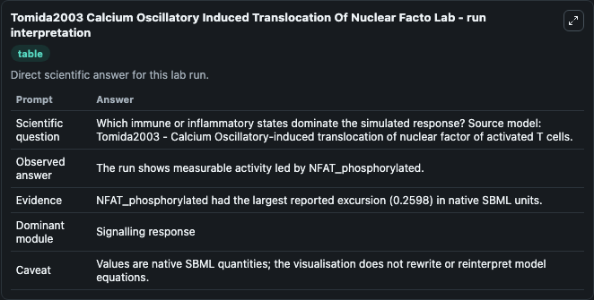
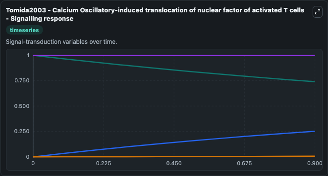
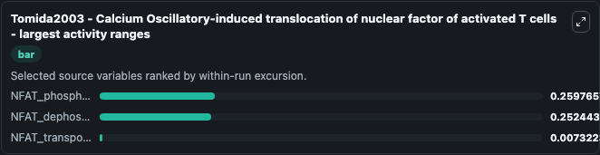
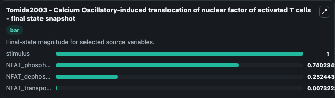
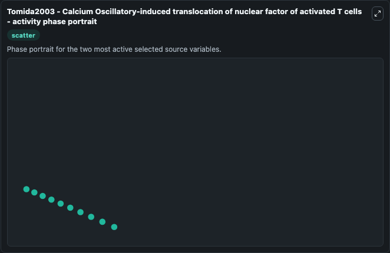

# Tomida2003 Calcium Oscillatory Induced Translocation Of Nuclear Facto

This Biosimulant lab wraps `Tomida2003 Calcium Oscillatory Induced Translocation Of Nuclear Facto` as a runnable systems biology model with a companion visualization module.
Tomida2003 - NFAT functions CalciumOscillation This model is described in the article: NFAT functions as a working memory of Ca2+ signals in decoding Ca2+ oscillation. It can be used to explore the configured dynamics and compare scenario outcomes across configurations.

## What You'll See

The lab asks: Which immune or inflammatory states dominate the simulated response? Source model: Tomida2003 - Calcium Oscillatory-induced translocation of nuclear factor of activated T cells. It runs for 1.0 time units with a communication step of 0.1. The run uses the model defaults declared by the curated SBML wrapper. The generated visualizations focus on stimulus, NFAT_phosphorylated, NFAT_transported, and NFAT_dephosphorylated, combining trajectory, endpoint-comparison, and summary-table views from one completed dark-mode run.

In this captured run, **NFAT_phosphorylated** moved from 1.000 to 0.7402 across 1.0 simulation windows.


### Output Visualizations



*Summary table for Tomida2003 Calcium Oscillatory Induced Translocation Of Nuclear Facto, reporting the scientific question, observed answer, dominant module, and caveat.*



*Trajectories of NFAT_phosphorylated, NFAT_dephosphorylated, NFAT_transported, and stimulus across the 1.0 simulation. In this run **NFAT_dephosphorylated** climbed from 0 to 0.2524 and **NFAT_phosphorylated** fell from 1.000 to 0.7402 — the largest movements among the focused observables.*



*Largest-excursion ranking of the focused observables — the absolute movement magnitude during the run. Top 3: **NFAT_phosphorylated** = 0.2598, **NFAT_dephosphorylated** = 0.2524, **NFAT_transported** = 0.00732.*



*Endpoint snapshot of the focused observables — final values from the captured run. Top 3 by value: **stimulus** = 1.000, **NFAT_phosphorylated** = 0.7402, **NFAT_dephosphorylated** = 0.2524, with 1 more observable below.*



*Visualization card from the Tomida2003 Calcium Oscillatory Induced Translocation Of Nuclear Facto dark-mode run.*


## Model Context

- Core model: `models/core`
- Visualization model: `models/visualisation`
- Standard: `other`
- Upstream source: `biomodels_ebi:BIOMD0000000678`
- License: `CC0`

## Inputs

| Input | Maps To | Default | Notes |
|---|---|---|---|
| Initial Stimulus | `systemsbiology_sbml_tomida2003_calcium_oscillatory_induced_transloca_biomd0000000678_model.initial_stimulus` | | Source state initial condition exposed as a model-specific control because no explicit intervention parameter is identifiable. Maps to SBML symbol `stimulus`. |
| Initial Nfat Phosphorylated | `systemsbiology_sbml_tomida2003_calcium_oscillatory_induced_transloca_biomd0000000678_model.initial_nfat_phosphorylated` | | Source state initial condition exposed as a model-specific control because no explicit intervention parameter is identifiable. Maps to SBML symbol `NFAT_phosphorylated`. |
| Initial Nfat Transported | `systemsbiology_sbml_tomida2003_calcium_oscillatory_induced_transloca_biomd0000000678_model.initial_nfat_transported` | | Source state initial condition exposed as a model-specific control because no explicit intervention parameter is identifiable. Maps to SBML symbol `NFAT_transported`. |
| Initial Nfat Dephosphorylated | `systemsbiology_sbml_tomida2003_calcium_oscillatory_induced_transloca_biomd0000000678_model.initial_nfat_dephosphorylated` | | Source state initial condition exposed as a model-specific control because no explicit intervention parameter is identifiable. Maps to SBML symbol `NFAT_dephosphorylated`. |

## Outputs

| Output | Maps To | Role |
|---|---|---|
| `state` | `systemsbiology_sbml_tomida2003_calcium_oscillatory_induced_transloca_biomd0000000678_model.state` | Available to the visualization model and downstream workflows. |
| `summary` | `systemsbiology_sbml_tomida2003_calcium_oscillatory_induced_transloca_biomd0000000678_model.summary` | Available to the visualization model and downstream workflows. |
| `species_labels` | `systemsbiology_sbml_tomida2003_calcium_oscillatory_induced_transloca_biomd0000000678_model.species_labels` | Available to the visualization model and downstream workflows. |
| `stimulus` | `systemsbiology_sbml_tomida2003_calcium_oscillatory_induced_transloca_biomd0000000678_model.stimulus` | Available to the visualization model and downstream workflows. |
| `nfat_phosphorylated` | `systemsbiology_sbml_tomida2003_calcium_oscillatory_induced_transloca_biomd0000000678_model.nfat_phosphorylated` | Available to the visualization model and downstream workflows. |
| `nfat_transported` | `systemsbiology_sbml_tomida2003_calcium_oscillatory_induced_transloca_biomd0000000678_model.nfat_transported` | Available to the visualization model and downstream workflows. |
| `nfat_dephosphorylated` | `systemsbiology_sbml_tomida2003_calcium_oscillatory_induced_transloca_biomd0000000678_model.nfat_dephosphorylated` | Available to the visualization model and downstream workflows. |

## Runtime

- Duration: `1.0`
- Communication step: `0.1`

## Running Locally

```bash
biosimulant labs serve
```
