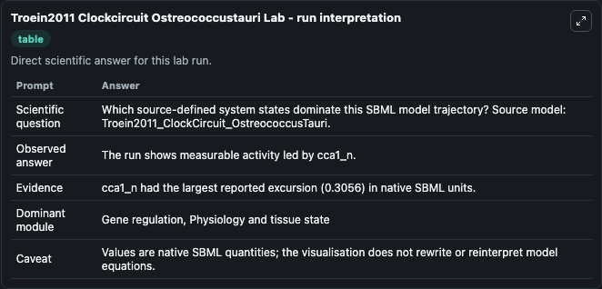
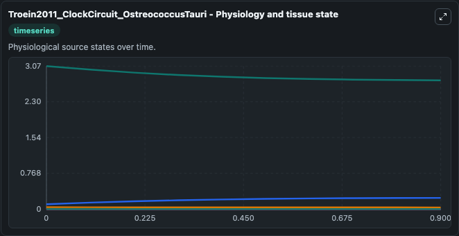
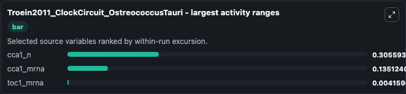
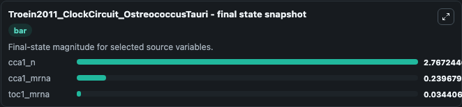
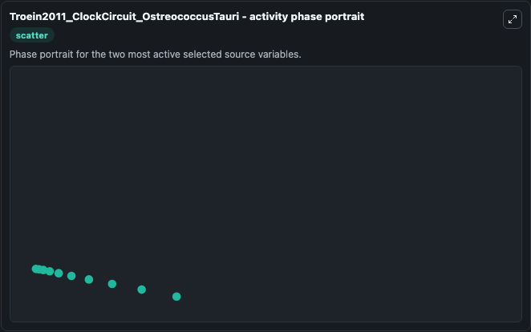

# Troein2011 Clockcircuit Ostreococcustauri

This Biosimulant lab wraps `Troein2011 Clockcircuit Ostreococcustauri` as a runnable systems biology model with a companion visualization module.
This model is from the article: Multiple light inputs to a simple clock circuit allow complex biological rhythms Troein C, Corellou F, Dixon LE, van Ooijen G, O'Neill JS, Bouget FY, Millar AJ. It can be used to explore the configured dynamics and compare scenario outcomes across configurations.

## What You'll See

The lab asks: Which source-defined system states dominate this SBML model trajectory? Source model: Troein2011_ClockCircuit_OstreococcusTauri. It runs for 1.0 time units with a communication step of 0.1. The run uses the model defaults declared by the curated SBML wrapper. The generated visualizations focus on cca1_mrna, toc1_mrna, toc1luc_mrna, luc_mrna, cca1luc_mrna, and cca1_n, combining trajectory, endpoint-comparison, and summary-table views from one completed dark-mode run.

In this captured run, **cca1_n** moved from 3.073 to 2.767 across 1.0 simulation windows.


### Output Visualizations



*Summary table for Troein2011 Clockcircuit Ostreococcustauri, reporting the scientific question, observed answer, dominant module, and caveat.*



*Trajectories of cca1_n, cca1_mrna, toc1_mrna, toc1luc_mrna, luc_mrna, and cca1luc_mrna across the 1.0 simulation. In this run **cca1_mrna** climbed from 0.1046 to 0.2397 and **cca1_n** fell from 3.073 to 2.767 — the largest movements among the focused observables.*



*Largest-excursion ranking of the focused observables — the absolute movement magnitude during the run. Top 3: **cca1_n** = 0.3056, **cca1_mrna** = 0.1351, **toc1_mrna** = 0.00416.*



*Endpoint snapshot of the focused observables — final values from the captured run. Top 3 by value: **cca1_n** = 2.767, **cca1_mrna** = 0.2397, **toc1_mrna** = 0.0344.*



*Visualization card from the Troein2011 Clockcircuit Ostreococcustauri dark-mode run.*


## Model Context

- Core model: `models/core`
- Visualization model: `models/visualisation`
- Standard: `other`
- Upstream source: `biomodels_ebi:BIOMD0000000350`
- License: `CC0`

## Inputs

| Input | Maps To | Default | Notes |
|---|---|---|---|
| Initial Cca1 MRNA | `systemsbiology_sbml_troein2011_clockcircuit_ostreococcustauri_biomd0000000350_model.initial_cca1_mrna` | | Source state initial condition exposed as a model-specific control because no explicit intervention parameter is identifiable. Maps to SBML symbol `cca1_mrna`. |
| Initial Toc1 MRNA | `systemsbiology_sbml_troein2011_clockcircuit_ostreococcustauri_biomd0000000350_model.initial_toc1_mrna` | | Source state initial condition exposed as a model-specific control because no explicit intervention parameter is identifiable. Maps to SBML symbol `toc1_mrna`. |
| Initial Toc1luc MRNA | `systemsbiology_sbml_troein2011_clockcircuit_ostreococcustauri_biomd0000000350_model.initial_toc1luc_mrna` | | Source state initial condition exposed as a model-specific control because no explicit intervention parameter is identifiable. Maps to SBML symbol `toc1luc_mrna`. |
| Initial Luc MRNA | `systemsbiology_sbml_troein2011_clockcircuit_ostreococcustauri_biomd0000000350_model.initial_luc_mrna` | | Source state initial condition exposed as a model-specific control because no explicit intervention parameter is identifiable. Maps to SBML symbol `luc_mrna`. |
| Initial Cca1luc MRNA | `systemsbiology_sbml_troein2011_clockcircuit_ostreococcustauri_biomd0000000350_model.initial_cca1luc_mrna` | | Source state initial condition exposed as a model-specific control because no explicit intervention parameter is identifiable. Maps to SBML symbol `cca1luc_mrna`. |
| Initial Cca1 N | `systemsbiology_sbml_troein2011_clockcircuit_ostreococcustauri_biomd0000000350_model.initial_cca1_n` | | Source state initial condition exposed as a model-specific control because no explicit intervention parameter is identifiable. Maps to SBML symbol `cca1_n`. |

## Outputs

| Output | Maps To | Role |
|---|---|---|
| `state` | `systemsbiology_sbml_troein2011_clockcircuit_ostreococcustauri_biomd0000000350_model.state` | Available to the visualization model and downstream workflows. |
| `summary` | `systemsbiology_sbml_troein2011_clockcircuit_ostreococcustauri_biomd0000000350_model.summary` | Available to the visualization model and downstream workflows. |
| `species_labels` | `systemsbiology_sbml_troein2011_clockcircuit_ostreococcustauri_biomd0000000350_model.species_labels` | Available to the visualization model and downstream workflows. |
| `cca1_mrna` | `systemsbiology_sbml_troein2011_clockcircuit_ostreococcustauri_biomd0000000350_model.cca1_mrna` | Available to the visualization model and downstream workflows. |
| `toc1_mrna` | `systemsbiology_sbml_troein2011_clockcircuit_ostreococcustauri_biomd0000000350_model.toc1_mrna` | Available to the visualization model and downstream workflows. |
| `toc1luc_mrna` | `systemsbiology_sbml_troein2011_clockcircuit_ostreococcustauri_biomd0000000350_model.toc1luc_mrna` | Available to the visualization model and downstream workflows. |
| `luc_mrna` | `systemsbiology_sbml_troein2011_clockcircuit_ostreococcustauri_biomd0000000350_model.luc_mrna` | Available to the visualization model and downstream workflows. |
| `cca1luc_mrna` | `systemsbiology_sbml_troein2011_clockcircuit_ostreococcustauri_biomd0000000350_model.cca1luc_mrna` | Available to the visualization model and downstream workflows. |
| `cca1_n` | `systemsbiology_sbml_troein2011_clockcircuit_ostreococcustauri_biomd0000000350_model.cca1_n` | Available to the visualization model and downstream workflows. |

## Runtime

- Duration: `1.0`
- Communication step: `0.1`

## Running Locally

```bash
biosimulant labs serve
```
