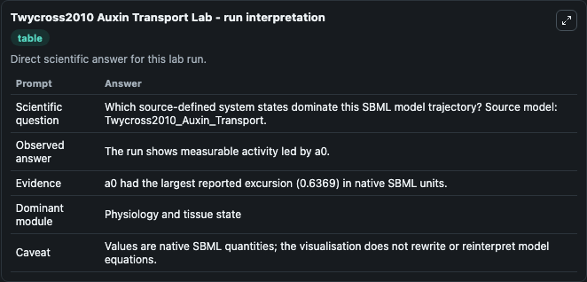
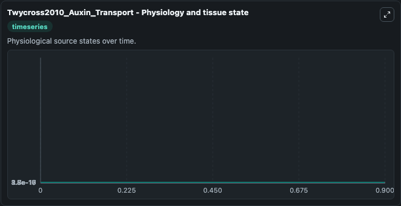
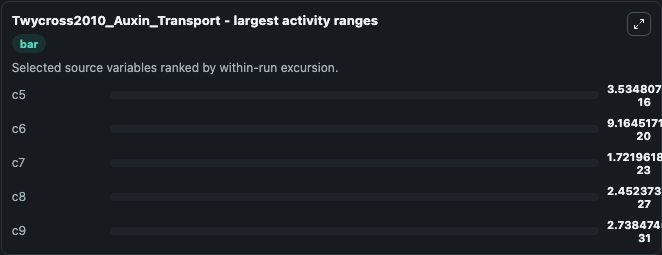
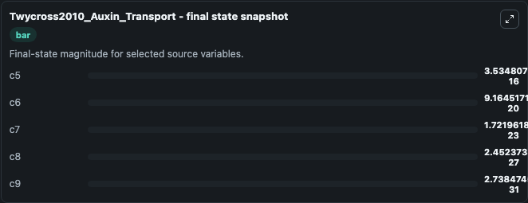
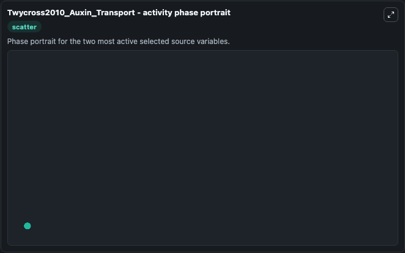

# Twycross2010 Auxin Transport

This Biosimulant lab wraps `Twycross2010 Auxin Transport` as a runnable systems biology model with a companion visualization module.
This is a model with 20 cells - 20 cytplasms and 21 apoplasts - as described in the article: Stochastic and deterministic multiscale models for systems biology: an auxin-transport case study. It can be used to explore the configured dynamics and compare scenario outcomes across configurations.

## What You'll See

The lab asks: Which source-defined system states dominate this SBML model trajectory? Source model: Twycross2010_Auxin_Transport. It runs for 1.0 time units with a communication step of 0.1. The run uses the model defaults declared by the curated SBML wrapper. The generated visualizations focus on ext, c9, c8, c7, c6, and c5, combining trajectory, endpoint-comparison, and summary-table views from one completed dark-mode run.

In this captured run, **c5** moved from 0 to 3.53e-16 across 1.0 simulation windows.


### Output Visualizations



*Summary table for Twycross2010 Auxin Transport, reporting the scientific question, observed answer, dominant module, and caveat.*



*Trajectories of c5, c6, c7, c8, c9, and ext across the 1.0 simulation. In this run **c5** climbed from 0 to 3.53e-16 — the largest movements among the focused observables.*



*Largest-excursion ranking of the focused observables — the absolute movement magnitude during the run. Top 3: **c5** = 3.53e-16, **c6** = 9.16e-20, **c7** = 1.72e-23, with 2 more observables below.*



*Endpoint snapshot of the focused observables — final values from the captured run. Top 3 by value: **c5** = 3.53e-16, **c6** = 9.16e-20, **c7** = 1.72e-23, with 2 more observables below.*



*Visualization card from the Twycross2010 Auxin Transport dark-mode run.*


## Model Context

- Core model: `models/core`
- Visualization model: `models/visualisation`
- Standard: `other`
- Upstream source: `biomodels_ebi:MODEL1005200000`
- License: `CC0`

## Inputs

| Input | Maps To | Default | Notes |
|---|---|---|---|
| Initial Model State Ext | `systemsbiology_sbml_twycross2010_auxin_transport_model1005200000_model.initial_model_state_ext` | | Source state initial condition exposed as a model-specific control because no explicit intervention parameter is identifiable. Maps to SBML symbol `ext`. |
| Initial Model State C9 | `systemsbiology_sbml_twycross2010_auxin_transport_model1005200000_model.initial_model_state_c9` | | Source state initial condition exposed as a model-specific control because no explicit intervention parameter is identifiable. Maps to SBML symbol `c9`. |
| Initial Model State C8 | `systemsbiology_sbml_twycross2010_auxin_transport_model1005200000_model.initial_model_state_c8` | | Source state initial condition exposed as a model-specific control because no explicit intervention parameter is identifiable. Maps to SBML symbol `c8`. |
| Initial Model State C7 | `systemsbiology_sbml_twycross2010_auxin_transport_model1005200000_model.initial_model_state_c7` | | Source state initial condition exposed as a model-specific control because no explicit intervention parameter is identifiable. Maps to SBML symbol `c7`. |
| Initial Model State C6 | `systemsbiology_sbml_twycross2010_auxin_transport_model1005200000_model.initial_model_state_c6` | | Source state initial condition exposed as a model-specific control because no explicit intervention parameter is identifiable. Maps to SBML symbol `c6`. |
| Initial Model State C5 | `systemsbiology_sbml_twycross2010_auxin_transport_model1005200000_model.initial_model_state_c5` | | Source state initial condition exposed as a model-specific control because no explicit intervention parameter is identifiable. Maps to SBML symbol `c5`. |

## Outputs

| Output | Maps To | Role |
|---|---|---|
| `state` | `systemsbiology_sbml_twycross2010_auxin_transport_model1005200000_model.state` | Available to the visualization model and downstream workflows. |
| `summary` | `systemsbiology_sbml_twycross2010_auxin_transport_model1005200000_model.summary` | Available to the visualization model and downstream workflows. |
| `species_labels` | `systemsbiology_sbml_twycross2010_auxin_transport_model1005200000_model.species_labels` | Available to the visualization model and downstream workflows. |
| `ext` | `systemsbiology_sbml_twycross2010_auxin_transport_model1005200000_model.ext` | Available to the visualization model and downstream workflows. |
| `model_state_c9` | `systemsbiology_sbml_twycross2010_auxin_transport_model1005200000_model.model_state_c9` | Available to the visualization model and downstream workflows. |
| `model_state_c8` | `systemsbiology_sbml_twycross2010_auxin_transport_model1005200000_model.model_state_c8` | Available to the visualization model and downstream workflows. |
| `model_state_c7` | `systemsbiology_sbml_twycross2010_auxin_transport_model1005200000_model.model_state_c7` | Available to the visualization model and downstream workflows. |
| `model_state_c6` | `systemsbiology_sbml_twycross2010_auxin_transport_model1005200000_model.model_state_c6` | Available to the visualization model and downstream workflows. |
| `model_state_c5` | `systemsbiology_sbml_twycross2010_auxin_transport_model1005200000_model.model_state_c5` | Available to the visualization model and downstream workflows. |

## Runtime

- Duration: `1.0`
- Communication step: `0.1`

## Running Locally

```bash
biosimulant labs serve
```
