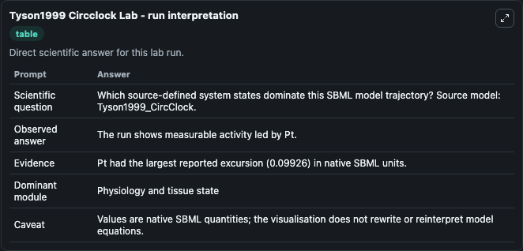
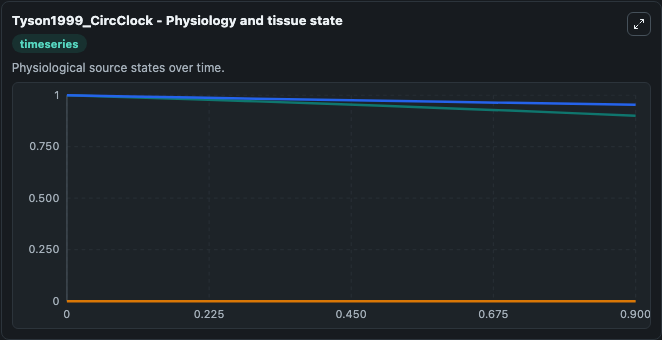
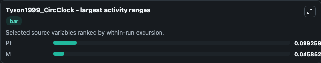
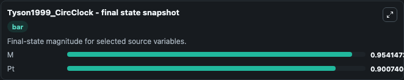
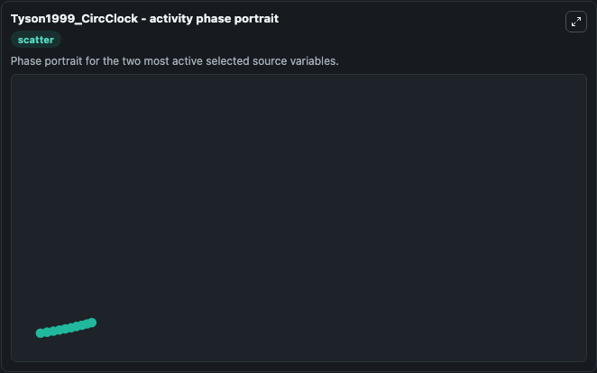

# Tyson1999 Circclock

This Biosimulant lab wraps `Tyson1999 Circclock` as a runnable systems biology model with a companion visualization module.
To the extent possible under law, all copyright and related or neighbouring rights to this encoded model have been dedicated to the public domain worldwide. It can be used to explore the configured dynamics and compare scenario outcomes across configurations.

## What You'll See

The lab asks: Which source-defined system states dominate this SBML model trajectory? Source model: Tyson1999_CircClock. It runs for 1.0 time units with a communication step of 0.1. The run uses the model defaults declared by the curated SBML wrapper. The generated visualizations focus on Pt, EmptySet, and M, combining trajectory, endpoint-comparison, and summary-table views from one completed dark-mode run.

In this captured run, **Pt** moved from 1.000 to 0.9007 across 1.0 simulation windows.


### Output Visualizations



*Summary table for Tyson1999 Circclock, reporting the scientific question, observed answer, dominant module, and caveat.*



*Trajectories of Pt, M, and EmptySet across the 1.0 simulation. In this run **Pt** fell from 1.000 to 0.9007 — the largest movements among the focused observables.*



*Largest-excursion ranking of the focused observables — the absolute movement magnitude during the run. Top 2: **Pt** = 0.0993, **M** = 0.0459.*



*Endpoint snapshot of the focused observables — final values from the captured run. Top 2 by value: **M** = 0.9541, **Pt** = 0.9007.*



*Visualization card from the Tyson1999 Circclock dark-mode run.*


## Model Context

- Core model: `models/core`
- Visualization model: `models/visualisation`
- Standard: `other`
- Upstream source: `biomodels_ebi:BIOMD0000000036`
- License: `CC0`

## Inputs

| Input | Maps To | Default | Notes |
|---|---|---|---|
| Initial Model State Pt | `systemsbiology_sbml_tyson1999_circclock_biomd0000000036_model.initial_model_state_pt` | | Source state initial condition exposed as a model-specific control because no explicit intervention parameter is identifiable. Maps to SBML symbol `P`. |
| Initial Empty Set | `systemsbiology_sbml_tyson1999_circclock_biomd0000000036_model.initial_empty_set` | | Source state initial condition exposed as a model-specific control because no explicit intervention parameter is identifiable. Maps to SBML symbol `EmptySet`. |
| Initial Model State M | `systemsbiology_sbml_tyson1999_circclock_biomd0000000036_model.initial_model_state_m` | | Source state initial condition exposed as a model-specific control because no explicit intervention parameter is identifiable. Maps to SBML symbol `M`. |

## Outputs

| Output | Maps To | Role |
|---|---|---|
| `state` | `systemsbiology_sbml_tyson1999_circclock_biomd0000000036_model.state` | Available to the visualization model and downstream workflows. |
| `summary` | `systemsbiology_sbml_tyson1999_circclock_biomd0000000036_model.summary` | Available to the visualization model and downstream workflows. |
| `species_labels` | `systemsbiology_sbml_tyson1999_circclock_biomd0000000036_model.species_labels` | Available to the visualization model and downstream workflows. |
| `model_state_pt` | `systemsbiology_sbml_tyson1999_circclock_biomd0000000036_model.model_state_pt` | Available to the visualization model and downstream workflows. |
| `empty_set` | `systemsbiology_sbml_tyson1999_circclock_biomd0000000036_model.empty_set` | Available to the visualization model and downstream workflows. |
| `model_state_m` | `systemsbiology_sbml_tyson1999_circclock_biomd0000000036_model.model_state_m` | Available to the visualization model and downstream workflows. |

## Runtime

- Duration: `1.0`
- Communication step: `0.1`

## Running Locally

```bash
biosimulant labs serve
```
