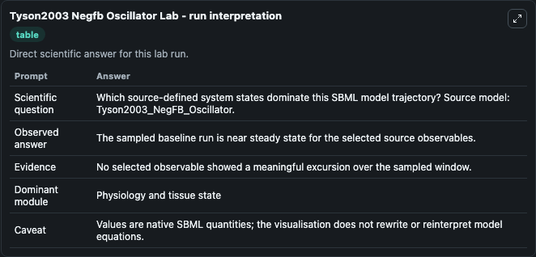
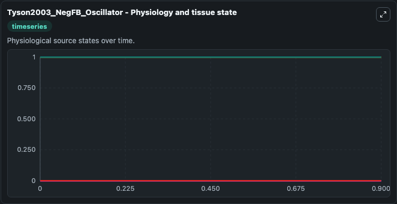
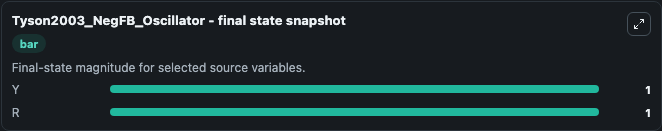

# Tyson2003 Negfb Oscillator

This Biosimulant lab wraps `Tyson2003 Negfb Oscillator` as a runnable systems biology model with a companion visualization module.
Originally created by libAntimony v1.4 (using libSBML 3.4.1) This is an SBML implementation the model of negative feedback oscillator (figure 2a) described in the article: Sniffers, buzzers, toggles a. It can be used to explore the configured dynamics and compare scenario outcomes across configurations.

## What You'll See

The lab asks: Which source-defined system states dominate this SBML model trajectory? Source model: Tyson2003_NegFB_Oscillator. It runs for 1.0 time units with a communication step of 0.1. The run uses the model defaults declared by the curated SBML wrapper. The generated visualizations focus on Yp, Rp, Y, X, S, and R, combining trajectory, endpoint-comparison, and summary-table views from one completed dark-mode run.

In this captured run, **Yp** moved from 0 to 0 across 1.0 simulation windows.


### Output Visualizations



*Summary table for Tyson2003 Negfb Oscillator, reporting the scientific question, observed answer, dominant module, and caveat.*



*Trajectories of Yp, Rp, Y, X, S, and R across the 1.0 simulation. In this run Yp, Rp, Y, X stayed near their initial values — no observable moved appreciably.*



*Endpoint snapshot of the focused observables — final values from the captured run. Top 2 by value: **Y** = 1.000, **R** = 1.000.*


## Model Context

- Core model: `models/core`
- Visualization model: `models/visualisation`
- Standard: `other`
- Upstream source: `biomodels_ebi:BIOMD0000000308`
- License: `CC0`

## Inputs

| Input | Maps To | Default | Notes |
|---|---|---|---|
| Initial Model State Yp | `systemsbiology_sbml_tyson2003_negfb_oscillator_biomd0000000308_model.initial_model_state_yp` | | Source state initial condition exposed as a model-specific control because no explicit intervention parameter is identifiable. Maps to SBML symbol `Yp`. |
| Initial Model State Rp | `systemsbiology_sbml_tyson2003_negfb_oscillator_biomd0000000308_model.initial_model_state_rp` | | Source state initial condition exposed as a model-specific control because no explicit intervention parameter is identifiable. Maps to SBML symbol `Rp`. |
| Initial Model State Y | `systemsbiology_sbml_tyson2003_negfb_oscillator_biomd0000000308_model.initial_model_state_y` | | Source state initial condition exposed as a model-specific control because no explicit intervention parameter is identifiable. Maps to SBML symbol `Y`. |
| Initial Model State X | `systemsbiology_sbml_tyson2003_negfb_oscillator_biomd0000000308_model.initial_model_state_x` | | Source state initial condition exposed as a model-specific control because no explicit intervention parameter is identifiable. Maps to SBML symbol `X`. |
| Initial Model State S | `systemsbiology_sbml_tyson2003_negfb_oscillator_biomd0000000308_model.initial_model_state_s` | | Source state initial condition exposed as a model-specific control because no explicit intervention parameter is identifiable. Maps to SBML symbol `S`. |
| Initial Model State R | `systemsbiology_sbml_tyson2003_negfb_oscillator_biomd0000000308_model.initial_model_state_r` | | Source state initial condition exposed as a model-specific control because no explicit intervention parameter is identifiable. Maps to SBML symbol `R`. |

## Outputs

| Output | Maps To | Role |
|---|---|---|
| `state` | `systemsbiology_sbml_tyson2003_negfb_oscillator_biomd0000000308_model.state` | Available to the visualization model and downstream workflows. |
| `summary` | `systemsbiology_sbml_tyson2003_negfb_oscillator_biomd0000000308_model.summary` | Available to the visualization model and downstream workflows. |
| `species_labels` | `systemsbiology_sbml_tyson2003_negfb_oscillator_biomd0000000308_model.species_labels` | Available to the visualization model and downstream workflows. |
| `model_state_yp` | `systemsbiology_sbml_tyson2003_negfb_oscillator_biomd0000000308_model.model_state_yp` | Available to the visualization model and downstream workflows. |
| `model_state_rp` | `systemsbiology_sbml_tyson2003_negfb_oscillator_biomd0000000308_model.model_state_rp` | Available to the visualization model and downstream workflows. |
| `model_state_y` | `systemsbiology_sbml_tyson2003_negfb_oscillator_biomd0000000308_model.model_state_y` | Available to the visualization model and downstream workflows. |
| `model_state_x` | `systemsbiology_sbml_tyson2003_negfb_oscillator_biomd0000000308_model.model_state_x` | Available to the visualization model and downstream workflows. |
| `model_state_s` | `systemsbiology_sbml_tyson2003_negfb_oscillator_biomd0000000308_model.model_state_s` | Available to the visualization model and downstream workflows. |
| `model_state_r` | `systemsbiology_sbml_tyson2003_negfb_oscillator_biomd0000000308_model.model_state_r` | Available to the visualization model and downstream workflows. |

## Runtime

- Duration: `1.0`
- Communication step: `0.1`

## Running Locally

```bash
biosimulant labs serve
```
