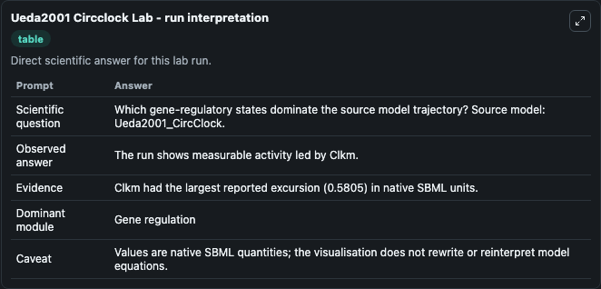
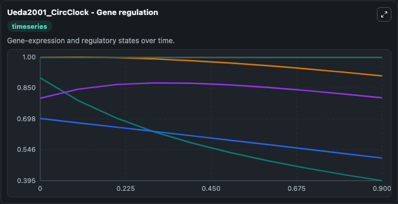
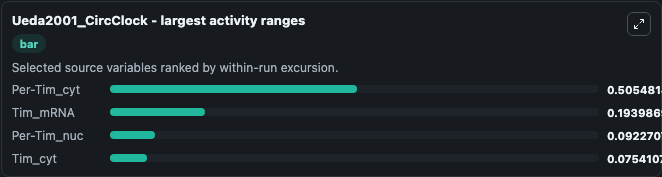
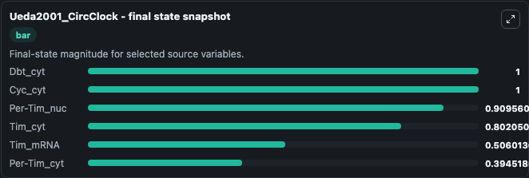
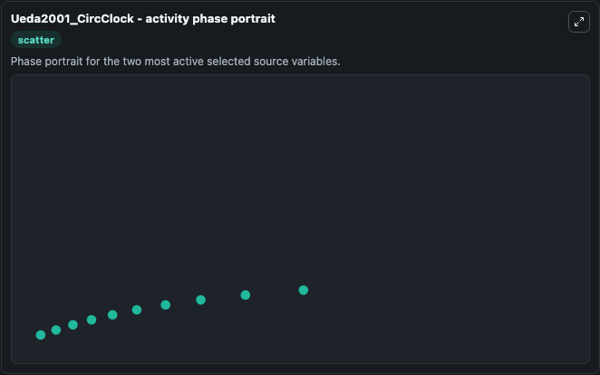

# Ueda2001 Circclock

This Biosimulant lab wraps `Ueda2001 Circclock` as a runnable systems biology model with a companion visualization module.
Bruce Shapiro: Generated by Cellerator Version 1.0 update 3.0303 using Mathematica 4.1 for Microsoft Windows (June 13, 2001), April 2, 2003 16:49:13, using (PC,x86, Microsoft Windows,WindowsNT,Windows. It can be used to explore the configured dynamics and compare scenario outcomes across configurations.

## What You'll See

The lab asks: Which gene-regulatory states dominate the source model trajectory? Source model: Ueda2001_CircClock. It runs for 1.0 time units with a communication step of 0.1. The run uses the model defaults declared by the curated SBML wrapper. The generated visualizations focus on Per-Tim_nuc, Dbt_cyt, Cyc_cyt, Per-Tim_cyt, Tim_cyt, and Tim_mRNA, combining trajectory, endpoint-comparison, and summary-table views from one completed dark-mode run.

In this captured run, **Per-Tim_cyt** moved from 0.9000 to 0.3945 across 1.0 simulation windows.


### Output Visualizations



*Summary table for Ueda2001 Circclock, reporting the scientific question, observed answer, dominant module, and caveat.*



*Trajectories of Per-Tim_cyt, Tim_mRNA, Per-Tim_nuc, Tim_cyt, Dbt_cyt, and Cyc_cyt across the 1.0 simulation. In this run **Tim_cyt** climbed from 0.8000 to 0.8021 and **Per-Tim_cyt** fell from 0.9000 to 0.3945 — the largest movements among the focused observables.*



*Largest-excursion ranking of the focused observables — the absolute movement magnitude during the run. Top 3: **Per-Tim_cyt** = 0.5055, **Tim_mRNA** = 0.1940, **Per-Tim_nuc** = 0.0923, with 1 more observable below.*



*Endpoint snapshot of the focused observables — final values from the captured run. Top 3 by value: **Dbt_cyt** = 1.000, **Cyc_cyt** = 1.000, **Per-Tim_nuc** = 0.9096, with 3 more observables below.*



*Visualization card from the Ueda2001 Circclock dark-mode run.*


## Model Context

- Core model: `models/core`
- Visualization model: `models/visualisation`
- Standard: `other`
- Upstream source: `biomodels_ebi:BIOMD0000000022`
- License: `CC0`

## Inputs

| Input | Maps To | Default | Notes |
|---|---|---|---|
| Initial Per Tim Nuc | `systemsbiology_sbml_ueda2001_circclock_biomd0000000022_model.initial_per_tim_nuc` | | Source state initial condition exposed as a model-specific control because no explicit intervention parameter is identifiable. Maps to SBML symbol `PTn`. |
| Initial Dbt Cyt | `systemsbiology_sbml_ueda2001_circclock_biomd0000000022_model.initial_dbt_cyt` | | Source state initial condition exposed as a model-specific control because no explicit intervention parameter is identifiable. Maps to SBML symbol `species_0000013`. |
| Initial Cyc Cyt | `systemsbiology_sbml_ueda2001_circclock_biomd0000000022_model.initial_cyc_cyt` | | Source state initial condition exposed as a model-specific control because no explicit intervention parameter is identifiable. Maps to SBML symbol `species_0000012`. |
| Initial Per Tim Cyt | `systemsbiology_sbml_ueda2001_circclock_biomd0000000022_model.initial_per_tim_cyt` | | Source state initial condition exposed as a model-specific control because no explicit intervention parameter is identifiable. Maps to SBML symbol `PTc`. |
| Initial Tim Cyt | `systemsbiology_sbml_ueda2001_circclock_biomd0000000022_model.initial_tim_cyt` | | Source state initial condition exposed as a model-specific control because no explicit intervention parameter is identifiable. Maps to SBML symbol `Timc`. |
| Initial Tim MRNA | `systemsbiology_sbml_ueda2001_circclock_biomd0000000022_model.initial_tim_mrna` | | Source state initial condition exposed as a model-specific control because no explicit intervention parameter is identifiable. Maps to SBML symbol `Timm`. |

## Outputs

| Output | Maps To | Role |
|---|---|---|
| `state` | `systemsbiology_sbml_ueda2001_circclock_biomd0000000022_model.state` | Available to the visualization model and downstream workflows. |
| `summary` | `systemsbiology_sbml_ueda2001_circclock_biomd0000000022_model.summary` | Available to the visualization model and downstream workflows. |
| `species_labels` | `systemsbiology_sbml_ueda2001_circclock_biomd0000000022_model.species_labels` | Available to the visualization model and downstream workflows. |
| `per_tim_nuc` | `systemsbiology_sbml_ueda2001_circclock_biomd0000000022_model.per_tim_nuc` | Available to the visualization model and downstream workflows. |
| `dbt_cyt` | `systemsbiology_sbml_ueda2001_circclock_biomd0000000022_model.dbt_cyt` | Available to the visualization model and downstream workflows. |
| `cyc_cyt` | `systemsbiology_sbml_ueda2001_circclock_biomd0000000022_model.cyc_cyt` | Available to the visualization model and downstream workflows. |
| `per_tim_cyt` | `systemsbiology_sbml_ueda2001_circclock_biomd0000000022_model.per_tim_cyt` | Available to the visualization model and downstream workflows. |
| `tim_cyt` | `systemsbiology_sbml_ueda2001_circclock_biomd0000000022_model.tim_cyt` | Available to the visualization model and downstream workflows. |
| `tim_mrna` | `systemsbiology_sbml_ueda2001_circclock_biomd0000000022_model.tim_mrna` | Available to the visualization model and downstream workflows. |

## Runtime

- Duration: `1.0`
- Communication step: `0.1`

## Running Locally

```bash
biosimulant labs serve
```
