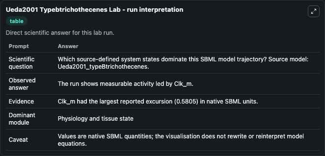
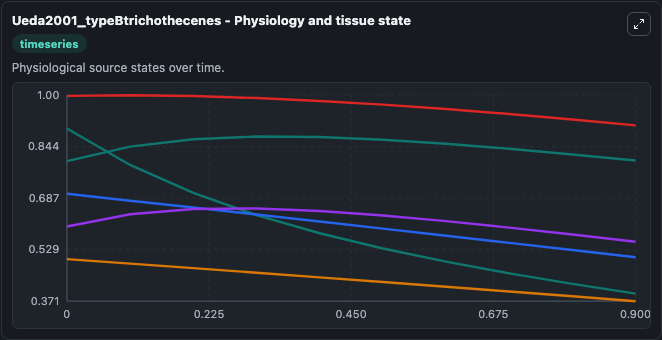
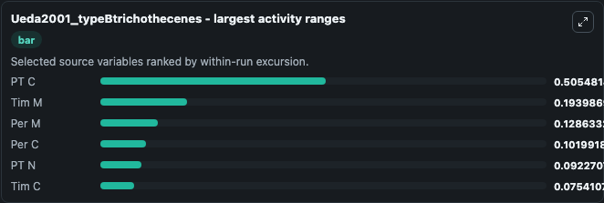
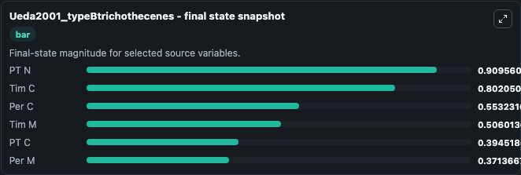
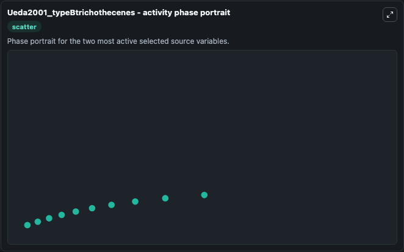

# Ueda2001 Typebtrichothecenes

This Biosimulant lab wraps `Ueda2001 Typebtrichothecenes` as a runnable systems biology model with a companion visualization module.
This a model from the article: Critical study of and improvements in chromatographic methods for the analysisof type B trichothecenes. It can be used to explore the configured dynamics and compare scenario outcomes across configurations.

## What You'll See

The lab asks: Which source-defined system states dominate this SBML model trajectory? Source model: Ueda2001_typeBtrichothecenes. It runs for 1.0 time units with a communication step of 0.1. The run uses the model defaults declared by the curated SBML wrapper. The generated visualizations focus on Tim M, Tim C, Per M, Per C, PT N, and PT C, combining trajectory, endpoint-comparison, and summary-table views from one completed dark-mode run.

In this captured run, **PT C** moved from 0.9000 to 0.3945 across 1.0 simulation windows.


### Output Visualizations



*Summary table for Ueda2001 Typebtrichothecenes, reporting the scientific question, observed answer, dominant module, and caveat.*



*Trajectories of PT C, Tim M, Per M, Per C, PT N, and Tim C across the 1.0 simulation. In this run **Tim C** climbed from 0.8000 to 0.8021 and **PT C** fell from 0.9000 to 0.3945 — the largest movements among the focused observables.*



*Largest-excursion ranking of the focused observables — the absolute movement magnitude during the run. Top 3: **PT C** = 0.5055, **Tim M** = 0.1940, **Per M** = 0.1286, with 3 more observables below.*



*Endpoint snapshot of the focused observables — final values from the captured run. Top 3 by value: **PT N** = 0.9096, **Tim C** = 0.8021, **Per C** = 0.5532, with 3 more observables below.*



*Visualization card from the Ueda2001 Typebtrichothecenes dark-mode run.*


## Model Context

- Core model: `models/core`
- Visualization model: `models/visualisation`
- Standard: `other`
- Upstream source: `biomodels_ebi:MODEL1006230044`
- License: `CC0`

## Inputs

| Input | Maps To | Default | Notes |
|---|---|---|---|
| Initial Tim M | `systemsbiology_sbml_ueda2001_typebtrichothecenes_model1006230044_model.initial_tim_m` | | Source state initial condition exposed as a model-specific control because no explicit intervention parameter is identifiable. Maps to SBML symbol `Tim_m`. |
| Initial Tim C | `systemsbiology_sbml_ueda2001_typebtrichothecenes_model1006230044_model.initial_tim_c` | | Source state initial condition exposed as a model-specific control because no explicit intervention parameter is identifiable. Maps to SBML symbol `Tim_c`. |
| Initial Per M | `systemsbiology_sbml_ueda2001_typebtrichothecenes_model1006230044_model.initial_per_m` | | Source state initial condition exposed as a model-specific control because no explicit intervention parameter is identifiable. Maps to SBML symbol `Per_m`. |
| Initial Per C | `systemsbiology_sbml_ueda2001_typebtrichothecenes_model1006230044_model.initial_per_c` | | Source state initial condition exposed as a model-specific control because no explicit intervention parameter is identifiable. Maps to SBML symbol `Per_c`. |
| Initial Pt N | `systemsbiology_sbml_ueda2001_typebtrichothecenes_model1006230044_model.initial_pt_n` | | Source state initial condition exposed as a model-specific control because no explicit intervention parameter is identifiable. Maps to SBML symbol `PT_n`. |
| Initial Pt C | `systemsbiology_sbml_ueda2001_typebtrichothecenes_model1006230044_model.initial_pt_c` | | Source state initial condition exposed as a model-specific control because no explicit intervention parameter is identifiable. Maps to SBML symbol `PT_c`. |

## Outputs

| Output | Maps To | Role |
|---|---|---|
| `state` | `systemsbiology_sbml_ueda2001_typebtrichothecenes_model1006230044_model.state` | Available to the visualization model and downstream workflows. |
| `summary` | `systemsbiology_sbml_ueda2001_typebtrichothecenes_model1006230044_model.summary` | Available to the visualization model and downstream workflows. |
| `species_labels` | `systemsbiology_sbml_ueda2001_typebtrichothecenes_model1006230044_model.species_labels` | Available to the visualization model and downstream workflows. |
| `tim_m` | `systemsbiology_sbml_ueda2001_typebtrichothecenes_model1006230044_model.tim_m` | Available to the visualization model and downstream workflows. |
| `tim_c` | `systemsbiology_sbml_ueda2001_typebtrichothecenes_model1006230044_model.tim_c` | Available to the visualization model and downstream workflows. |
| `per_m` | `systemsbiology_sbml_ueda2001_typebtrichothecenes_model1006230044_model.per_m` | Available to the visualization model and downstream workflows. |
| `per_c` | `systemsbiology_sbml_ueda2001_typebtrichothecenes_model1006230044_model.per_c` | Available to the visualization model and downstream workflows. |
| `pt_n` | `systemsbiology_sbml_ueda2001_typebtrichothecenes_model1006230044_model.pt_n` | Available to the visualization model and downstream workflows. |
| `pt_c` | `systemsbiology_sbml_ueda2001_typebtrichothecenes_model1006230044_model.pt_c` | Available to the visualization model and downstream workflows. |

## Runtime

- Duration: `1.0`
- Communication step: `0.1`

## Running Locally

```bash
biosimulant labs serve
```
