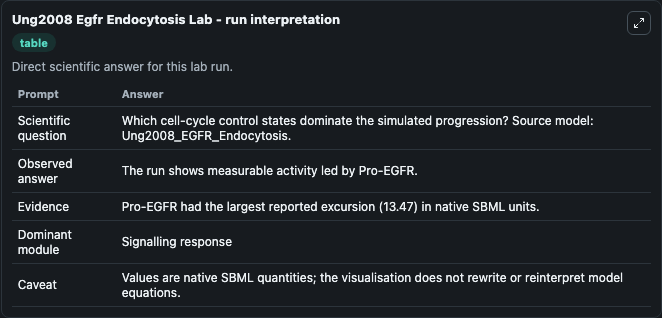
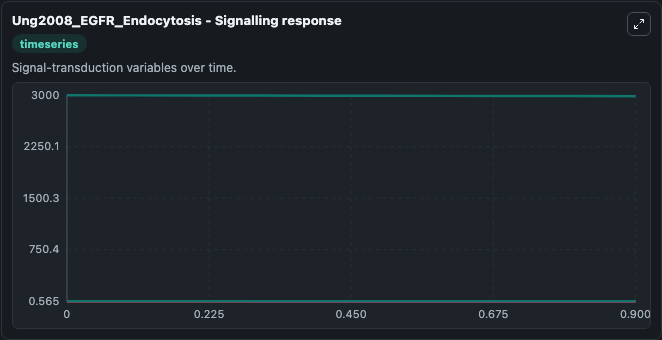
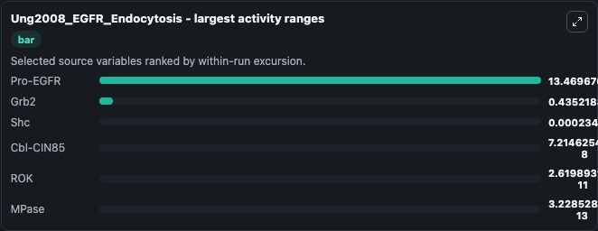
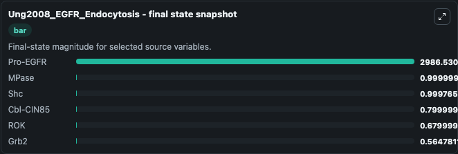
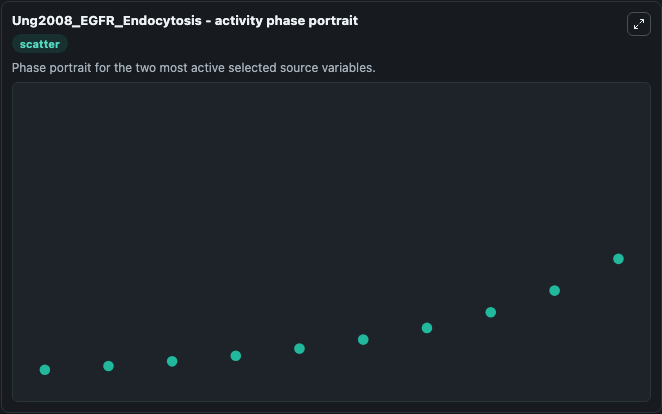

# Ung2008 Egfr Endocytosis

This Biosimulant lab wraps `Ung2008 Egfr Endocytosis` as a runnable systems biology model with a companion visualization module.
Model reproduces the various plots in the publication for 'Control' concentrations. It can be used to explore the configured dynamics and compare scenario outcomes across configurations.

## What You'll See

The lab asks: Which cell-cycle control states dominate the simulated progression? Source model: Ung2008_EGFR_Endocytosis. It runs for 1.0 time units with a communication step of 0.1. The run uses the model defaults declared by the curated SBML wrapper. The generated visualizations focus on Pro-EGFR, Shc, MPase, Grb2, Cbl-CIN85, and ROK, combining trajectory, endpoint-comparison, and summary-table views from one completed dark-mode run.

In this captured run, **Pro-EGFR** moved from 3000.0 to 2986.5 across 1.0 simulation windows.


### Output Visualizations



*Summary table for Ung2008 Egfr Endocytosis, reporting the scientific question, observed answer, dominant module, and caveat.*



*Trajectories of Pro-EGFR, Grb2, Shc, Cbl-CIN85, ROK, and MPase across the 1.0 simulation. In this run **Pro-EGFR** fell from 3000.0 to 2986.5 — the largest movements among the focused observables.*



*Largest-excursion ranking of the focused observables — the absolute movement magnitude during the run. Top 3: **Pro-EGFR** = 13.470, **Grb2** = 0.4352, **Shc** = 0.000234, with 3 more observables below.*



*Endpoint snapshot of the focused observables — final values from the captured run. Top 3 by value: **Pro-EGFR** = 2986.5, **MPase** = 1.0000, **Shc** = 0.9998, with 3 more observables below.*



*Visualization card from the Ung2008 Egfr Endocytosis dark-mode run.*


## Model Context

- Core model: `models/core`
- Visualization model: `models/visualisation`
- Standard: `other`
- Upstream source: `biomodels_ebi:BIOMD0000000205`
- License: `CC0`

## Inputs

| Input | Maps To | Default | Notes |
|---|---|---|---|
| Initial Pro EGFR | `systemsbiology_sbml_ung2008_egfr_endocytosis_biomd0000000205_model.initial_pro_egfr` | | Source state initial condition exposed as a model-specific control because no explicit intervention parameter is identifiable. Maps to SBML symbol `species_122`. |
| Initial Model State Shc | `systemsbiology_sbml_ung2008_egfr_endocytosis_biomd0000000205_model.initial_model_state_shc` | | Source state initial condition exposed as a model-specific control because no explicit intervention parameter is identifiable. Maps to SBML symbol `species_7`. |
| Initial M Pase | `systemsbiology_sbml_ung2008_egfr_endocytosis_biomd0000000205_model.initial_m_pase` | | Source state initial condition exposed as a model-specific control because no explicit intervention parameter is identifiable. Maps to SBML symbol `species_125`. |
| Initial Grb2 | `systemsbiology_sbml_ung2008_egfr_endocytosis_biomd0000000205_model.initial_grb2` | | Source state initial condition exposed as a model-specific control because no explicit intervention parameter is identifiable. Maps to SBML symbol `species_12`. |
| Initial Cbl Cin85 | `systemsbiology_sbml_ung2008_egfr_endocytosis_biomd0000000205_model.initial_cbl_cin85` | | Source state initial condition exposed as a model-specific control because no explicit intervention parameter is identifiable. Maps to SBML symbol `species_114`. |
| Initial Model State Rok | `systemsbiology_sbml_ung2008_egfr_endocytosis_biomd0000000205_model.initial_model_state_rok` | | Source state initial condition exposed as a model-specific control because no explicit intervention parameter is identifiable. Maps to SBML symbol `species_105`. |

## Outputs

| Output | Maps To | Role |
|---|---|---|
| `state` | `systemsbiology_sbml_ung2008_egfr_endocytosis_biomd0000000205_model.state` | Available to the visualization model and downstream workflows. |
| `summary` | `systemsbiology_sbml_ung2008_egfr_endocytosis_biomd0000000205_model.summary` | Available to the visualization model and downstream workflows. |
| `species_labels` | `systemsbiology_sbml_ung2008_egfr_endocytosis_biomd0000000205_model.species_labels` | Available to the visualization model and downstream workflows. |
| `pro_egfr` | `systemsbiology_sbml_ung2008_egfr_endocytosis_biomd0000000205_model.pro_egfr` | Available to the visualization model and downstream workflows. |
| `shc` | `systemsbiology_sbml_ung2008_egfr_endocytosis_biomd0000000205_model.shc` | Available to the visualization model and downstream workflows. |
| `m_pase` | `systemsbiology_sbml_ung2008_egfr_endocytosis_biomd0000000205_model.m_pase` | Available to the visualization model and downstream workflows. |
| `grb2` | `systemsbiology_sbml_ung2008_egfr_endocytosis_biomd0000000205_model.grb2` | Available to the visualization model and downstream workflows. |
| `cbl_cin85` | `systemsbiology_sbml_ung2008_egfr_endocytosis_biomd0000000205_model.cbl_cin85` | Available to the visualization model and downstream workflows. |
| `rok` | `systemsbiology_sbml_ung2008_egfr_endocytosis_biomd0000000205_model.rok` | Available to the visualization model and downstream workflows. |

## Runtime

- Duration: `1.0`
- Communication step: `0.1`

## Running Locally

```bash
biosimulant labs serve
```
