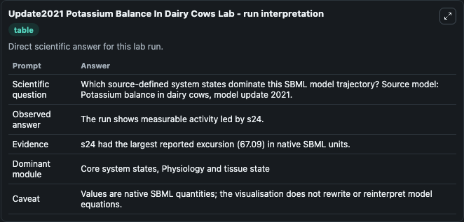
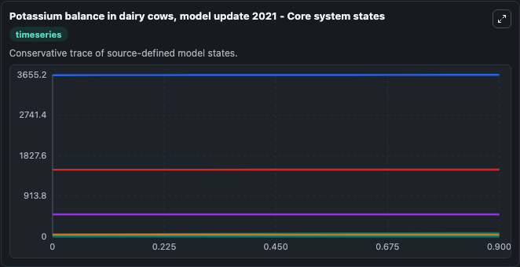
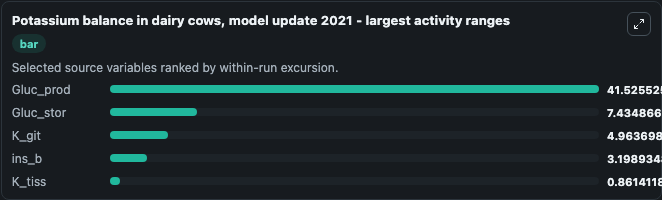
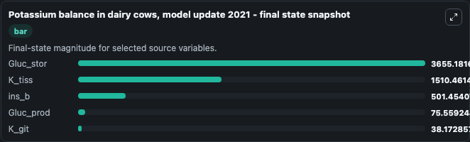
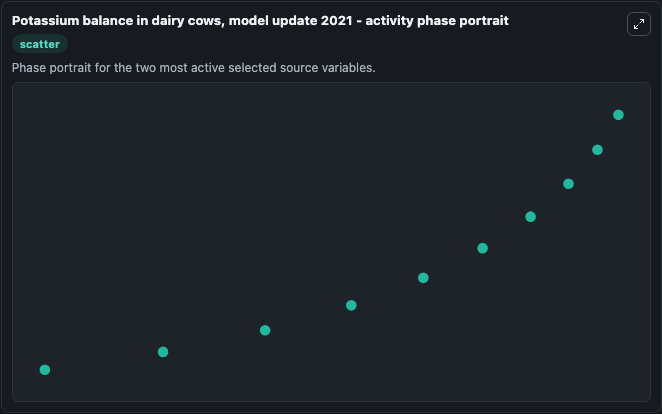

# Update2021 Potassium Balance In Dairy Cows

This Biosimulant lab wraps `Update2021 Potassium Balance In Dairy Cows` as a runnable systems biology model with a companion visualization module.
This updated model is derived from MODEL1710230000 here on Biomodels. It can be used to explore the configured dynamics and compare scenario outcomes across configurations.

## What You'll See

The lab asks: Which source-defined system states dominate this SBML model trajectory? Source model: Potassium balance in dairy cows, model update 2021. It runs for 1.0 time units with a communication step of 0.1. The run uses the model defaults declared by the curated SBML wrapper. The generated visualizations focus on src_Glucb, Gluc_stor, K_tiss, K_git, Gluc_prod, and ins_b, combining trajectory, endpoint-comparison, and summary-table views from one completed dark-mode run.

In this captured run, **Gluc_prod** moved from 34.034 to 75.559 across 1.0 simulation windows.


### Output Visualizations



*Summary table for Update2021 Potassium Balance In Dairy Cows, reporting the scientific question, observed answer, dominant module, and caveat.*



*Trajectories of Gluc_prod, Gluc_stor, K_git, ins_b, K_tiss, and src_Glucb across the 1.0 simulation. In this run **Gluc_prod** climbed from 34.034 to 75.559 and **K_git** fell from 43.137 to 38.173 — the largest movements among the focused observables.*



*Trajectories of Gluc_prod, Gluc_stor, K_git, ins_b, K_tiss, and src_Glucb across the 1.0 simulation. In this run **Gluc_prod** climbed from 34.034 to 75.559 and **K_git** fell from 43.137 to 38.173 — the largest movements among the focused observables.*



*Endpoint snapshot of the focused observables — final values from the captured run. Top 3 by value: **Gluc_stor** = 3655.2, **K_tiss** = 1510.5, **ins_b** = 501.5, with 2 more observables below.*



*Trajectories of Gluc_prod, Gluc_stor, K_git, ins_b, K_tiss, and src_Glucb across the 1.0 simulation. In this run **Gluc_prod** climbed from 34.034 to 75.559 and **K_git** fell from 43.137 to 38.173 — the largest movements among the focused observables.*


## Model Context

- Core model: `models/core`
- Visualization model: `models/visualisation`
- Standard: `other`
- Upstream source: `biomodels_ebi:MODEL2201250001`
- License: `CC0`

## Inputs

| Input | Maps To | Default | Notes |
|---|---|---|---|
| Src Glucfeed | `systemsbiology_sbml_potassium_balance_in_dairy_cows_model_update_202_model2201250001_model.src_glucfeed` | | Source parameter exposed because its SBML label indicates a boundary, stimulus, dose, ligand, protocol, substrate, or environmental control. Maps to SBML symbol `p46`. |

## Outputs

| Output | Maps To | Role |
|---|---|---|
| `state` | `systemsbiology_sbml_potassium_balance_in_dairy_cows_model_update_202_model2201250001_model.state` | Available to the visualization model and downstream workflows. |
| `summary` | `systemsbiology_sbml_potassium_balance_in_dairy_cows_model_update_202_model2201250001_model.summary` | Available to the visualization model and downstream workflows. |
| `species_labels` | `systemsbiology_sbml_potassium_balance_in_dairy_cows_model_update_202_model2201250001_model.species_labels` | Available to the visualization model and downstream workflows. |
| `src_glucb` | `systemsbiology_sbml_potassium_balance_in_dairy_cows_model_update_202_model2201250001_model.src_glucb` | Available to the visualization model and downstream workflows. |
| `gluc_stor` | `systemsbiology_sbml_potassium_balance_in_dairy_cows_model_update_202_model2201250001_model.gluc_stor` | Available to the visualization model and downstream workflows. |
| `k_tiss` | `systemsbiology_sbml_potassium_balance_in_dairy_cows_model_update_202_model2201250001_model.k_tiss` | Available to the visualization model and downstream workflows. |
| `k_git` | `systemsbiology_sbml_potassium_balance_in_dairy_cows_model_update_202_model2201250001_model.k_git` | Available to the visualization model and downstream workflows. |
| `gluc_prod` | `systemsbiology_sbml_potassium_balance_in_dairy_cows_model_update_202_model2201250001_model.gluc_prod` | Available to the visualization model and downstream workflows. |
| `ins_b` | `systemsbiology_sbml_potassium_balance_in_dairy_cows_model_update_202_model2201250001_model.ins_b` | Available to the visualization model and downstream workflows. |

## Runtime

- Duration: `1.0`
- Communication step: `0.1`

## Running Locally

```bash
biosimulant labs serve
```
